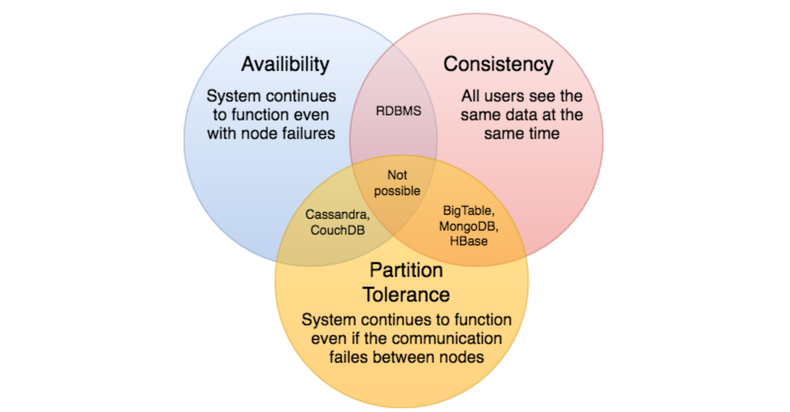

# CAP 定理

CAP定理指出，分布式软件系统不可能同时提供以下三个保证(CAP)中的两个以上:一致性、可用性和分区容忍。当我们设计一个分布式系统时，CAP之间的权衡几乎是我们要考虑的第一件事。CAP定理认为，在设计分布式系统时，我们只能选择以下两种:

一致性: 所有节点在同一时间看到相同的数据。一致性是通过在允许进一步读取之前更新多个节点实现的。

可用性: 每个请求在成功失败时都得到一个响应。可用性是通过在不同的服务器上复制数据来实现的。

分区容错: 尽管消息丢失或部分故障，系统仍能继续工作。具有分区容错性的系统可以承受任何数量的网络故障，而不会导致整个网络的故障。在节点和网络的组合中充分复制数据，以保持系统在间歇性中断中正常运行。

我们无法构建一个持续可用、顺序一致和容忍任何分区故障的通用数据存储。我们只能建立一个具有这三种属性中的任意两种的系统。因为，为了保持一致，所有节点都应该以相同的顺序看到相同的更新集。但是，如果网络中有一个分区，那么在客户机从最新的分区中读取数据后，在从过期分区中读取数据之前，一个分区中的更新可能无法到达其他分区。处理这种可能性的唯一方法是停止服务来自过期分区的请求，但这样服务就不再是100%可用了。