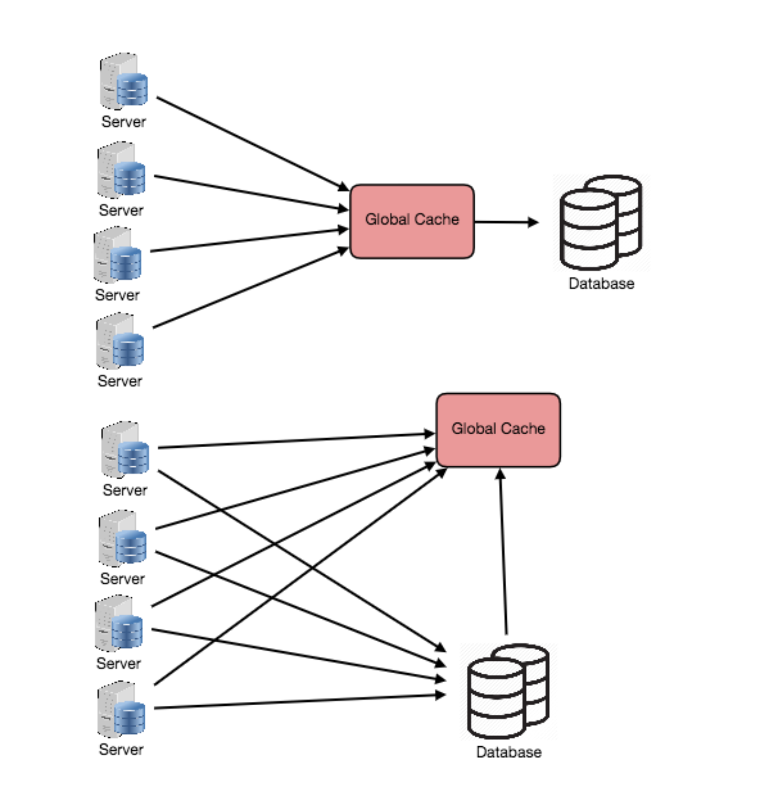

##  应用程序服务器缓存
直接在请求层节点上放置缓存可以实现响应数据的本地存储。每次向服务发出请求时，如果存在，节点将快速返回本地缓存的数据。如果不在缓存中，则请求节点将从磁盘查询数据。一个请求层节点上的缓存也可以位于内存(这非常快)和节点的本地磁盘(比到网络存储更快)中。

当您将此扩展到多个节点时会发生什么?如果将请求层扩展到多个节点，仍然可以让每个节点托管自己的缓存。但是，如果负载均衡器将请求随机分布在各个节点上，那么相同的请求将被发送到不同的节点，从而增加缓存丢失。克服这个障碍的两个选择是全局缓存和分布式缓存。

## 分布式缓存
在分布式缓存中，每个节点都拥有部分缓存数据。通常，缓存是使用一致的哈希函数进行分割的，这样，如果请求节点正在寻找特定的数据块，它可以快速知道在分布式缓存中查找的位置，以确定该数据是否可用。在这种情况下，每个节点都有一小块缓存，然后在返回原点之前向另一个节点发送数据请求。因此，分布式缓存的优点之一是我们可以轻松地增加缓存空间，这可以通过向请求池中添加节点来实现。
分布式缓存的一个缺点是解析丢失的节点。一些分布式缓存通过在不同节点上存储多个数据副本来解决这个问题;但是，您可以想象这个逻辑是如何迅速变得复杂的，特别是当您从请求层添加或删除节点时。即使一个节点消失了，部分缓存丢失了，请求也只会从起点进行拉取—所以这并不一定是灾难性的!

## 全局缓存
全局缓存就像它听起来的那样:所有节点使用相同的单一缓存空间。这需要添加一个比原始存储更快的服务器或某种类型的文件存储，并由所有请求层节点访问。每个请求节点以与本地节点相同的方式查询缓存。这种缓存方案可能有点复杂,因为它很容易淹没一个缓存客户端和请求的数量增加,但在一些非常有效的架构(特别是那些专门的硬件,使这个全球缓存非常快,或者有固定的数据集需要缓存)。

下图中描述了两种常见的全局缓存形式。首先，当缓存中没有找到缓存的响应时，缓存本身将负责从底层存储中检索丢失的数据。其次，请求节点负责检索缓存中没有找到的任何数据。

大多数利用全局缓存的应用程序倾向于使用第一种类型，其中缓存本身管理驱逐和获取数据，以防止客户端对相同数据的大量请求。然而，在某些情况下，第二个实现更有意义。例如，如果缓存用于非常大的文件，低缓存命中率会导致缓存缓冲区因缓存失败而过载;在这种情况下，缓存中有很大比例的总数据集(或热数据集)是有帮助的。另一个例子是存储在缓存中的文件是静态的，不应该被驱逐的架构。(这可能是因为应用程序对数据延迟的需求——对于大型数据集，某些数据片段可能需要非常快——在这种情况下，应用程序逻辑比缓存更理解驱逐策略或热点。)

## 内容分发网络(CDN)
cdn是一种缓存，用于提供大量静态媒体服务的站点。在一个典型的CDN设置中，一个请求将首先向CDN请求一块静态媒体;CDN将在本地提供该内容。如果文件不可用，CDN将查询后端服务器的文件，然后在本地缓存它，并将其提供给请求的用户。

如果我们正在构建的系统还没有大到足以有其自己的CDN,我们可以缓解未来转变为静态媒体从一个单独的子域名(例如,static.yourservice.com)使用一个轻量级的HTTP服务器像Nginx和转换一个CDN后的DNS服务器。

## 缓存失效
虽然缓存很棒，但它确实需要一些维护来保持缓存与真实来源(例如，数据库)一致。如果数据在数据库中被修改，那么它应该在缓存中失效，如果没有，这可能会导致不一致的应用程序行为。

解决这个问题被称为缓存无效，有三种主要的方案被使用:

*   透写缓存:在这种模式下，数据写入缓存，同时写入相应的数据库。缓存的数据允许快速检索，由于相同的数据被写入永久存储，我们将在缓存和存储之间实现完全的数据一致性。此外，该方案确保在发生崩溃、电源故障或其他系统中断时不会丢失任何东西。

    虽然透写将数据丢失的风险降到最低，但由于每次写操作都必须执行两次才能成功返回给客户端，因此该方案的缺点是写操作延迟较大。

*   绕写缓存:这种技术类似于透写缓存，但数据直接写入永久存储，绕过缓存。这可以减少缓存被写操作淹没，这些操作随后不会被重新读取，但缺点是对最近写的数据的读请求将创建一个“cache miss”，必须从较慢的后端存储读取，并经历更高的延迟。

*   回写缓存:在这种方案下，数据单独写入缓存，并立即向客户端确认完成。对永久存储器的写是在指定的时间间隔或特定的条件下完成的。这为写密集型应用程序带来了低延迟和高吞吐量，然而，在崩溃或其他不利事件发生时，这种速度伴随着数据丢失的风险，因为所写数据的唯一副本在缓存中。

##  缓存驱逐策略
以下是一些最常见的缓存退出策略:
1. 先进先出(FIFO):缓存将驱逐第一个被访问的块，而不考虑它之前被访问的频率和次数。
2. 后进先出(LIFO):缓存首先取出最近被访问的块，而不考虑它之前被访问的频率或次数。
3. 最近最少使用(LRU):先丢弃最近最少使用的物品。
4. 最近使用的物品(Most Recently Used, MRU):丢弃物品，与LRU不同，最近使用的物品优先。
5. 最少频繁使用(LFU):计算物品需要的频率。那些用得最少的先被丢弃。
6. 随机替换(RR):随机选择一个候选项，并在必要时丢弃它以腾出空间。