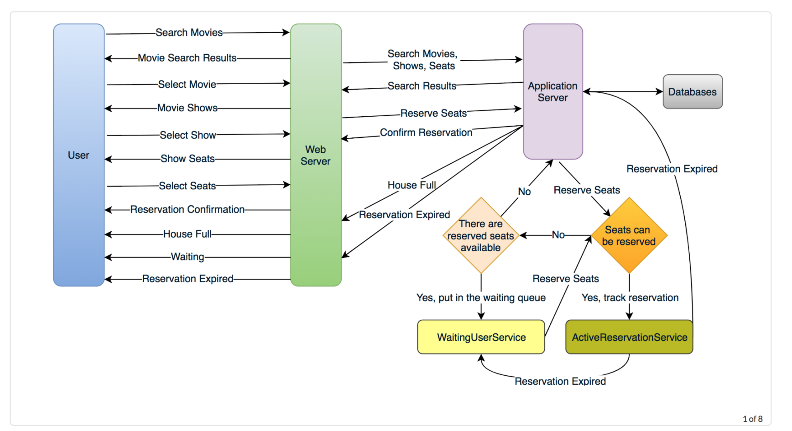

# 设计BookMyShow

让我们设计一个像BookMyShow这样销售电影票的在线售票系统。类似服务:bookmyshow.com, ticketmaster.com

Level: Hard

## 1. 什么是网上电影票预订系统?

   电影票预订系统为其客户提供了在线购买电影票的能力。电子售票系统允许顾客随时随地浏览正在播放的电影，并预订座位。

## 2. 系统的需求和目标

   我们的订票服务应符合以下要求:

   功能需求:

   1.我们的订票服务应该能够列出不同的城市，其附属影院位于。

   2.一旦用户选择了某个城市，该服务就应该显示该城市上映的电影。

   3.一旦用户选择了电影，服务应该显示运行该电影的电影院及其可用的节目。

   4.用户应该能够选择特定电影院的演出并预订他们的票。

   5.该服务应能向用户显示电影院的座位安排。用户应该能够根据自己的喜好选择多个座位。

   6.用户应该能够区分可用的座位和已预订的座位。

   7.用户在付款完成预订之前，应该能够在座位上停留5分钟。

   8.如果有可能有座位可用，用户应该能够等待，例如当其他用户持有的座位过期时。

   9.等候的顾客应以先到先得的方式得到公平的服务。

   非功能性需求:

   1.系统需要高度并发。在任何特定的时间点，同一座位将会有多个预订请求。服务应该优雅而公平地处理这个问题。

   2.该服务的核心是订票，这意味着金融交易。这意味着系统应该是安全的，并且数据库应该与ACID兼容。

## 3. 一些设计方面的考虑

   1.为简单起见，让我们假设我们的服务不需要用户身份验证。

   2.该系统将不处理部分机票订单。要么用户得到他们想要的所有罚单，要么什么都得不到。

   3.公平是系统的必修课。

   4.为了防止系统被滥用，我们可以限制用户不超过10个座位。

   5.我们可以假设，当人们期待已久的热门电影上映时，车流量会激增，座位很快就会坐满。该系统应该是可伸缩的，高可用性的，以应对流量的激增。

## 4. 能力评估

   流量估计:假设我们的服务每月有30亿的页面浏览量，每月卖出1000万张票。

   存储空间估算:假设我们有500个城市，平均每个城市有10个电影院。如果每家影院有2000个座位，平均每天有两场演出。

   让我们假设每个座位预订需要50个字节(id、NumberOfSeats、ShowID、MovieID、SeatNumbers、SeatStatus、Timestamp等)存储在数据库中。我们还需要存储关于电影和电影院的信息，假设它需要50字节。所以，存储一天所有城市所有影院的所有节目数据:

   500 cities * 10 cinemas * 2000 seats * 2 shows * (50+50) bytes = 2GB / day bytes = 1GB

   要存储五年的数据，我们需要大约3.6PB。

## 5. System APIs

   我们可以使用SOAP或REST api来公开服务的功能。以下是用于搜索电影放映和预订座位的api的定义。

   SearchMovies(api_dev_key, keyword, city, lat_long, radius, start_datetime, end_datetime, postal_code,

   includeSpellcheck, results_per_page, sorting_order)

   Parameters:

   api_dev_key (string):注册帐户的API开发人员密钥。这将用于根据用户分配的配额限制用户。

   keyword (string):要搜索的关键字。

   city(字符串):过滤电影的城市。

   lat_long (string):要过滤的纬度和经度。radius (number):我们要搜索事件的区域的半径。

   start_datetime (string):过滤开始日期时间在这个日期时间之后的电影。

   end_datetime (string):过滤开始日期在此日期之前的电影。

   postal_code (string):按邮政编码过滤电影。

   inclespellcheck (Enum: " yes "或" no"): yes，在响应中包含拼写检查建议。

   results_per_page (number):每页返回多少个结果。最大的是30。

   sorting_order (string):搜索结果的排序顺序。一些允许的值:' name,asc '， ' name,desc '， ' date,asc '， ' date,desc '， ' distance,asc '， ' name,date,asc '， ' name,date,desc '， ' date,name,asc '， ' date,name,desc '， ' date,name,asc '， ' date,name,desc '， ' date,name,asc '， ' date,name,desc '。

   Returns: (JSON)

   以下是一些电影和它们的节目:

   Parameters:

   Api_dev_key (string):同上

   session_id(字符串):用于跟踪此预订的用户会话ID。一旦预约时间过期，用户在服务器上的预约将使用此ID删除。

   movie_id (string):要保留的电影。

   show_id (string): Show to reserve.

   seats_to_reserve (number):包含要预留的座位id的数组。

   Returns: (JSON)

   返回预订的状态，可能是以下情况之一:1)“预订成功”2)“预订失败-显示全部”，3)“预订失败-重试，因为其他用户持有预订座位”。

## 6. 数据库设计

   以下是关于我们将要存储的数据的一些观察结果:

   1.每个城市可以有多个电影院。

   2.每个电影院将有多个大厅。

   3.每部电影将有多个节目，每个节目将有多个预订。

   4.一个用户可以有多个预订。

## 7. High Level Design

   在高层次上，我们的web服务器将管理用户的会话，而应用服务器将处理所有的票据管理，将数据存储在数据库中，并与缓存服务器一起处理预订。

## 8. 详细的组件设计

   首先，假设服务是从单个服务器提供的，让我们尝试构建我们的服务。

   订票工作流程:以下是典型的订票工作流程:

   1.用户搜索电影。

   2.用户选择电影。

   3.用户被显示电影的可用显示。

   4.用户选择一个节目。

   5.用户选择要保留的座位数量。

   6.如果需要的座位数量是可用的，用户会看到剧院的地图来选择座位。如果没有，则将用户带到下面的“步骤8”

   7.一旦用户选择了座位，系统将尝试保留这些被选择的座位。

   8.如无法预订座位，我们有以下选择:

   ●显示充满;用户将看到错误消息。

   ●用户想要预订的座位不再可用，但是还有其他的座位可用，因此用户被带回到剧院地图以选择不同的座位。

   ●没有座位可供预订，但由于在预订池中有其他用户持有的一些座位尚未预订，所以所有的座位尚未被预订。用户将被带到一个等待页面，在那里他们可以等待，直到预定池中释放出所需的座位。这种等待可能导致以下选择:

   ○如果所需的座位数量可用，用户将被带到剧院地图页面，在那里他们可以选择座位。

   ○在等待时，如果所有座位都预订了，或者预订池中的座位比用户预定的要少，则会显示错误消息。

   ○用户取消等待，返回电影搜索页面。

   ○在用户的会话过期并返回到电影搜索页面后，用户最多可以等待一个小时。

   1.如果成功预订座位，用户有5分钟的时间为预订付费。付款后，预订被标记为完成。如果用户不能在5分钟内付款，那么他们所有的预留座位就会被释放出来供其他用户使用。

服务器如何跟踪所有尚未预订的活动预订?服务器如何跟踪所有等待的顾客?

我们需要两个守护进程服务，一个用于跟踪所有活动预订，并从系统中删除任何过期的预订，我们将其称为ActiveReservationService。另一个服务将跟踪所有等待的用户请求，一旦所需的座位数量可用，它将通知(等待时间最长的)用户选择座位，我们称其为WaitingUserService。

a. ActiveReservationsService

除了将所有数据保存在数据库中，我们还可以在Linked HashMap中保留所有“show”的内存。我们需要一个Linked HashMap，以便在预订完成时跳转到任何预订并删除它。另外，由于每个保留都有过期时间，所以链接的HashTable的头将始终指向最老的保留记录，因此当超时到达时，保留可以过期。

为了存储每个节目的每个预订，我们可以有一个HashTable，其中' key '将是' ShowID '， ' value '将是包含' BookingID '和创建' Timestamp '的链接HashMap。

在数据库中，我们将预订存储在' Booking '表中，过期时间将存储在Timestamp列中。“Status”字段的值为“Reserved(1)”，一旦预订完成，系统将更新“Status”为“booking(2)”，并从相关显示的Linked HashMap中删除预订记录。当预订过期时，除了将其从内存中删除外，我们还可以将其从Booking表中删除，或者将其标记为“expired(3)”。

ActiveReservationsService还将与外部金融服务合作处理用户支付。无论何时预订完成或预订过期，WaitingUsersService都会收到一个信号，以便为任何等待的客户提供服务。

b. WaitingUsersService

就像ActiveReservationsService一样，我们可以将一个show的所有等待用户保存在一个Linked HashMap中。我们需要一个Linked HashMap，这样当用户取消请求时，我们可以跳转到任何用户，从HashMap中删除他们。此外，由于我们以先到先得的方式提供服务，Linked HashMap的头将始终指向等待时间最长的用户，因此只要有座位，我们就可以以公平的方式为用户提供服务。

我们将有一个HashTable来存储每个Show的所有等待用户。“key”将是“ShowID”，“value”将是一个包含“userid”及其wait-start-time的链接HashMap。

客户端可以使用长轮询来更新自己的预订状态。只要有空位，服务器就可以使用这个请求来通知用户。

预订到期

在服务器上，ActiveReservationsService跟踪活动预订的过期时间(基于预订时间)。客户端将显示一个计时器(过期时间)可以与服务器不同步,我们可以添加一个5秒的缓冲服务器维护从破碎的经验——这样——客户永远不会超时服务器后,防止一个成功的收购。

## 9. 并发性

   如何处理并发;没有两个用户可以预订相同的座位?我们可以在SQL数据库中使用事务来避免任何冲突。例如，如果我们使用SQL server，我们可以利用事务隔离级别来锁定行，然后才能更新它们。下面是示例代码:

   “Serializable”是最高级的隔离级别，它保证了Dirty、Nonrepeatable和phantom读取的安全性。这里需要注意的一件事是，在事务中，如果我们读取行，就会获得写锁，因此其他人无法更新这些行。

   一旦上面的数据库事务成功，我们就可以开始在ActiveReservationService中跟踪预订。

## 10. 容错

   当ActiveReservationsService或WaitingUsersService崩溃时会发生什么?

   每当ActiveReservationsService崩溃时，我们可以从“Booking”表中读取所有活动预订。请记住，在预订完成之前，我们将“Status”列保持为“Reserved(1)”。另一个选择是有主从配置，这样当主崩溃时，从可以接管。因为我们没有在数据库中存储等待的用户，所以当WaitingUsersService崩溃时，我们没有任何方法恢复数据，除非我们有一个主从设置。

   类似地，我们将对数据库进行主从设置，使其具有容错能力。

## 11. 数据分区

   数据库分区:如果我们按照“MovieID”进行分区，那么一个电影的所有显示都将在一个服务器上。对于一部非常热门的电影，这可能会在服务器上造成很大的负载。更好的方法是基于ShowID进行分区，这样负载就可以在不同的服务器之间分配。

   ActiveReservationService和WaitingUserService分区:我们的web服务器将管理所有活动用户的会话，并处理与用户的所有通信。我们可以使用一致的哈希来根据' ShowID '为ActiveReservationService和WaitingUserService分配应用服务器。这样，一个特定节目的所有预订和等待用户都将由一组特定的服务器处理。让我们假设为了负载平衡，我们的Consistent hashing为任何Show分配了三个服务器，所以每当一个预留过期时，持有该预留的服务器将做以下事情:

   1.更新数据库以删除Booking(或标记其过期)，并更新' Show_Seats '表中的席位' Status '。

   2.从Linked HashMap中移除保留。

   3.通知用户他们的预订已经过期。

   4.向所有等待该Show的用户的WaitingUserService服务器广播一条消息，以找出等待时间最长的用户。一致的哈希方案将告诉哪些服务器持有这些用户。

   5.如果所需的座位可用，则向等待时间最长的用户所在的WaitingUserService服务器发送一条消息来处理他们的请求。

   当预约成功时，会发生以下事情:

   1.持有该预订的服务器向持有该Show的等待用户的所有服务器发送一条消息，以便它们可以使所有需要比可用座位更多的等待用户过期。

   2.所有等待用户的服务器在收到上述消息后，将查询数据库，查看目前有多少空闲座位可用。在这里，数据库缓存将极大地帮助只运行一次查询。

   3.在所有等待的用户中，如果用户希望保留比现有座位更多的座位，则将其过期。为此，WaitingUserService必须遍历所有等待用户的Linked HashMap。
