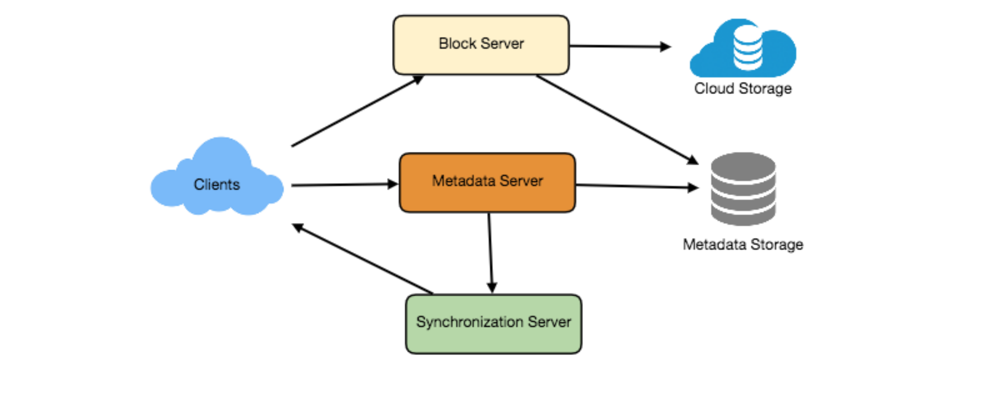
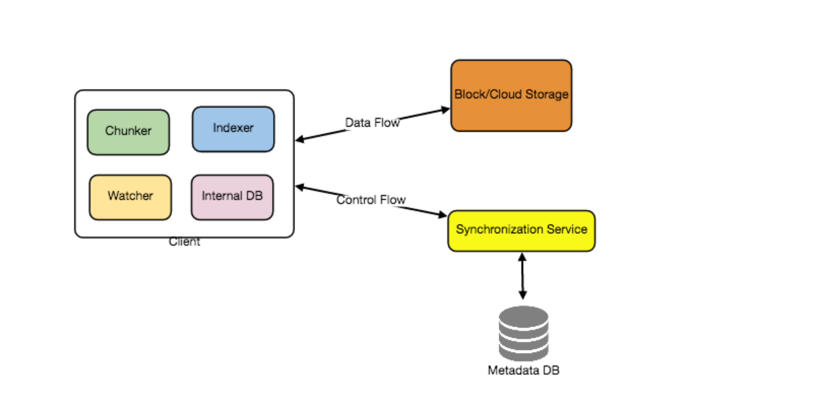
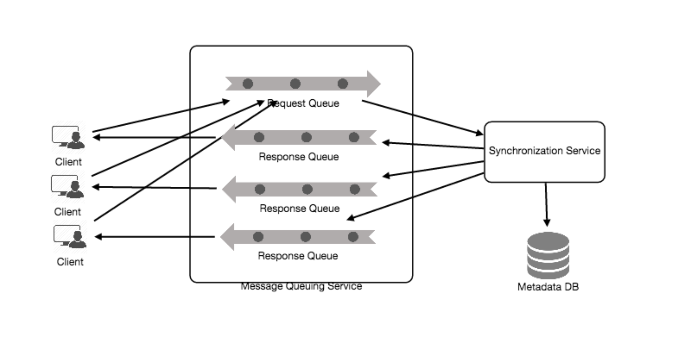
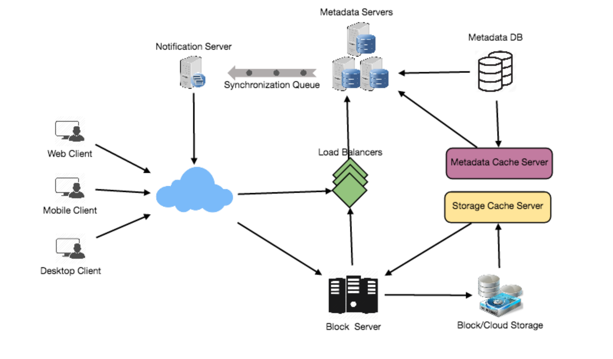

# 设计 Dropbox

让我们设计一个像 Dropbox 或者 Google Drive 的文件托管服务。云文件存储允许用户在远程服务器上存储数据。通常，这些服务器由云存储提供商维护，并通过网络（通常通过互联网）提供给用户。用户每月支付云数据存储费用。

类似服务：OneDrive、Google Drive

难度：中等

## 1. 为什么选择云存储?

   云文件存储服务最近变得非常流行，因为它们简化了多个设备之间数字资源的存储和交换。从使用单一个人电脑转向使用具有不同平台和操作系统的多台设备，如智能手机和平板电脑，以及它们随时可以从不同地理位置进行便携式访问，这被认为是云存储服务巨大普及的原因。这些服务的一些最大好处是：

   可用性:  云存储服务的座右铭是随时随地提供数据。用户可以随时随地从任何设备访问其文件/照片。

   可靠性和持久性: 云存储的另一个好处是它提供了100%的数据可靠性和持久性。云存储通过将数据的多个副本存储在不同地理位置的服务器上，确保用户永远不会丢失数据。

   Scalability可扩展性:  用户将永远不必担心离开存储空间。使用云存储，只要您愿意付费，您就可以拥有无限的存储空间。

   如果你没用过dropbox.com之前，我们强烈建议在那里创建一个帐户，上传/编辑一个文件，并查看他们提供的服务的不同选项。这将有助于你更好地理解本章。

## 2. 系统要求和目标：

   💡 你应该在面试开始时明确要求，并提出问题，以确定面试官心目中的系统的确切范围。

   我们希望通过云存储系统实现什么？以下是我们系统的顶级要求：

   1.用户应该能够从任何设备上传和下载他们的文件/照片。

   2.用户应该能够与其他用户共享文件或文件夹。

   3.我们的服务应该支持设备之间的自动同步，即在一个设备上更新文件后，它应该在所有设备上同步。

   4.系统应支持存储高达GB的大型文件。

   5.ACID 是必需的。应保证所有文件操作的原子性、一致性、隔离性和持久性。

   6.我们的系统应该支持离线编辑。用户应该能够在脱机时添加/删除/修改文件，一旦他们联机，他们的所有更改都应该同步到远程服务器和其他联机设备。

   扩展要求

   ●系统应支持数据快照，以便用户可以返回到文件的任何版本。

## 3. 一些设计注意事项

   ●我们应该期待巨大的读写量。

   ●预计读写比几乎相同。

   ●在内部，文件可以存储在较小的部分或块中（例如：4MB），这可以提供很多好处，例如，所有失败的操作只能针对文件的较小部分重试。如果用户未能上载文件，则仅重试失败的区块。

   ●我们可以通过只传输更新的数据块来减少数据交换量。

   ●通过删除重复块，我们可以节省存储空间和带宽使用。

   ●在客户端保存元数据（文件名、大小等）的本地副本可以节省大量到服务器的往返时间。

   ●对于小的更改，客户端可以智能地上传差异，而不是整个数据块。

## 4. 容量预估和限制

   ●假设我们有5亿总用户和1亿每日活动用户（DAU）。

   ●假设每个用户平均从三个不同的设备连接。

   ●平均来说，如果一个用户有200个文件/照片，我们将有1000亿个文件。

   ●让我们假设平均文件大小为100KB，这将为我们提供10 PB的总存储空间。

   100B * 100KB => 10PB

   ●我们还假设每分钟将有一百万个活动连接。

## 5. 高级别设计

   用户将指定一个文件夹作为其设备上的工作区。放置在此文件夹中的任何文件/照片/文件夹都将上载到云中，无论何时修改或删除文件，都将以相同的方式反映在云存储中。用户可以在其所有设备上指定类似的工作区，并且在一个设备上所做的任何修改都将传播到所有其他设备，以便在任何地方都具有相同的工作区视图。

   在较高级别上，我们需要存储文件及其元数据信息，如文件名、文件大小、目录等，以及与谁共享此文件。因此，我们需要一些能够帮助客户端将文件上传/下载到云存储的服务器，以及一些能够帮助更新文件和用户元数据的服务器。我们还需要一些机制，以便在更新发生时通知所有客户机，以便他们能够同步其文件。

   如下图所示，块服务器将与客户端一起从云存储上传/下载文件，元数据服务器将在SQL或NoSQL数据库中更新文件的元数据。同步服务器将处理通知所有客户端不同同步更改的工作流。

为 Dropbox r的高级别设计

## 6. 组件设计

   让我们逐一介绍一下系统的主要组件：

   a. 客户端

   客户端应用程序监视用户计算机上的工作区文件夹，并将其中的所有文件/文件夹与远程云存储同步。客户端应用程序将与存储服务器协作，将实际文件上载、下载和修改到后端云存储。客户端还与远程同步服务交互，以处理任何文件元数据更新，例如文件名、大小、修改日期等的更改。

   以下是客户端的一些基本操作：

   1.上传和下载文件。

   2.检测工作区文件夹中的文件更改。

   3.处理脱机或并发更新引起的冲突。

   我们如何有效地处理文件传输? 如上所述，我们可以将每个文件分解为更小的块，以便只传输修改过的块，而不是整个文件。假设我们将每个文件分成固定大小的4MB块。我们可以根据1）我们在云中使用的存储设备来优化空间利用率和每秒输入/输出操作（IOPS）2）网络带宽3）存储中的平均文件大小等静态计算最佳块大小。在我们的元数据中，我们还应该记录每个文件以及构成它的块。

   我们应该在客户端保留元数据的副本吗? 保留元数据的本地副本不仅使我们能够进行脱机更新，还可以节省大量更新远程元数据的往返时间。

   客户机如何有效地侦听其他客户机上发生的更改? 一种解决方案是，客户机定期与服务器检查是否有任何更改。这种方法的问题是，我们在本地反映更改时会有延迟，因为客户端会定期检查更改，而服务器则会在发生更改时发出通知。如果客户机经常检查服务器的更改，这不仅会浪费带宽，因为服务器大部分时间都必须返回空响应，而且会使服务器保持忙碌。以这种方式提取信息也是不可伸缩的。

   上述问题的解决方案可以是使用HTTP长轮询。对于长轮询，客户机从服务器请求信息，期望服务器不会立即响应。如果在收到轮询时服务器没有客户端的新数据，则服务器将保持请求打开并等待响应信息变为可用，而不是发送空响应。一旦有了新信息，服务器立即向客户端发送HTTP/S响应，完成打开的HTTP/S请求。在收到服务器响应后，客户机可以立即发出另一个服务器请求，以便将来进行更新。

   基于上述考虑，我们可以将客户分为以下四个部分：

   I. Internal Metadata Database将跟踪所有文件、块、它们的版本以及它们在文件系统中的位置。

   II. Chunker 将文件分割成更小的块。它还将负责从文件块重建文件。我们的分块算法将检测用户修改的文件部分，并仅将这些部分传输到云存储；这将节省我们的带宽和同步时间。

   III. Watcher 将监视本地工作区文件夹，并将用户执行的任何操作（例如，当用户创建、删除或更新文件或文件夹时）通知索引器（如下所述）。监视程序还侦听同步服务广播的其他客户端上发生的任何更改

   IV. Indexer 将处理从观察者接收到的事件，并使用有关修改文件块的信息更新内部元数据数据库。一旦区块成功提交/下载到云存储，索引器将与远程同步服务通信，向其他客户端广播更改并更新远程元数据数据库。

客户端应该如何处理速度较慢的服务器? 如果服务器正忙/没有响应，客户端应该以指数方式退出。这意味着，如果服务器响应太慢，客户端应该延迟重试，并且这种延迟应该成倍增加。

移动客户端是否应立即同步远程更改? 与定期检查文件更改的桌面或web客户端不同，移动客户端通常按需同步以节省用户的带宽和空间。

b. Metadata Database

元数据数据库负责维护有关文件/块、用户和工作区的版本控制和元数据信息。元数据数据库可以是关系数据库（如MySQL）或NoSQL数据库服务（如DynamoDB）。无论数据库的类型如何，同步服务都应该能够使用数据库提供文件的一致视图，特别是当多个用户同时使用同一文件时。由于NoSQL数据存储不支持有利于可伸缩性和性能的ACID属性，我们需要以编程方式将对ACID属性的支持纳入同步服务的逻辑中，以防我们选择这种数据库。但是，使用关系数据库可以简化同步服务的实现，因为它们本机支持ACID属性。

元数据数据库应存储有关以下对象的信息：

1.Chunks

2.Files

3.User

4.Devices

5.Workspace (同步文件夹)

c. 同步服务

同步服务是处理客户端所做文件更新并将这些更改应用于其他订阅客户端的组件。它还将客户端的本地数据库与远程元数据数据库中存储的信息同步。同步服务是系统体系结构中最重要的部分，因为它在管理元数据和同步用户文件方面起着关键作用。桌面客户端与同步服务通信，以从云存储获取更新，或向云存储和可能的其他用户发送文件和更新。如果客户端脱机一段时间，它会在联机后立即轮询系统以获取新的更新。当同步服务收到更新请求时，它会检查元数据数据库的一致性，然后继续更新。随后，将向所有订阅的用户或设备发送通知，以报告文件更新。

同步服务的设计应确保在客户端和云存储之间传输更少的数据，以实现更好的响应时间。为了达到这个设计目标，同步服务可以使用差异算法来减少需要同步的数据量。我们可以只传输文件的两个版本之间的差异，而不是将整个文件从客户端传输到服务器，或者反之亦然。因此，仅传输已更改的文件部分。这也减少了最终用户的带宽消耗和云数据存储。如上所述，我们将把文件分成4MB的块，并且只传输修改过的块。服务器和客户端可以计算散列（例如，SHA-256），以查看是否更新块的本地副本。在服务器上，如果我们已经有一个具有类似哈希的块（甚至来自另一个用户），我们不需要创建另一个副本，我们可以使用相同的块。这将在后面的重复数据消除中详细讨论。

为了能够提供高效和可扩展的同步协议，我们可以考虑使用客户端和同步服务之间的通信中间件。消息传递中间件应提供可扩展的消息队列和更改通知，以支持使用拉或推策略的大量客户端。这样，多个同步服务实例可以从全局请求队列接收请求，并且通信中间件将能够平衡它们的负载。

d. 消息队列服务

我们架构的一个重要部分是消息传递中间件，它应该能够处理大量的请求。支持客户端和同步服务实例之间基于异步消息的通信的可扩展消息队列服务最适合我们应用程序的要求。消息队列服务支持系统分布式组件之间的异步和松散耦合的基于消息的通信。消息队列服务应该能够高效地将任意数量的消息存储在高可用、可靠和可扩展的队列中。

消息队列服务将在我们的系统中实现两种类型的队列。请求队列是一个全局队列，所有客户端都将共享它。客户端更新元数据数据库的请求将首先发送到请求队列，同步服务将从那里获取更新元数据的请求。对应于单个订阅客户端的响应队列负责将更新消息传递给每个客户端。因为一旦客户端接收到消息，就会从队列中删除消息，所以我们需要为每个订阅的客户端创建单独的响应队列来共享更新消息。

e. 云/块存储

云/块存储存储用户上传的文件块。客户机直接与存储器交互，以从存储器发送和接收对象。元数据和存储的分离使我们能够使用云中或内部的任何存储。

为 Dropbox 的组件设计详情

## 7. 文件处理工作流

   下面的序列显示了当客户端A更新与客户端B和C共享的文件时，应用程序组件之间的交互，因此它们也应该接收更新。如果其他客户端在更新时未联机，则消息队列服务会将更新通知保留在单独的响应队列中，直到它们稍后联机。

   1.客户端A将块上传到云存储。

   2.客户端A更新元数据并提交更改。

   3.客户端A得到确认，并向客户端B和C发送有关更改的通知。

   4.客户端B和C接收元数据更改并下载更新的块。

## 8. 消除重复数据

   重复数据消除是一种用于消除重复数据拷贝以提高存储利用率的技术。它还可以应用于网络数据传输，以减少必须发送的字节数。对于每个新传入的块，我们可以计算它的散列，并将该散列与现有块的所有散列进行比较，以查看我们的存储中是否已经存在相同的块。

   我们可以通过两种方式在系统中实施重复数据消除：

   a. 一个处理后重复数据删除技术。

   使用后处理重复数据删除，新的块首先存储在存储设备上，然后一些进程分析数据，寻找复制。这样做的好处是，客户端在存储数据之前不需要等待哈希计算或查找完成，从而确保存储性能不会下降。这种方法的缺点是:1)我们将不必要地存储重复数据，尽管在短时间内;2)重复数据的传输将消耗带宽。

   b. 在线重复数据删除

   或者，当客户端在设备上输入数据时，重复数据删除哈希计算可以实时完成。如果我们的系统识别出一个它已经存储的块，只会在元数据中添加对现有块的引用，而不是该块的完整副本。这种方法将为我们提供最佳的网络和存储使用。

## 9. 元数据分区

   为了向外扩展元数据数据库，我们需要对它进行分区，以便它能够存储关于数百万用户和数十亿个文件块的信息。我们需要提出一个分区方案，将我们的数据划分并存储到不同的DB服务器上。

1. 垂直分区:我们可以通过这样一种方式对数据库进行分区，即在一台服务器上存储与某个特定特性相关的表。例如，我们可以将所有与用户相关的表存储在一个数据库中，将所有与文件块相关的表存储在另一个数据库中。虽然这种方法实现起来很简单，但它也有一些问题:

   1.我们还会有规模问题吗?如果我们有数万亿块要存储，而我们的数据库不能支持存储如此大量的记录，那该怎么办?我们如何进一步划分这些表?

   2.在两个独立的数据库中连接两个表可能会导致性能和一致性问题。我们联接用户表和文件表的频率有多高?

2. 基于范围的分区:如果我们根据文件路径的第一个字母将文件块存储在单独的分区中会怎么样?因此，我们将所有以字母“A”开头的文件保存在一个分区中，而那些以字母“B”开头的文件保存在另一个分区中，以此类推。这种方法称为基于范围的分区。我们甚至可以将某些不太经常出现的字母组合到一个数据库分区中。我们应该静态地提出这种分区方案，以便始终能够以可预测的方式存储和查找文件。

   这种方法的主要问题是，它可能导致服务器不平衡。例如，如果我们决定将所有以字母‘E’开头的文件放入一个DB分区，然后我们意识到我们有太多以字母‘E’开头的文件，以至于我们无法将它们放入一个DB分区。

   3.基于哈希的分区:在这个方案中，我们取我们正在存储的对象的哈希值，并根据这个哈希值计算出这个对象应该去的DB分区。在我们的例子中，我们可以取我们正在存储的File对象的' FileID '的哈希值来确定文件将存储的分区。我们的哈希函数将随机将对象分配到不同的分区中，例如，我们的哈希函数总是可以将任何ID映射到[1…256]之间的一个数字，而这个数字将是我们存储对象的分区。

   这种方法仍然会导致分区的重载，这可以通过使用一致的哈希来解决。

## 10. Caching

   我们可以在系统中有两种缓存。为了处理热文件块，我们可以为块存储引入缓存。我们可以使用一个现成的解决方案，比如Memcache，它可以用它们各自的idshash存储整个块，并且块服务器在访问块存储之前可以快速检查缓存是否有需要的块。根据客户机的使用模式，我们可以确定需要多少缓存服务器。一台高端商用服务器的内存可达144GB;因此，一个这样的服务器可以缓存36K块。

   哪种缓存替换策略最适合我们的需求?当缓存满了，我们想用一个新的更热的块替换一个块时，我们该如何选择呢?最近最少使用(Least Recently Used, LRU)对于我们的系统来说是一个合理的策略。在这个策略下，我们首先丢弃最近最少使用的块。

   类似地，我们可以为Metadata DB提供一个缓存。

## 11. Load Balancer (LB)

   我们可以在系统的两个地方添加负载均衡层:1)在客户端和块服务器之间，2)在客户端和元数据服务器之间。最初，可以采用一种简单的轮询方法;将传入的请求平均分配到后端服务器。这个LB实现起来很简单，而且不引入任何开销。这种方法的另一个好处是，如果服务器死亡，LB将把它从轮换中移除，并停止向它发送任何流量。Round Robin LB的一个问题是，它不会考虑服务器负载。如果服务器负载过重或运行缓慢，LB将不会停止向该服务器发送新请求。为了处理这个问题，可以放置一个更智能的LB解决方案，它可以周期性地查询后端服务器的负载，并据此调整流量。

## 12.安全，权限和文件共享

   当用户将他们的文件存储在云中时，他们最关心的是他们数据的隐私和安全。特别是因为在我们的系统中，用户可以与其他用户共享他们的文件，甚至可以将其公开与所有人共享。为了处理这个问题，我们将在元数据数据库中存储每个文件的权限，以反映哪些文件是可见的或任何用户可以修改的。
