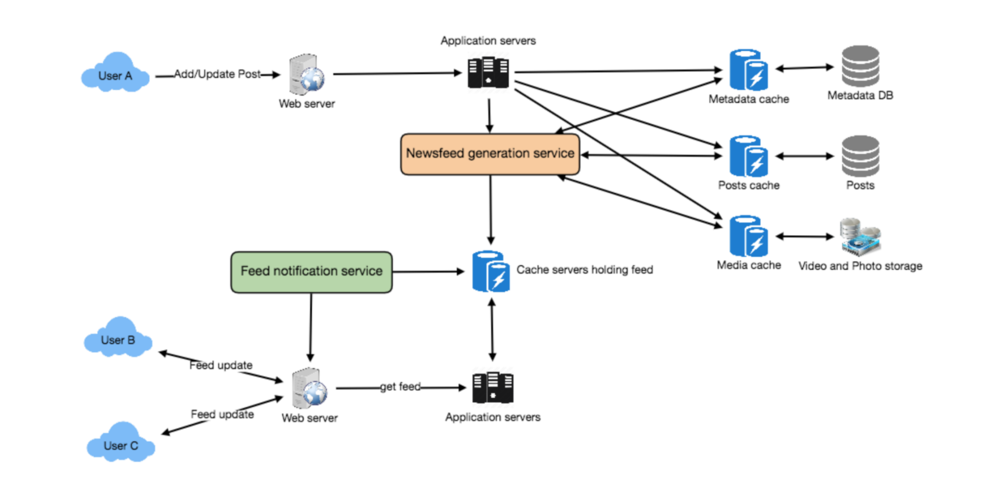

# 设计 Facebook 的新闻流

让我们设计Facebook的Newsfeed，它将包含来自用户关注的所有人和页面的帖子、照片、视频和状态更新。类似服务:Twitter Newsfeed, Instagram Newsfeed, Quora Newsfeed

## 1. Facebook的新闻推送是什么?

   Newsfeed是指Facebook主页中间不断更新的新闻列表。它包括状态更新、照片、视频、链接、应用程序活动以及用户在Facebook上关注的人、页面和群组的点赞。换句话说，它是一个完整的可滚动版本，汇集了你和你朋友的生活故事，包括照片、视频、地点、状态更新和其他活动。

   任何你设计的社交媒体网站——Twitter、Instagram或Facebook，你都需要某种新闻推送系统来显示来自朋友和追随者的更新。

## 2. 系统的需求和目标

   让我们按照以下要求为Facebook设计一个新闻提要:

   功能需求:

   1.Newsfeed将根据用户关注的人、页面和组的帖子生成。

   2.一个用户可能有很多朋友，并关注大量的页面组。

   3.提要可能包含图像、视频或只是文本。

   4.我们的服务应该支持添加新帖子，当他们到达，为所有活跃用户的新闻提要。

   非功能性需求:

   1.我们的系统应该能够在实时生成任何用户的新闻feed -最大延迟可以看到终端用户可以是2秒。

   2.假设有一个新的新闻提要请求，一个帖子到达用户提要的时间不应该超过5秒。

## 3. 容量估算与约束

   让我们假设一个用户平均有300个朋友，关注200个页面。

   流量估计:让我们假设每天有3亿活跃用户，每个用户平均每天获取5次时间线。这将导致每天15亿次的新闻订阅请求，即大约每秒17,500次请求。

   存储估计:我们假设，平均而言，我们需要在每个用户的提要中保存大约500篇文章，以便快速获取。我们还假设每个帖子的平均大小是1KB。这意味着我们需要为每个用户存储大约500KB的数据。为了为所有活动用户存储所有这些数据，我们需要150TB的内存。如果一个服务器可以容纳100GB，我们将需要大约1500台机器来为所有活动用户在内存中保存前500个帖子。

## 4. 系统api

   💡      一旦我们确定了需求，定义系统api总是一个好主意。这将明确地声明系统所期望的内容。

   我们可以使用SOAP或REST api来公开服务的功能。以下是获取新闻提要的API的定义:

   getUserFeed(api_dev_key, user_id, since_id, count, max_id, exclude_replies)

   Parameters:

   api_dev_key (string):注册帐户的API开发人员密钥。这可以用于根据用户分配的配额限制用户。

   user_id (number):系统将为其生成新闻提要的用户的ID。

   since_id(数量):可选的;返回ID大于(即最近)指定ID的结果。数(数量):可选的;指定要尝试和检索的提要条目的数量，每个不同的请求最多为200个。

   max_id(数量):可选的;返回ID小于(即大于)或等于指定ID的结果。

   exclude_replies(布尔):可选的;此参数将阻止回复出现在返回的时间线上。

   返回:(JSON)返回一个JSON对象，包含一个提要条目列表。

## 5. 数据库设计

   有三个基本对象:用户，实体(例如，页面，组等)和FeedItem(或Post)。以下是对这些实体之间关系的一些观察:

   ●用户可以关注实体，并与其他用户成为朋友。

   ●用户和实体都可以发布包含文本、图像或视频的FeedItems。

   ●每个FeedItem都有一个UserID，用来指向创建它的用户。为了简单起见，我们假设只有用户可以创建提要条目，尽管在Facebook上，Pages也可以发布提要条目。

   ●每个FeedItem都可以有一个EntityID来指向创建该帖子的页面或组。

   如果我们使用关系数据库，我们需要建模两个关系:User-Entity关系和FeedItem-Media关系。由于每个用户可以与许多人成为朋友，并关注许多实体，所以我们可以将这种关系存储在一个单独的表中。“UserFollow”中的“Type”列标识被跟踪的实体是用户还是实体。类似地，我们可以为FeedMedia关系创建一个表。

## 6. 高级系统设计

   在较高的层次上，这个问题可以分为两个部分:

   提要生成:新闻提要是由用户所关注的用户和实体(页面和组)的帖子(或提要条目)生成的。因此，当我们的系统接收到一个请求来为用户(比如Jane)生成提要时，我们将执行以下步骤:

   1.检索Jane跟踪的所有用户和实体的id。

   2.为这些id检索最新、最受欢迎和相关的帖子。这些是我们可以在简的新闻推送中显示的潜在帖子。

   3.根据与简的相关性对这些帖子进行排序。这代表简的当前状态。

   4.将此提要存储在缓存中，并返回Jane的提要上要呈现的顶级文章(比如20篇)。

   5.在前端，当Jane到达其当前提要的末尾时，她可以从服务器获取接下来的20篇文章，以此类推。

   这里需要注意的一点是，我们只生成了一次提要，并将其存储在缓存中。那简关注的人发布的新帖子呢?如果Jane在线，我们应该有一个机制来排名并将这些新帖子添加到她的feed中。我们可以周期性地(比如每五分钟)执行上述步骤，对更新的帖子进行排名并添加到她的提要中。然后，Jane会被告知她的提要中有可以获取的新条目。

   提要发布:每当Jane加载她的新闻提要页面时，她必须从服务器请求和拉取提要条目。当她到达当前提要的末尾时，她可以从服务器提取更多的数据。对于更新的条目，要么服务器通知Jane，然后她就可以进行拉取，要么服务器推送这些新帖子。稍后我们将详细讨论这些选项。

   在高层次上，我们需要以下组件在我们的新闻提要服务:

   1.Web服务器:用于维护与用户的连接。此连接将用于在用户和服务器之间传输数据。

   2.应用程序服务器:执行在数据库服务器中存储新职位的工作流。我们还需要一些应用服务器来检索新闻提要并将其推送给最终用户。

   3.元数据数据库和缓存:用于存储用户、页面和组的元数据。

   4.Posts database and cache:用于存储关于Posts及其内容的元数据。

   5.视频和照片存储，以及缓存:Blob存储，用来存储帖子中包含的所有媒体。

   6.新闻feed生成服务:为用户收集和排名所有相关的帖子生成新闻feed并存储在缓存中。该服务还将接收实时更新，并将这些更新的提要条目添加到任何用户的时间轴上。

   7.提要通知服务:通知用户有可供其新闻提要使用的新条目。

   下面是我们系统的高层架构图。用户B和用户C在用户A的后面。

Facebook文章架构

## 7. 详细的组件设计

   让我们详细讨论系统的不同组件

   a. Feed generation

   让我们以新闻feed生成服务为例，从Jane关注的所有用户和实体获取最新的帖子;这个查询看起来像这样:

以下是feed生成服务的设计问题:

1.对于有很多朋友关注的用户来说，这是非常慢的，因为我们必须对大量的帖子进行排序和排名。

2.当用户加载他们的页面时，我们生成时间轴。这将会非常慢并且有很高的延迟。

3.对于实时更新，每个状态更新将导致所有追随者的feed更新。这可能会导致我们的新闻feed代服务的大量积压。

4.对于实时更新，服务器向用户推送(或通知)新的帖子可能会导致非常沉重的负载，特别是对于有很多追随者的人或页面。为了提高效率，我们可以预先生成时间轴并将其存储在内存中。

离线生成新闻提要:我们可以使用专门的服务器持续生成用户的新闻提要，并将其存储在内存中。因此，每当用户为他们的提要请求新文章时，我们可以简单地从预先生成的存储位置提供它。使用该方案时，用户的新闻提要不是在加载时编译的，而是定期编译，并在用户请求时返回给他们。

每当这些服务器需要为某个用户生成提要时，它们首先会查询该用户最后一次生成提要的时间。然后，从那时起将产生新的饲料数据。我们可以将这些数据存储在一个哈希表中，其中“key”是UserID，“value”是一个STRUCT，如下所示:

我们可以将feeditemid存储在一个Linked HashMap中，这将使我们不仅可以跳转到任何提要条目，而且还可以轻松地遍历该映射。每当用户想要获取更多的提要条目时，他们可以发送他们当前在他们的新闻提要中看到的最后一个FeedItemID，然后我们可以跳转到链接哈希映射中的那个FeedItemID，并从那里返回下一批提要条目的页面。

我们应该在内存中为用户的提要存储多少提要条目?最初，我们可以决定为每个用户存储500个提要条目，但是这个数字稍后可以根据使用模式进行调整。例如，假设用户提要的一个页面有20篇文章，而大多数用户从不浏览超过10页的提要，那么我们可以决定每个用户只存储200篇文章。对于任何用户，谁想看到更多的帖子(比存储在内存)，我们总是可以查询后端服务器。

我们应该为所有用户生成(并保存在内存中)新闻提要吗?会有很多用户不经常登录。这里有一些我们可以做的事情来处理这个。一种更简单的方法是使用基于LRU的缓存，它可以从内存中删除长时间没有访问他们的新闻提要的用户。一个更智能的解决方案可以找出用户的登录模式来预先生成他们的新闻feed，例如，用户在一天中的什么时间是活跃的?用户在一周的哪几天访问他们的新闻提要?等。

现在，让我们在下一节中讨论“实时更新”问题的一些解决方案。

b.	动态信息 发布

将一个帖子推送给所有关注者的过程称为扇出。通过类比，推方法称为fanout-on-write，而拉方法称为fanout-on-load。让我们讨论向用户发布提要数据的不同选项。

1.“Pull”模型或扇出加载:该方法涉及将所有最近的提要数据保存在内存中，以便用户可以在需要时从服务器提取这些数据。客户端可以定期或在需要时手动提取提要数据。这种方法可能的问题是一个新数据可能不会显示给用户,直到他们发出请求,b)很难找到合适的节奏,因为大多数的时间拉请求将导致一个空响应如果没有新数据,造成资源浪费。

2.“推送”模式或“写后扇出”:对于一个推送系统，一旦用户发布了一篇文章，我们就可以立即将这篇文章推送给她的所有关注者。这样做的好处是，当你抓取feed时，你不需要浏览你的好友列表，然后为每个好友获取feed。它显著减少了读操作。为了有效地管理这一点，用户必须与服务器维护一个Long Poll请求来接收更新。这种方法可能存在的一个问题是，当用户有数百万粉丝(或名人用户)时，服务器必须向很多人推送更新。

3.混合:处理提要数据的另一种有趣的方法是使用混合方法，即结合扇出-写和扇出-载。具体来说，我们可以停止推送来自粉丝数量高的用户(名人用户)的帖子，只推送那些拥有数百(或数千)粉丝的用户的数据。对于名人用户，我们可以让关注者删除更新。因为推送操作对于那些有很多朋友或粉丝的用户来说是非常昂贵的，所以通过为他们禁用fanout，我们可以节省大量的资源。另一种方法是，一旦用户发布了一篇帖子;我们可以限制粉丝只能是她的网友。此外，为了从这两种方法中获益，将推送通知和拉取结合起来为终端用户服务是一种很好的方法。单纯的推拉模式是不太通用的。

在每个请求中，我们可以向客户机返回多少提要条目?对于用户可以在一个请求中获取的条目数量，我们应该有一个最大限制(比如20个)。但是我们应该让客户端选择他们想要的每个请求的提要条目的数量，因为用户可能会根据设备(移动vs桌面)获取不同数量的帖子。

我们是否应该总是通知用户，如果他们的新闻提要有新的帖子可用?每当有新数据可用时，通知用户是很有用的。然而，在数据使用相对昂贵的移动设备上，它可能会消耗不必要的带宽。因此，至少对于移动设备来说，我们可以选择不推送数据，而是让用户“拉刷新”来获得新帖子。

## 8. 动态消息排名

   在新闻提要中，最直接的方法是根据帖子的创建时间来排名。但如今的排名算法所做的远远不止于此，它要确保“重要”职位的排名更高。排名的高级理念是，首先选择关键的“信号”，使一个帖子的重要性，然后考虑如何将它们结合起来，计算出最终的排名分数。

   更具体地说，我们可以选择与任何提要条目重要性相关的功能，例如:点赞数、评论、分享、更新时间、帖子是否有图片或视频等，然后使用这些功能计算出分数。这对于一个简单的排名系统来说已经足够了。一个更好的排名系统可以通过不断评估我们在用户粘性、留存率和广告收益等方面的进展而显著提升自己。

## 9. 数据分区

   a. 分片帖子和元数据

   由于我们每天都有大量的新帖子，我们的读负载也非常高，我们需要将我们的数据分布到多个机器上，这样我们可以有效地读写它。对于存储帖子及其元数据的数据库，我们可以采用设计Twitter中讨论的类似设计。

   b.	分片动态数据

   对于存储在内存中的提要数据，我们可以根据UserID对其进行分区。我们可以尝试将用户的所有数据存储在一台服务器上。在存储时，我们可以将UserID传递给我们的哈希函数，该函数将把用户映射到一个缓存服务器，在那里我们将存储用户的提要对象。另外，对于任何给定的用户，因为我们不希望存储超过500个feeditmeid，所以我们不会遇到用户的feed数据在单个服务器上无法容纳的情况。要获取用户的提要，我们总是必须只查询一个服务器。对于未来的增长和复制，我们必须使用一致的哈希。
