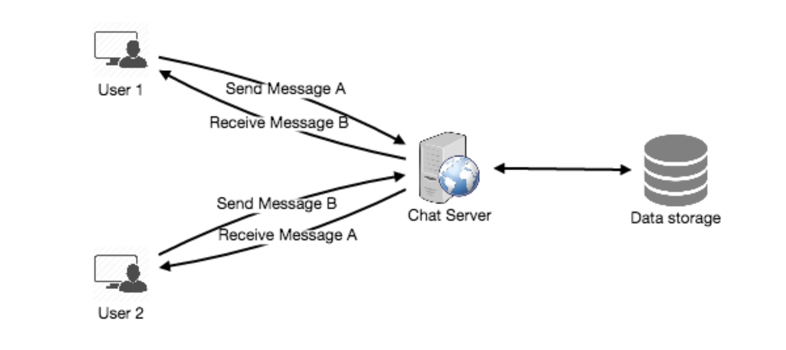
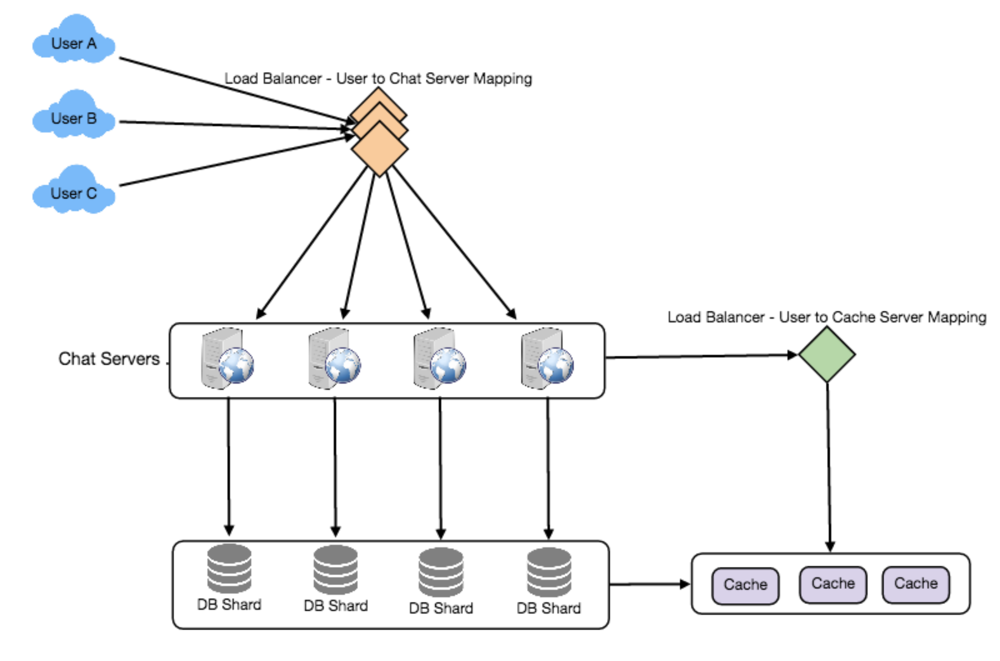

# 设计Fackbook Messager

让我们设计一个像Facebook Messenger这样的即时通讯服务，用户可以通过网络和移动界面互相发送短信。

## 1. 什么是Facebook Messenger?

   Facebook Messenger是一个向用户提供基于文本的即时通讯服务的软件应用程序。Messenger用户可以通过手机和网站与他们的Facebook好友聊天。

## 2. 系统的需求和目标

   我们的信使应满足以下要求:

   功能需求:

   1.Messenger应该支持用户之间的一对一对话。

   2.Messenger应该跟踪其用户的线上线下状态。

   3.Messenger应该支持聊天历史的持久存储。

   非功能性需求:

   1.用户应该有实时聊天体验，以最小的延迟。

   2.我们的系统应该高度一致;用户应该能够在他们所有的设备上看到相同的聊天历史。

   3.Messenger的高可用性是可取的;为了一致性，我们可以容忍较低的可用性。

   扩展要求:

   ●群组聊天:Messenger应该支持多人在群组中互相交谈。

   ●推送通知:当用户离线时，Messenger应该能够通知用户有新消息。

## 3. 容量估算与约束

   假设我们有5亿日活跃用户，平均每个用户每天发送40条消息;这每天给我们200亿条信息。

   存储估计: 让我们假设一条消息平均为100字节，所以为了存储一天的所有消息，我们需要2TB的存储空间。

   20 billion messages * 100 bytes => 2 TB/day

   虽然facebook messenger存储了所有之前的聊天记录，但仅为估计保存5年的聊天历史，我们需要3.6 pb的存储。

   2 TB * 365 days * 5 years ~= 3.6 PB

   除了聊天消息外，我们还需要存储用户信息、消息元数据(ID、时间戳等)。此外，上述计算没有考虑到数据压缩和复制。

   带宽估计: 如果我们的服务每天获得2TB的数据，这将给我们每秒钟25MB的传入数据。

   2 TB / 86400 sec ~= 25 MB/s

   由于每个传入的消息都需要发送给另一个用户，因此上传和下载都需要25mb的带宽。

   High level estimates:

 |  Total messages	|20 billion per day|
|:---|:---|
 |  Storage for each day	|2TB|
   |Storage for 5 years|	3.6PB|
   |Incomming data	|25MB/s|
   |Outgoing data	|25MB/s|

## 4. 高水平设计

   在高层次上，我们将需要一个聊天服务器，它将成为协调用户之间所有通信的中心部件。当一个用户想要向另一个用户发送消息时，他们会连接到聊天服务器并将消息发送到服务器;然后服务器将该消息传递给其他用户，并将其存储在数据库中。

详细的工作流如下所示:

1.用户a通过聊天服务器向用户b发送消息。

2.服务器接收到消息并向User-A发送确认信息。

3.服务器将消息存储在数据库中，并将消息发送给User-B。

4.用户b收到消息后，向服务器发送确认信息。

5.服务器通知User-A消息已成功传递给User-B。

发送消息的请求流

## 5. 详细的组件设计

   让我们首先尝试构建一个简单的解决方案，其中所有内容都运行在一台服务器上。在高层次上，我们的系统需要处理以下用例:

   1.接收传入的消息并传递传出的消息。

   2.从数据库中存储和检索消息。

   3.记录哪些用户在线或已经离线，并将这些状态变化通知所有相关用户。

   让我们逐一讨论这些场景:

   一个消息处理。

   我们如何有效地发送接收消息? 要发送消息，用户需要连接到服务器并为其他用户发送消息。要从服务器获取消息，用户有两个选项:

   1.Pull model: 用户可以定期询问服务器是否有新的消息。

   2.Push model: 用户可以保持与服务器的连接打开，并且可以依赖于服务器在有新消息时通知他们。

   如果我们使用第一种方法，那么服务器需要跟踪仍在等待传递的消息，只要接收用户连接到服务器请求任何新消息，服务器就可以返回所有挂起的消息。为了减少用户的延迟，他们必须非常频繁地检查服务器，如果没有挂起的消息，大多数时间他们将得到空响应。这将浪费大量资源，并不是一个有效的解决方案。

   如果我们采用第二种方法，即所有活动用户都保持与服务器的连接打开，那么只要服务器收到消息，它就可以立即将消息传递给预期的用户。通过这种方式，服务器不需要跟踪挂起的消息，并且我们将拥有最小的延迟，因为消息是在打开的连接上立即传递的。

   客户端如何保持与服务器的开放连接?我们可以使用HTTP长轮询或WebSockets。在长轮询中，客户端可以期望服务器不会立即响应，从而向服务器请求信息。如果服务器在接收到轮询时没有为客户端提供新数据，那么服务器不会发送空响应，而是打开请求并等待响应信息可用。一旦有了新信息，服务器立即向客户端发送响应，完成打开的请求。在收到服务器响应后，客户端可以立即发出另一个服务器请求以进行未来的更新。这大大提高了延迟、吞吐量和性能。长轮询请求可能超时或接收到与服务器的断开连接，在这种情况下，客户端必须打开一个新请求。

   服务器如何跟踪所有打开的连接，以便有效地将消息重定向到用户? 服务器可以维护一个哈希表，其中“key”是UserID，“value”是连接对象。因此，每当服务器接收到用户的消息时，它就会在哈希表中查找该用户以找到连接对象，并在打开的请求上发送消息。

   当服务器收到下线用户的消息时，会发生什么? 如果接收方已断开连接，服务器可以通知发送方发送失败。如果这是一个临时的断开，例如，接收者的长轮询请求刚刚超时，那么我们应该期待用户重新连接。在这种情况下，我们可以要求发送方重试发送消息。这个重试可以嵌入到客户机的逻辑中，这样用户就不必重新输入消息。服务器还可以将消息存储一段时间，并在接收方重新连接后重试发送。

   我们需要多少聊天服务器? 让我们随时为5亿次连接做计划。假设现代服务器可以在任何时候处理50K并发连接，那么我们将需要10K这样的服务器。

   如何知道哪个服务器持有与哪个用户的连接? 我们可以在聊天服务器前引入软件负载均衡器;可以将每个UserID映射到服务器以重定向请求。

   服务器应该如何处理“传递消息”请求? 服务器收到新消息后需要做如下操作:1)将消息存储在数据库中2)将消息发送给接收方3)向发送方发送确认。

   聊天服务器将首先找到为接收者保存连接的服务器，并将消息传递给该服务器，以将其发送给接收者。然后，聊天服务器可以向发送者发送确认;我们不需要等待将消息存储到数据库中;这可以在后台发生。下一节将讨论消息的存储。

   信使如何维护消息的排序? 我们可以为每条消息存储一个时间戳，这将是服务器接收到消息的时间。但这仍然不能确保客户端消息的正确顺序。服务器的时间戳不能确定消息的确切顺序的情况如下:

   1.User-1向User-2的服务器发送消息M1。

   2.服务器接收到T1的M1。

   3.同时，User-2为User-1向服务器发送消息M2。

   4.服务器在T2接收到消息M2，即T2 > T1。

   5.服务器向User-2发送消息M1，向User-1发送消息M2。

   所以用户-1会先看到M1，然后是M2，而用户-2会先看到M2，然后是M1。

   要解决这个问题，我们需要为每个客户机的每个消息保留一个序列号。这个序列号将确定每个用户消息的确切顺序。使用此解决方案，两个客户端都将看到不同的消息序列视图，但该视图在所有设备上都是一致的。

   b.从数据库中存储和检索消息

   每当聊天服务器收到一条新消息时，它都需要将其存储在数据库中。为此，我们有两个选择:

   1.启动一个单独的线程，该线程将与数据库一起存储消息。

   2.向数据库发送异步请求来存储消息。

   在设计数据库时，我们必须牢记以下几点:

   1.如何有效地使用数据库连接池。

   2.如何重试失败的请求?

   3.在哪里记录那些即使在某些重试后仍然失败的请求?

   4.当问题解决后，如何重试这些记录的请求(重试后失败)?

   我们应该使用哪种存储系统? 我们需要一个能够支持非常高速率的小更新的数据库，并且能够快速获取一系列记录。这是必需的，因为我们有大量的小消息需要插入到数据库中，而在查询时，用户最感兴趣的是以顺序的方式访问这些消息。

   我们不能使用像MySQL那样的RDBMS或像MongoDB那样的NoSQL，因为我们不能承受每次用户收到消息时从数据库中读取一行。这不仅会使我们的服务的基本操作在高延迟的情况下运行，而且还会对数据库造成巨大的负载。

   像HBase这样的宽列数据库解决方案可以很容易地满足我们的这两个需求。HBase是一个面向列的键值NoSQL数据库，可以将一个键的多个值存储到多个列中。HBase模仿谷歌的BigTable，运行在HDFS (Hadoop Distributed File System)之上。HBase组数据一起存储新数据在内存缓冲区和缓冲区满后,它将数据转储到磁盘的存储方式不仅有助于快速存储很多小数据,而且获取的行键或扫描的行范围。HBase也是一个存储可变大小数据的高效数据库，这也是我们的服务所需要的。

   客户端如何有效地从服务器获取数据?客户端在从服务器获取数据时应该分页。页面大小对于不同的客户端可能是不同的，例如，手机有更小的屏幕，所以我们需要更少的消息对话在视口中。

   c. 管理用户状态

   我们需要跟踪用户的在线离线状态，并在状态发生变化时通知所有相关用户。因为我们在服务器上为所有活动用户维护一个连接对象，所以我们可以很容易地从中找出用户的当前状态。在任何时候都有5亿活跃用户的情况下，如果我们必须向所有相关的活跃用户广播每个状态变化，将消耗大量的资源。我们可以对此进行以下优化:

   1.当客户端启动应用程序时，它可以在他们的朋友列表中获取所有用户的当前状态。

   2.每当用户向另一个脱机的用户发送消息时，我们可以向发送方发送一个失败消息，并在客户机上更新状态。

   3.每当用户联机时，服务器总是可以延迟几秒钟广播该状态，以查看用户是否不会立即下线。

   4.客户端可以从服务器中获取那些在用户视图中显示的用户的状态。这应该不是一个频繁的操作，因为服务器正在广播用户的在线状态，我们可以忍受用户的陈旧的离线状态一段时间。

   5.每当客户端与另一个用户开始一个新的聊天时，我们可以拉出当时的状态。

Facebook messenger的详细组件设计

设计概要: 客户端打开一个连接到聊天服务器发送消息;然后服务器将它传递给请求的用户。所有活动用户将保持与服务器的连接，以接收消息。每当有新消息到达时，聊天服务器将把它推送给长轮询请求的接收用户。消息可以存储在HBase中，支持快速的小更新和基于范围的搜索。服务器可以将用户的在线状态广播给其他相关用户。客户端可以为那些在客户端视口中不常见的用户获取状态更新。

## 6. 数据分区

   由于我们将存储大量的数据(3.6PB 5年)，我们需要将其分布到多个数据库服务器上。我们的划分方案是什么?

   基于UserID的分区: 假设我们基于UserID的哈希进行分区，这样我们就可以将一个用户的所有消息保存在同一个数据库中。如果一个DB shard是4TB，我们将拥有“3.6PB4TB ~= 900”5年的shard。为了简单起见，我们假设我们保留1K个碎片。因此，我们将通过“hash(UserID) % 1000”找到分片编号，然后存储从那里获取数据。这个分区方案也可以非常快速地获取任何用户的聊天记录。

   一开始，我们可以使用较少的数据库服务器，在一个物理服务器上驻留多个碎片。因为我们可以在一台服务器上有多个数据库实例，所以我们可以很容易地在一台服务器上存储多个分区。我们的哈希函数需要理解这个逻辑分区方案，以便能够在一个物理服务器上映射多个逻辑分区。

   由于我们将存储无限的消息历史，我们可以从大量的逻辑分区开始，这些分区将映射到更少的物理服务器，随着存储需求的增加，我们可以添加更多的物理服务器来分发我们的逻辑分区。

   基于MessageID的分区: 如果我们将一个用户的不同消息存储在单独的数据库shard上，那么获取一个聊天的一系列消息将会非常慢，所以我们不应该采用这种方案。

## 7. 缓存

   我们可以缓存一些最近的消息(比如最近的15)在用户的视图(比如最近的5)。因为我们决定将所有用户的消息存储在一个分片上，一个用户的缓存应该完全驻留在一台机器上。

## 8. 负载均衡

   我们需要在聊天服务器前安装一个负载均衡器;它可以将每个UserID映射到保存用户连接的服务器，然后将请求定向到该服务器。类似地，我们的缓存服务器也需要一个负载均衡器。

## 9. 容错和复制

   当聊天服务器失败时会发生什么?我们的聊天服务器与用户保持连接。如果服务器宕机，我们是否应该设计一种机制将这些连接传输到其他服务器?将TCP连接故障转移到其他服务器是非常困难的;更简单的方法是在连接丢失时让客户端自动重新连接。

   我们是否应该存储多个用户消息副本?我们不能只有用户数据的一个副本，因为如果保存数据的服务器崩溃或永久关闭，我们没有任何机制来恢复这些数据。为此，我们要么必须在不同的服务器上存储多个数据副本，要么使用Reed-Solomon编码等技术来分发和复制数据。

## 10. 扩展需求

   a. 群聊

   我们可以在系统中拥有单独的群组聊天对象，这些对象可以存储在聊天服务器上。group-chat对象由GroupChatID标识，并将维护该聊天的成员的列表。我们的负载均衡器可以基于GroupChatID来指导每个组聊天消息，处理该组聊天的服务器可以遍历聊天的所有用户，以找到处理每个用户连接以传递消息的服务器。

   在数据库中，我们可以将所有组聊天存储在一个基于GroupChatID分区的单独表中。

   b. 推送通知

   在我们当前的设计中，用户只能向活动用户发送消息，如果接收用户离线，我们就向发送用户发送一个失败。推送通知将使我们的系统能够向离线用户发送消息。

   对于推送通知，每个用户都可以从他们的设备(或网络浏览器)中选择，每当有新的消息或事件时，就会收到通知。每个制造商都维护一组服务器来处理将这些通知推送给用户。

   要在我们的系统中有推送通知，我们需要设置一个通知服务器，它将为离线用户接收消息，并将它们发送到制造商的推送通知服务器，然后将它们发送到用户的设备。
