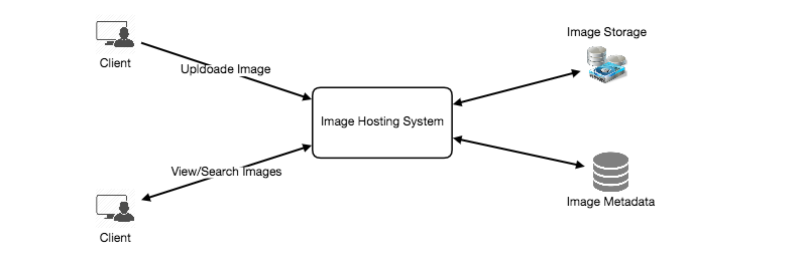
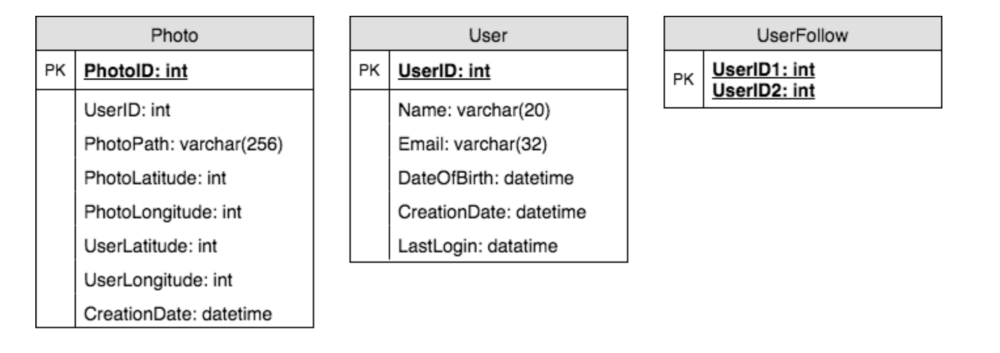
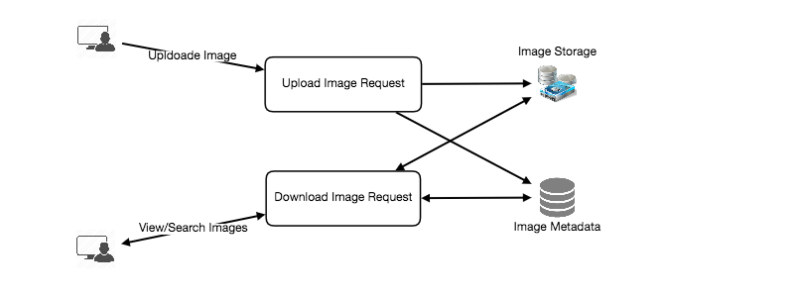
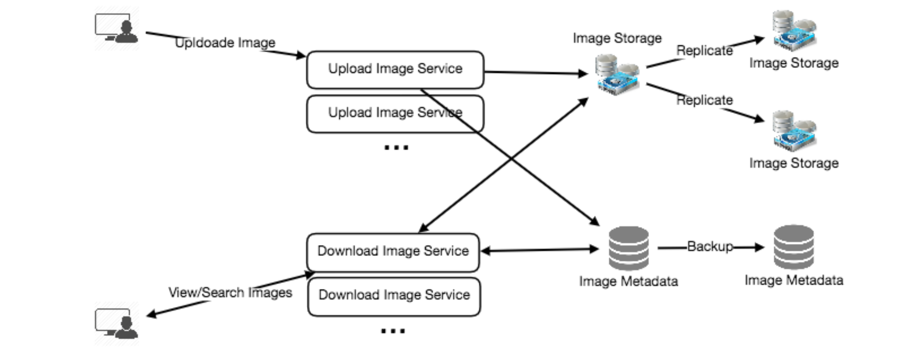

# 设计 Instagram

让我们设计一个照片分享服务，比如Instagram，用户可以上传照片与其他用户分享。类似服务:Flickr、picasa.com

## 1. Why Instagram?

   Instagram是一种社交网络服务，用户可以上传和分享自己的照片和视频。用户可以公开或私下分享，也可以通过许多其他社交网络平台(如Facebook、Twitter、Flickr和Tumblr)分享。

   为了这个练习，我们计划设计一个更简单的Instagram版本，用户可以分享照片，也可以关注其他用户。每个用户的时间线将包括来自该用户追随的所有人的顶级照片。

## 2. 系统的需求和目标

   在设计Instagram时，我们将重点关注以下一组要求:

###  功能需求

   1. 用户应该能够上传downloadview照片。

   2. 用户可以根据视频标题进行搜索。

   3. 用户可以关注其他用户。

   4. 该系统应该能够生成和显示用户的时间表，其中包括来自所有用户追随的人的顶级照片。

###   非功能性需求

   1. 我们的服务需要高可用性。

   2. 对于时间轴的生成，系统可接受的延迟为200ms。

   3. 一致性可能会受到打击(在可用性方面)，如果用户有一段时间没有看到照片，应该没有问题。

   4. 系统应高度可靠，任何上传的视频不应丢失。
   不在范围内: 给照片添加标签，在标签上搜索照片，评论照片，给照片加标签，关注谁，建议等。
      
## 3. 一些设计方面的考虑

   该系统的读取量很大，因此我们将重点构建一个能够快速检索照片的系统。

   1. 实际上，用户可以上传任意多的照片。在设计该系统时，有效的存储管理应该是一个关键因素。

   2. 在读取图像时，期望有较低的延迟。
      
   3. 数据应该是100%可靠的。如果用户上传了一个镜像，系统将保证它永远不会丢失。
      
   4. 容量估算与约束
    * 假设我们总共有3亿用户，其中有100万的日活跃用户。
   * 每天200万张新照片，每秒23张。
   * 平均照片文件大小=> 200kb
   * 总空间需要1天的照片
      
          2M * 200KB => 400 GB
   * 5年所需总空间:

   400GB * 365 (days a year) * 5 (years) ~= 712 TB

## 5. 高级系统设计

   在高层次上，我们需要支持两个场景，一个是上传照片，另一个是查看搜索照片。我们的服务需要一些块存储服务器来存储照片，也需要一些数据库服务器来存储关于照片的元数据信息。

## 6. 数据库模式

   💡      在面试的早期阶段定义DB模式将有助于理解不同组件之间的数据流，并在之后指导数据分区。

   我们需要存储用户的数据，他们上传的照片，以及他们关注的人。Photo table将存储所有与照片相关的数据，我们需要在(PhotoID, CreationDate)上有一个索引，因为我们需要首先获取最近的照片。

存储上述模式的一种简单方法是使用类似MySQL的RDBMS，因为我们需要连接。但是关系数据库也有其挑战，特别是当我们需要对它们进行扩展时。关于细节，请查看SQL和NoSQL。

我们可以将照片存储在像HDFS或S3这样的分布式文件存储中。

我们可以将上述模式存储在分布式键值存储中，以享受NoSQL提供的好处。所有与照片相关的元数据都可以放到一个表中，其中“key”是“PhotoID”，“value”是一个包含PhotoLocation, UserLocation, CreationTimestamp等的对象。

我们还需要存储用户和照片之间的关系，以知道谁拥有哪张照片。我们需要存储的另一个关系是用户关注的人的列表。对于这两个表，我们可以使用像Cassandra这样的宽列数据存储。对于' UserPhoto '表，' key '将是' UserID '， ' value '将是用户拥有的' photoid '列表，存储在不同的列。我们将为' UserFollow '表提供一个类似的方案。

通常，Cassandra或键值存储总是维护一定数量的副本以提供可靠性。此外，在这样的数据存储中，删除不会立即应用，数据在从系统中永久删除之前会保留某些天(以支持取消删除)。

## 7. 组件设计

   写或照片上传可能会很慢，因为它们必须进入磁盘，而读可能会更快，特别是当它们从缓存中提供服务时。

   上传用户可以消耗所有的连接，因为上传会是一个较慢的过程。这意味着，如果系统忙于处理所有的写请求，则无法为读服务。为了处理这个瓶颈，我们可以将读写分离到不同的服务中。由于web服务器有连接限制，我们应该在设计系统之前记住这一点。让我们假设一个web服务器在任何时候最多可以有500个连接，这意味着它不能有超过500个并发的上传或读取。这就指导我们使用单独的专用服务器进行读写操作，这样上传就不会占用系统。

   分离图像读和写请求也将允许我们独立地扩展或优化每个请求。

## 8. 可靠性和冗余

   我们的服务不允许丢失文件。因此，我们将存储每个文件的多个副本，这样，如果一个存储服务器失效，我们可以从另一个存储服务器上的另一个副本检索映像。

   同样的原则也适用于系统的其他组件。如果我们希望系统具有高可用性，我们需要在系统中运行多个服务副本。因此，如果一些服务停止，系统仍然可用并提供服务。冗余消除了系统中的单点故障。

   如果在任何时候只需要运行一个服务实例，我们可以运行该服务的冗余次要副本，该副本不为任何流量提供服务，但当主服务出现任何问题时，它可以在故障转移之后进行控制。

   在系统中创建冗余可以消除单点故障，并在危机需要时提供备份或备用功能。例如，如果同一个服务在生产环境中运行两个实例，其中一个出现故障或降级，系统可以将故障转移到健康的副本。故障转移可以自动发生，也可以需要人工干预。

## 9. 数据分片

   让我们讨论不同的元数据分片方案:

   假设我们基于UserID进行分片，这样我们就可以将一个用户的所有照片保存在同一个分片上。如果一个DB碎片是4TB，我们将有7124 => 178个碎片。让我们假设未来的增长是200个碎片。

   因此，我们将通过UserID % 200找到分片号，然后将数据存储在那里。为了在我们的系统中唯一地标识任何照片，我们可以给每个PhotoID附加shard number。

   我们如何生成photoid? 每个DB shard都可以有自己的PhotoID自增序列，因为我们会给每个PhotoID附加ShardID，所以它在整个系统中是唯一的。

   这个分区方案有什么不同的问题?

   1.我们如何处理热门用户?有几个人关注这些热门用户，他们上传的任何照片都会被很多人看到。

   2.一些用户会将大量的照片与其他用户进行比较，从而使存储分布不均匀。

   3.如果我们不能将一个用户的所有图片存储在一个分片上怎么办?如果我们将一个用户的照片分发到多个分片上，会导致更高的延迟吗?

   4.将用户的所有图片存储在一个分片上可能会导致一些问题，如如果该分片关闭，用户的所有数据都不可用，或者如果该分片服务于高负载，则会出现更高的延迟等。

   b. 基于PhotoID进行分区 如果我们可以先生成唯一的PhotoID，然后通过PhotoID % 200找到分片号，就可以解决以上问题。在这种情况下，我们不需要给ShardID附加PhotoID，因为PhotoID本身在整个系统中是唯一的。

   我们如何生成photoid? 在这里，我们不能在每个分片中使用一个自动递增的序列来定义PhotoID，因为我们需要首先使用PhotoID来找到它将存储在哪里的分片。一种解决方案是，我们专门使用一个单独的数据库实例来生成自动递增的id。如果我们的PhotoID可以容纳64位，我们可以定义一个只包含64位ID字段的表。每当我们想要在系统中添加照片时，我们可以在这个表中插入一个新行并将那个ID作为新照片的PhotoID。

   这个生成DB的键不是一个单点故障吗?是的，会的。解决这个问题的方法是，我们可以定义两个这样的数据库，一个生成偶数编号的id，另一个生成奇数编号的id。对于MySQL下面的脚本可以定义这样的序列:

   KeyGeneratingServer1:

   auto-increment-increment = 2

   auto-increment-offset = 1

   ​

   KeyGeneratingServer2:

   auto-increment-increment = 2

   auto-increment-offset = 2

   我们可以在这两个数据库前面放置一个负载均衡器，在它们之间进行轮询，并处理停机时间。这两个服务器可能会不同步，其中一个生成的密钥比另一个多，但这不会在我们的系统中造成任何问题。我们可以通过为user、Photo-Comments或系统中出现的其他对象定义单独的ID表来扩展这种设计。

   或者，我们可以实现一个密钥生成方案，类似于我们在设计一个URL缩短服务(如TinyURL)中讨论的那样。

   我们如何规划系统的未来发展?我们可以有大量的逻辑分区来容纳未来的数据增长，例如，在开始时，多个逻辑分区驻留在单个物理数据库服务器上。由于每个数据库服务器上可以有多个数据库实例，因此我们可以为任何服务器上的每个逻辑分区拥有单独的数据库。因此，当我们感觉到某个数据库服务器有大量数据时，我们可以将一些逻辑分区从它迁移到另一个服务器。我们可以维护一个配置文件(或一个独立的数据库)，它可以映射我们的逻辑分区到数据库服务器;这将使我们能够轻松地移动分区。每当我们想要移动一个分区时，我们只需要更新配置文件来宣布更改。

## 10. 排名和时间表生成
   要为任何给定的用户创建时间轴，我们需要获取该用户所关注的其他人的最新、最受欢迎和相关的照片。

   为了简单起见，假设我们需要为用户的时间轴获取前100张照片。我们的应用服务器将首先获取用户关注的人的列表，然后从每个用户获取最新的100张照片的元数据信息。在最后一步，服务器将把所有这些照片提交给我们的排名算法，该算法将确定前100张照片(基于最近，相似度等)返回给用户。这种方法的一个可能的问题是更高的延迟，因为我们必须查询多个表，并对结果执行排序合并排序。为了提高效率，我们可以预先生成时间轴并将其存储在一个单独的表中。

   预先生成时间轴:我们可以有专门的服务器，不断地生成用户的时间轴，并将它们存储在“UserTimeline”表中。因此，当任何用户需要最新的照片作为时间轴时，我们只需查询这个表并将结果返回给用户。

   当这些服务器需要生成用户的时间线时，它们将首先查询UserTimeline表，以查看最后一次为该用户生成时间线是什么时候。然后，从那个时间点开始将生成新的时间轴数据(按照上面提到的步骤)。
    向用户发送时间轴数据有哪些不同的方法?
1. Pull: 客户端可以定期或在需要时手动从服务器上提取时间轴数据。这种方法可能存在的问题是a)新数据可能不会显示给用户，直到客户端发出一个pull请求b)如果没有新数据，大多数情况下pull请求将导致空响应。
2. Push: 服务器可以在新数据可用时立即将其推送给用户。为了有效地管理这一点，用户必须与服务器维护一个Long Poll请求来接收更新。这种方法可能存在的一个问题是，当用户有很多粉丝或名人用户有数百万粉丝时;在这种情况下，服务器必须非常频繁地推送更新。
3. 混合的: 我们可以采用混合的方法。我们可以将所有关注量高的用户拉出模型，只推送几百(或几千)关注量高的用户。另一种方法是，服务器以一定的频率向所有用户推送更新，让拥有大量followupdates的用户定期拉取数据。
   关于时间轴生成的详细讨论可以参考《设计Facebook的Newsfeed》。
   
## 11. 使用分片数据创建时间轴
   要为任何给定的用户创建时间轴，最重要的要求之一是获取该用户所关注的所有人的最新照片。为此，我们需要有一个机制来在照片创建时对其进行排序。如果我们能使照片创建时间成为PhotoID的一部分，这可以有效地完成。因为我们在PhotoID上有一个主索引，所以找到最新的PhotoID会非常快。

   我们可以用epoch来表示。假设我们的PhotoID有两部分;第一部分将表示epoch秒，第二部分将是一个自动递增序列。因此，为了创建一个新的PhotoID，我们可以使用当前epoch时间，并从生成的键DB中添加一个自动递增的ID。我们可以从这个PhotoID (PhotoID % 200)计算出分片编号，并将照片存储在那里。

   我们的PhotoID的大小是多少? 假设我们的epoch时间从今天开始，我们需要多少比特来存储未来50年的秒数?

   86400 sec/day * 365 (days a year) * 50 (years) => 1.6 billion seconds

   我们需要31位来存储这个数字。因为平均来说，我们预计每秒会有23张新照片;我们可以分配9位来存储自动递增序列。每一秒我们可以存储(2^9 => 512)新照片。我们可以每秒钟重置自动递增序列。

   我们将在设计Twitter的“数据分片”一节中详细讨论这种技术。

## 12. 缓存和负载均衡

   为了服务全球分布的用户，我们的服务需要一个大规模的照片传输系统。我们的服务应该使用大量地理分布的照片缓存服务器，并使用cdn(详细信息请参见缓存)，将其内容推向更接近用户的地方。

   我们可以为元数据服务器引入缓存来缓存热数据库行。我们可以使用Memcache来缓存数据，在访问数据库之前应用服务器可以快速检查缓存是否有需要的行。最近最少使用(Least Recently Used, LRU)对于我们的系统来说是一个合理的缓存回收策略。在此策略下，我们首先丢弃最近最少查看的行。

   如何构建更智能的缓存? 如果我们遵循80-20法则，也就是说，照片的每日阅读量的20%会产生80%的流量，这意味着某些照片非常受欢迎，以至于大多数人都会阅读它们。这意味着我们可以尝试缓存每天读取的照片和元数据量的20%。
   