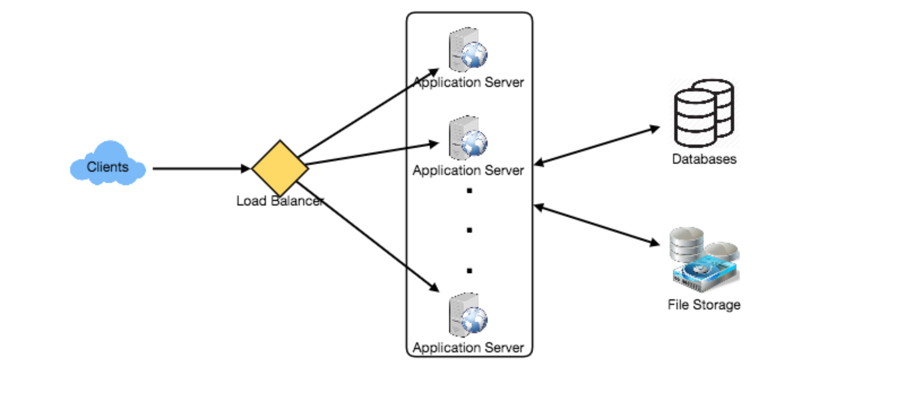
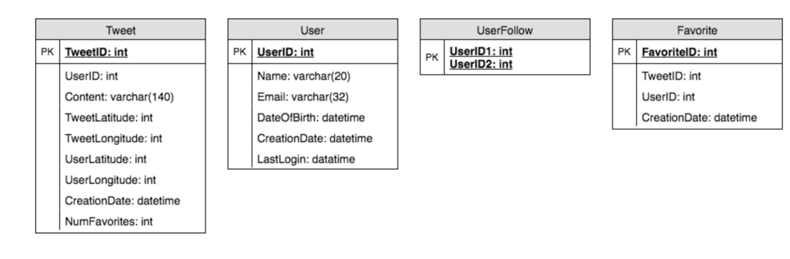
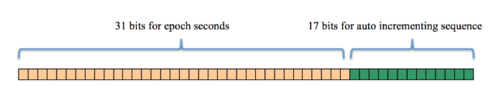
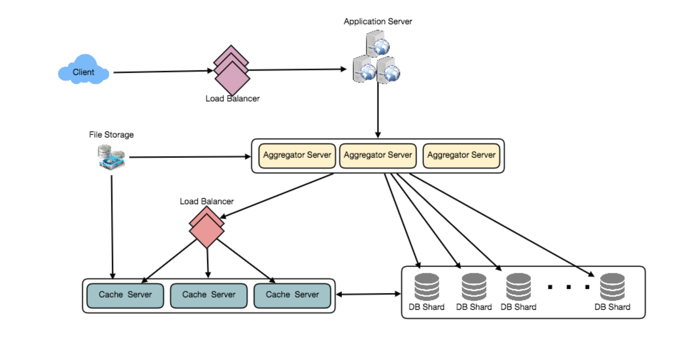

# 设计 Twitter

让我们设计一个类似Twitter的社交网络服务。该服务的用户将能够发布推文、关注他人以及喜爱的推文。难度:中等

## 1. 什么是Twitter?

   Twitter是一种在线社交网络服务，用户可以在这里发布和阅读140个字符的短消息，称为“tweets”。注册用户可以发布和阅读tweets，但未注册的用户只能阅读。用户通过他们的网站界面、短信或移动应用程序访问Twitter。

## 2. 系统的需求和目标

   我们将设计一个更简单的Twitter版本，要求如下:

   功能性需求

   1.用户应该能够发布新的推文。

   2.用户应该能够关注其他用户。

   3.用户应该能够将推文标记为“最爱”。

   4.该服务应该能够创建和显示用户的时间线，包括来自所有用户追随的人的top tweets。

   5.推文可以包含照片和视频。

   非功能性需求：

   1.我们的服务需要高可用性。

   2.对于时间轴的生成，系统可接受的延迟为200ms。

   3.一致性可能会受到打击(在可用性方面)，如果用户有一段时间没有看到一条tweet，应该没问题。

   扩展需求

   1.搜索推文.

   2.回复一条推特。

   3.热门话题-当前的热门话题搜索。

   4.其他用户标签。

   5.推文通知

   6.关注谁? 推荐？

   7.时刻

## 3. 容量估算与约束

   假设用户总数为10亿，日活跃用户(DAU)为2亿。此外，我们每天有1亿条新推文，平均每个用户关注200人。

   每天有多少个最爱?如果每个用户平均每天收藏5条推文，我们将得到:

   200M users * 5 favorites => 1B favorites

   我们的系统将产生多少tweet浏览?让我们假设一个用户平均每天访问自己的时间线2次，并且访问其他5个人的页面。如果用户看到20条推文，则每个页面显示一条推文，那么系统将生成的推文视图总数为:

   200M DAU * ((2 + 5) * 20 tweets) => 28B/day

   假设每个tweet有140个字符，我们需要两个字节来存储一个字符而不压缩。让我们假设我们需要30个字节来存储每个tweet的元数据(如ID、时间戳、用户ID等)。我们需要的总存储空间:

   100M * (280 + 30) bytes => 30GB/day

   我们五年的存储需要多少?我们需要多少存储空间来存储用户的数据?我们把这个留作练习。

   并不是所有的推文都有媒体，让我们假设平均每5条推文都有一张照片，每10条推文都有一个视频。我们还假设照片的平均大小是200KB，视频的平均大小是2MB。这将使我们每天拥有24TB的新媒体。

   (100M/5 photos * 200KB) + (100M/10 videos * 2MB) ~= 24TB/day

   由于每天的总接收量是24TB，这将转化为290MBsec。

   记住，我们每天有28B的推特浏览量。我们必须显示每条tweet的照片(如果它有照片)，但让我们假设用户在他们的时间轴上看到的每三个视频都观看。因此，总出口为:

   (28B * 280 bytes) / 86400s of text => 93MB/s

+ (28B/5 * 200KB ) / 86400s of photos => 13GB/S

+ (28B/10/3 * 2MB ) / 86400s of Videos => 22GB/s

  Total ~= 35GB/s

## 4. 系统APIs

   💡      一旦我们确定了需求，定义系统api总是一个好主意。这将明确地声明系统所期望的内容。

   我们可以使用SOAP或REST api来公开服务的功能。下面是发布新推文的API定义:

   tweet(api_dev_key, tweet_data, tweet_location, user_location, media_ids, maximum_results_to_return)

   参数:

   api_dev_key (string):注册帐户的API开发人员密钥。这将用于根据用户分配的配额限制用户。

   tweet_data (string): tweet的文本，通常不超过140个字符。

   tweet_location (string):该Tweet所指向的可选位置(经度，纬度)。user_location (string):添加tweet的用户的可选位置(经度、纬度)。

   media_ids (number[]):与Tweet关联的media_ids的可选列表。(所有媒体照片、视频等)需单独上传。

   返回值: (字符串)

   一个成功的帖子将返回访问该tweet的URL。否则，将返回一个适当的HTTP错误。

## 5. 高层系统设计

   我们需要一个能够有效存储所有新tweet的系统，100M86400s =>每秒1150条tweet，并能够读取28B86400s =>每秒325K条tweet。从需求可以清楚地看出，这将是一个读量很大的系统。

   在较高的层次上，我们需要多个应用服务器来为所有这些请求提供服务，而负载均衡器就在它们前面，用于流量分配。在后台，我们需要一个高效的数据库，它可以存储所有的新tweets，并支持大量的读取。我们还需要一些文件存储来存储照片和视频。

虽然我们预计每天的写负载是1亿，读负载是280亿。这意味着，我们的系统平均每秒将收到大约1160条新推文和325K个读请求。这个流量将在一天中分布不均匀，但是，在高峰时间，我们应该预计每秒至少有几千个写请求和大约1M个读请求。在设计系统架构时，我们应该记住这一点。

## 6.数据库模式

我们需要存储关于用户的数据，他们的推文，他们最喜欢的推文，以及他们关注的人。

要在SQL和NoSQL数据库中选择存储上述模式，请参见设计Instagram中的“数据库模式”。

## 7.数据分片

由于我们每天有大量的新推文，我们的读负载也非常高，我们需要将我们的数据分发到多个机器上，这样我们可以有效地读写它。我们有很多方法来分片数据;让我们一个一个来看看:

基于UserID的分片:我们可以尝试将用户的所有数据存储在一台服务器上。在存储时，我们可以将UserID传递给我们的哈希函数，该函数将把用户映射到数据库服务器，在那里我们将存储用户的所有tweets、收藏、关注等。当查询用户的tweetsfollowsfavorites时，我们可以询问哈希函数在哪里可以找到用户的数据，然后从那里读取数据。这种方法有几个问题:

1.如果用户变热门了怎么办?在容纳用户的服务器上可能有很多查询。这种高负载将影响我们的服务性能。

2.随着时间的推移，一些用户最终会存储大量的推文，或者与其他人相比拥有大量的追随者。保持用户数据的均匀分布是非常困难的。

为了从这些情况中恢复，我们要么必须重新分配数据，要么使用一致的哈希。

基于TweetID的分片:我们的哈希函数将每个TweetID映射到一个随机的服务器上，我们将在那里存储该Tweet。为了搜索tweet，我们必须查询所有的服务器，每个服务器将返回一组tweet。集中式服务器将聚合这些结果并将它们返回给用户。让我们看看时间轴生成的例子，以下是我们的系统生成用户时间轴的步骤数:

1.我们的应用服务器将找到用户关注的所有人。

2.应用服务器会将查询发送到所有数据库服务器，以查找这些人的推文。

3.每个数据库服务器将查找每个用户的tweets，根据最近次数对它们进行排序，并返回顶部的tweets。

4.应用服务器将合并所有的结果，并对它们再次排序，以返回顶部的结果给用户。

这种方法解决了热用户的问题，但与通过UserID进行分片相比，我们必须查询所有数据库分区才能找到用户的tweet，这可能导致更高的延迟。

通过在数据库服务器前引入缓存来存储热推文，我们可以进一步提高性能。

基于Tweet创建时间的分片:基于最近时间存储Tweet将使我们能够快速获取所有最热门的Tweet，并且我们只需要查询一个非常小的服务器集。但这里的问题是，流量负载将不会被分配，例如，在写入时，所有的新tweet将被发送到一个服务器，而其余的服务器将处于空闲状态。同样，在读取数据时，与保存旧数据的服务器相比，保存最新数据的服务器将具有非常高的负载。

如果我们可以通过TweedID和Tweet创建时间来结合分片呢?如果我们不单独存储tweet创建时间，而使用TweetID来反映它，我们可以从这两种方法中获得好处。通过这种方式，它将非常快速地找到最新的tweet。为此，我们必须让每个TweetID在我们的系统中都是唯一的，而且每个TweetID也应该包含时间戳。

我们可以用epoch来表示。假设我们的TweetID有两部分;第一部分将表示epoch秒，第二部分将是一个自动递增序列。因此，要创建一个新的TweetID，我们可以取当前epoch time并向其添加一个自动递增的数字。我们可以从这个TweetID求出分片编号并存储在那里。

TweetID的大小是多少呢?假设我们的epoch时间从今天开始，我们需要多少比特来存储未来50年的秒数?

86400 sec/day * 365 (days a year) * 50 (years) => 1.6B

我们需要31位来存储这个数字。因为我们平均期望每秒有1150条新tweet，我们可以分配17位来存储自动递增序列;这将使我们的TweetID长48位。所以，每一秒我们可以存储(2^17 => 130K)新的tweets。我们可以每秒钟重置自动递增序列。为了实现容错性和更好的性能，我们可以使用两个数据库服务器来为我们生成自动递增的键，一个生成偶数键，另一个生成奇数键。

If we assume our current epoch seconds are “1483228800”, our TweetID will look like this:

1483228800 000001

1483228800 000002

1483228800 000003

1483228800 000004

…

如果我们将TweetID设置为64位(8字节)长，我们可以轻松地将tweet存储100年，并以毫秒粒度存储它们。

## 8. 缓存

   我们可以为数据库服务器引入缓存，以缓存热门推文和用户。我们可以使用现成的解决方案，比如Memcache，它可以存储整个tweet对象。应用服务器在访问数据库之前可以快速检查缓存是否有所需的tweet。根据客户机的使用模式，我们可以确定需要多少缓存服务器。

   哪种缓存替换策略最适合我们的需求?当缓存已满时，我们想用更新更热的tweet替换一条tweet，我们该如何选择呢?最近最少使用(Least Recently Used, LRU)对于我们的系统来说是一个合理的策略。在这一政策下，我们首先删除最近浏览次数最少的推文。

   我们怎样才能有更多的智能缓存?如果我们遵循80-20规则，那就是20%的推文产生80%的阅读流量，这意味着某些推文非常受欢迎，以至于大多数人都会阅读它们。这意味着我们可以尝试从每个分片缓存20%的每日读量。

   如果我们缓存最新的数据呢?我们的服务可以从这种方法中受益。假设80%的用户只看到过去三天的推文;我们可以试着缓存过去三天的所有推文。假设我们有专门的缓存服务器来缓存过去三天所有用户的所有推文。如上所述，我们每天会收到1亿条新推文或30GB的新数据(不包括照片和视频)。如果我们想要存储过去三天的所有tweet，我们将需要少于100GB的内存。这些数据可以很容易地装入一台服务器，但我们应该将其复制到多个服务器上，以分发所有的读流量，以减少缓存服务器的负载。因此，每当我们生成一个用户的时间轴时，我们可以询问缓存服务器是否有该用户的所有最近的tweet，如果有，我们可以简单地从缓存返回所有数据。如果缓存中没有足够的tweets，我们必须查询后端来获取数据。在类似的设计中，我们可以尝试缓存过去三天的照片和视频。

   我们的缓存就像一个哈希表，其中“key”是“OwnerID”，“value”是一个双重链接的列表，包含了该用户在过去三天的所有推文。因为我们希望首先检索最近的数据，所以我们总是可以在链表的头部插入新的tweet，这意味着所有的旧tweet将在链表的尾部附近。因此，我们可以从尾部删除推文，为更新的推文腾出空间。

## 9. 时间线生成

   关于时间轴生成的详细讨论可以参考《设计Facebook的Newsfeed》。

## 10. 复制和容错

   由于系统的读取量很大，我们可以为每个DB分区使用多个辅助数据库服务器。辅助服务器将只用于读取流量。所有写操作将首先发送到主服务器，然后复制到辅助服务器。该方案还将提供容错功能，因为只要主服务器出现故障，我们就可以将故障转移到备用服务器。

## 11. 负载均衡

   我们可以在我们系统的三个地方添加负载均衡层:

   1)在客户机和应用服务器之间;

   2)在应用服务器和数据库复制服务器之间;

   3)在聚合服务器和缓存服务器之间。
   
最初，可以采用一种简单的轮询方法;它将传入的请求在服务器之间平均分配。这个LB实现起来很简单，而且不引入任何开销。这种方法的另一个好处是，如果服务器死亡，LB将把它从轮换中移除，并停止向它发送任何流量。Round Robin LB的一个问题是，它不会考虑服务器负载。如果服务器负载过重或运行缓慢，LB将不会停止向该服务器发送新请求。为了处理这个问题，可以放置一个更智能的LB解决方案，它可以周期性地查询后端服务器的负载，并据此调整流量。

## 12. 监控

   有能力监控我们的系统是至关重要的。我们应该不断收集数据，以便立即了解我们的系统是如何运行的。我们可以收集以下指标，以了解我们的服务表现:

   1.每天有新的推文，每天的峰值是多少?

   2.时间线发送统计，我们的服务每天发送多少tweet。

   3.用户刷新时间轴时看到的平均延迟。

   通过监控这些计数器，我们将意识到是否需要更多的复制、负载平衡或缓存等。

## 13. 扩展需求

   如何订阅服务? 从某人关注的人那里获得所有最新的推文，并按时间将它们合并排序。使用分页来获取显示tweet。只从某人追随的所有人那里获取前N条推文。这个N将依赖于客户端的Viewport，因为在移动端我们显示的tweet比Web客户端要少。我们还可以缓存下一个top tweets来加快速度。

   或者，我们可以预先生成feed来提高效率，详细信息请参见design Instagram的“排名和时间轴生成”。

   转发推特:对于数据库中的每个Tweet对象，我们可以存储原始Tweet的ID，而不存储此Retweet对象上的任何内容。

   热门话题:我们可以缓存最近N秒内最频繁出现的标签或搜索查询，并在每M秒后更新它们。我们可以根据推文、搜索查询、转发或喜欢的频率对热门话题进行排名。我们可以给予更多的重视，向更多的人展示的主题。

   关注谁?如何给出建议?这一功能将提高用户粘性。我们可以推荐某人关注的人的朋友。我们可以到下面两到三层去找名人提建议。我们可以优先考虑粉丝多的人。

   由于任何时候都只能提出一些建议，所以可以使用机器学习(ML)来洗牌和重新排序。ML信号可以包括最近有增加的追随者的人，如果另一个人在追随这个用户，共同的追随者，共同的位置或兴趣，等等。

   朋友圈:使用ML -监督学习或聚类，为不同的网站获取过去1到2小时的热门新闻，找出相关的推文，优先级，分类(新闻，支持，金融，娱乐等)。然后我们可以把这些文章在朋友圈中显示为热门话题。

   搜索:搜索包括对推文进行索引、排序和检索。类似的解决方案将在我们的下一个问题设计Twitter搜索中讨论。
