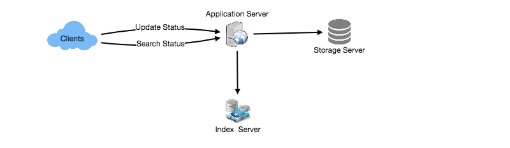
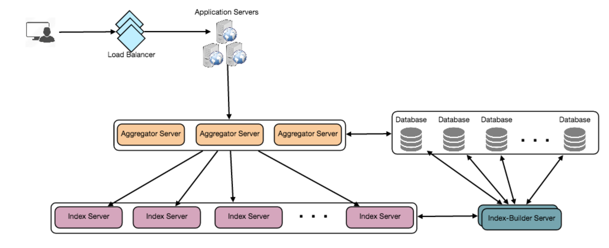

# 设计Twitter 搜索

Twitter是最大的社交网络服务之一，用户可以在这里分享照片、新闻和文本消息。在本章中，我们将设计一个可以存储和搜索用户tweets的服务。类似的问题:Tweet搜索。难度:中等

## 1. 什么是Twitter搜索?

   Twitter用户可以随时更新自己的状态。每个状态都由纯文本组成，我们的目标是设计一个允许搜索所有用户状态的系统。

## 2. 系统的需求和目标

   ●假设Twitter有15亿用户，每天有8亿活跃用户。

   ●Twitter平均每天有4亿条状态更新。

   ●状态的平均大小为300字节。

   ●让我们假设每天有5亿次搜索。

   ●搜索查询将由多个单词和ANDOR组合而成。

   我们需要设计一个能够高效存储和查询用户状态的系统。

## 3. 容量估算与约束

   存储容量:由于我们每天有4亿个新状态，每个状态平均为300字节，因此我们需要的总存储容量为:

   400M * 300 => 112GB/day

   每秒总存储容量:

   112GB / 86400 sec ~= 1.3MB/second

## 4. System APIs

   我们可以使用SOAP或REST api来公开服务的功能;以下是搜索API的定义:

   search(api_dev_key, search_terms, maximum_results_to_return, sort, page_token)

   Parameters:

   api_dev_key (string):注册帐户的API开发人员密钥。这将用于根据用户分配的配额限制用户。

   search_terms (string):包含搜索项的字符串。

   maximum_results_to_return (number):要返回的状态消息的数量。

   sort (number):可选排序方式:Latest first (0 - default)， Best matched (1)， Most likes(2)。

   page_token (string):这个令牌将在结果集中指定应该返回的页面。

   Returns: (JSON)

   一个JSON，包含与搜索查询匹配的状态消息列表的信息。每个结果条目可以有用户ID和名称、状态文本、状态ID、创建时间、喜欢的数量等。

## 5. 高水平设计

   在高层，我们需要将所有状态存储在数据库中，并构建一个索引来跟踪哪个单词出现在哪个状态中。这个索引将帮助我们快速找到用户试图搜索的状态。

Twitter搜索的高级设计

## 6. 详细的组件设计

1. 存储:我们每天需要存储112GB的新数据。对于如此庞大的数据量，我们需要提出一种数据分区方案，将其有效地分布到多个服务器上。如果我们计划未来五年，我们将需要以下的存储:

   112GB * 365days * 5 => 200 TB

   如果我们永远不想超过80%，我们将需要240TB。让我们假设我们希望为容错保留所有状态的额外副本，那么我们的总存储需求将是480 TB。如果我们假设一台现代服务器可以存储多达4TB的数据，那么我们将需要120台这样的服务器来存储未来5年所需的所有数据。

   让我们从一个简单的设计开始，在这个设计中，我们将状态存储在MySQL数据库中。我们可以假设将状态存储在一个有两列的表中，即StatusID和StatusText。假设我们基于StatusID对数据进行分区。如果我们的StatusID在系统范围内是唯一的，我们可以定义一个哈希函数，它可以将StatusID映射到存储服务器，在存储服务器上存储状态对象。

   如何创建系统范围内唯一的statusid ?如果我们每天有4亿个新状态，那么在5年里我们能期望有多少个状态对象?

   400M * 365 days * 5 years => 730 billion

   这意味着我们需要一个5字节的数字来唯一地标识statusid。假设我们有一个服务，它可以在需要存储对象时生成唯一的StatusID(我们将在后面详细讨论这个问题)。我们可以将StatusID提供给散列函数，以便找到存储服务器并将状态对象存储在那里。

2. 索引:我们的索引应该是什么样的?由于我们的状态查询将由单词组成，因此，让我们构建索引，它可以告诉我们哪个单词来自哪个状态对象。我们先来估计一下指数的大小。如果我们想为所有的英语单词和一些著名的名词(如人名、城市名等)建立索引，并且假设我们有大约30万个英语单词和20万个名词，那么我们的索引中总共会有50万个单词。让我们假设一个单词的平均长度是5个字符。如果我们将索引保存在内存中，我们将需要2.5MB的内存来存储所有的单词:

   500K * 5 => 2.5 MB

   让我们假设我们想在内存中为所有的状态对象保留索引，仅在过去两年。由于我们将在5年内获得730B状态对象，这将在两年内给我们292B状态消息。鉴于此，每个StatusID将是5个字节，我们需要多少内存来存储所有的StatusID ?

   292B * 5 => 1460 GB

   所以我们的索引就像一个大型的分布式哈希表，其中' key '是单词，而' value '是包含该单词的所有状态对象的statusid列表。假设平均每个状态有40个单词，因为我们不会索引介词和其他小词，如“the”，“an”，“and”等，让我们假设每个状态有大约15个单词需要索引。这意味着每个StatusID将在索引中存储15次。所以总内存将需要存储索引:

   (1460 * 15) + 2.5MB ~= 21 TB

   假设高端服务器有144GB内存，我们需要152台这样的服务器来保存索引。

   我们可以基于两个标准对数据进行分片:

   基于Words的分片:在构建索引时，我们将遍历某个状态的所有单词，并计算每个单词的哈希值，以找到它将被索引的服务器。要找到包含特定单词的所有状态，我们必须只查询包含该单词的服务器。

   对于这种方法，我们有几个问题:

   1.如果一个词变得炙手可热怎么办?在保存该单词的服务器上会有很多查询。这种高负载将影响我们的服务性能。

   2.随着时间的推移，与其他单词相比，一些单词最终会存储大量的statusid，因此，在状态增长时保持单词的统一分布非常困难。

   为了从这些情况中恢复，我们要么必须重新分区我们的数据，要么使用一致的哈希。

   基于状态对象的分片:在存储时，我们将把StatusID传递给散列函数，以查找服务器并索引该服务器上的所有状态单词。在查询特定单词时，我们必须查询所有服务器，每个服务器将返回一组statusid。集中式服务器将聚合这些结果并将它们返回给用户。

详细的组件设计

## 7. 容错

   当索引服务器失效时会发生什么?我们可以拥有每个服务器的辅助副本，如果主服务器死亡，它可以在故障转移后获得控制权。主服务器和辅助服务器都将拥有相同的索引副本。

   如果主服务器和辅助服务器同时死亡怎么办?我们必须分配一个新的服务器，并在上面重建相同的索引。我们怎么做呢?我们不知道这个服务器上保存了哪些文字状态。如果我们使用“基于状态对象的分片”，那么蛮力解决方案就是遍历整个数据库，并使用哈希函数过滤statusid，以找出将存储在该服务器上的所有必需的状态。这将是低效的，而且在服务器重建期间，我们将无法从它提供任何查询，从而错过了一些应该由用户看到的状态。

   如何有效地检索status和索引服务器之间的映射?我们必须构建一个反向索引，将所有StatusID映射到它们的索引服务器。我们的Index-Builder服务器可以保存这些信息。我们将需要构建一个Hashtable，其中“key”将是索引服务器号，“value”将是一个HashSet，包含所有保存在该索引服务器上的statusid。注意，我们将所有的statusid保存在一个HashSet中，这将使我们能够快速地从索引中删除statusid。因此，现在无论何时索引服务器必须重建自己，它都可以简单地向index - builder服务器请求它需要存储的所有状态，然后获取这些状态来构建索引。这种方法肯定是非常快的。我们还应该有一个Index-Builder服务器的副本，用于容错。

## 8. Cache

   为了处理热状态对象，我们可以在数据库前面引入缓存。我们可以使用Memcache，它可以在内存中存储所有这样的热状态对象。应用服务器在访问后端数据库之前可以快速检查缓存是否具有该状态对象。根据客户端的使用模式，我们可以调整需要多少缓存服务器。对于缓存退出策略，最近最少使用(Least Recently Used, LRU)似乎适合我们的系统。

## 9. 负载均衡

   我们可以在我们系统的两个地方添加负载均衡层1)在客户端和应用服务器之间，2)在应用服务器和后端服务器之间。最初，可以采用一种简单的轮询方法;将传入的请求平均分配到后端服务器。这个LB实现起来很简单，而且不引入任何开销。这种方法的另一个好处是，如果服务器死亡，LB将把它从轮换中移除，并停止向它发送任何流量。Round Robin LB的一个问题是，它不会考虑服务器负载。如果服务器负载过重或运行缓慢，LB将不会停止向该服务器发送新请求。为了处理这个问题，可以放置一个更智能的LB解决方案，它可以周期性地查询后端服务器的负载，并据此调整流量。

## 10. 排名

   如果我们想要根据社交图距离、受欢迎程度、相关性等对搜索结果进行排名呢?

   让我们假设我们想要根据受欢迎程度对状态进行排名，比如，一个状态得到了多少个赞或评论，等等。在这种情况下，我们的排名算法可以计算出一个“人气数字”(基于喜欢的数量等)，并将其存储在索引中。在将结果返回给聚合器服务器之前，每个分区可以根据这个流行度对结果进行排序。聚合器服务器将所有这些结果组合在一起，根据流行程度对它们进行排序，并将最热门的结果发送给用户。
