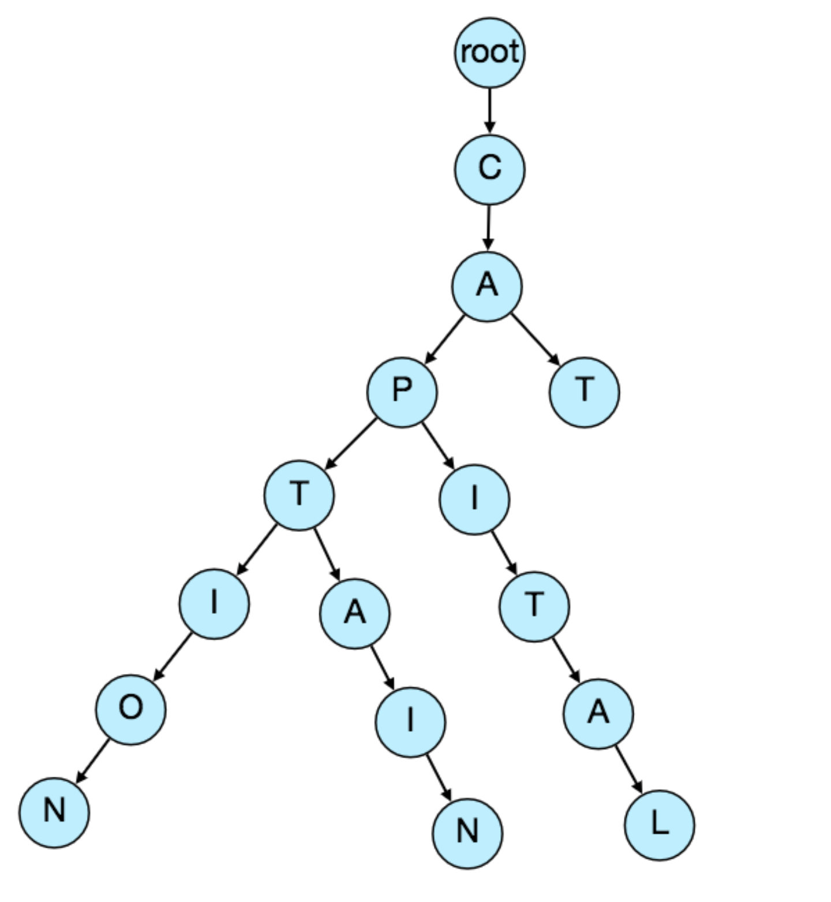
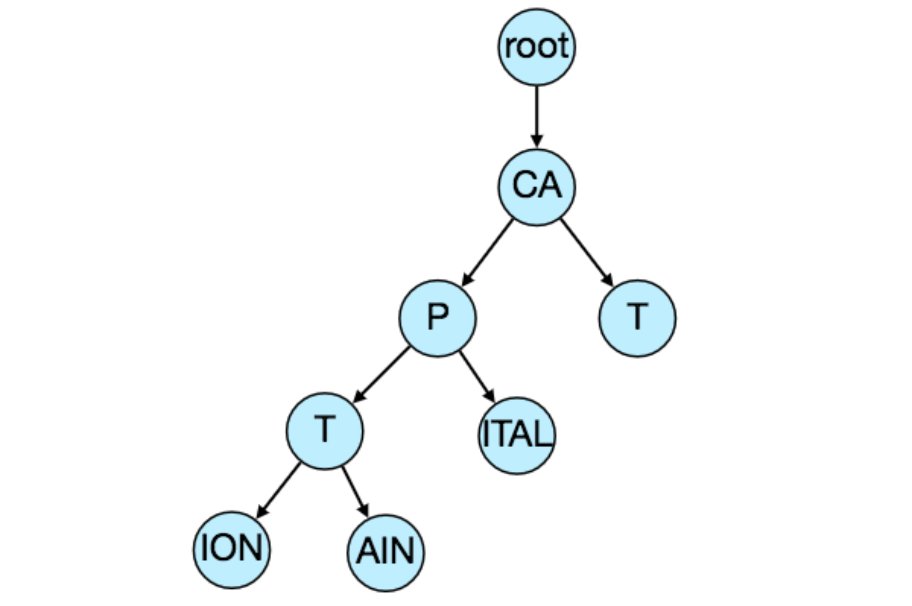
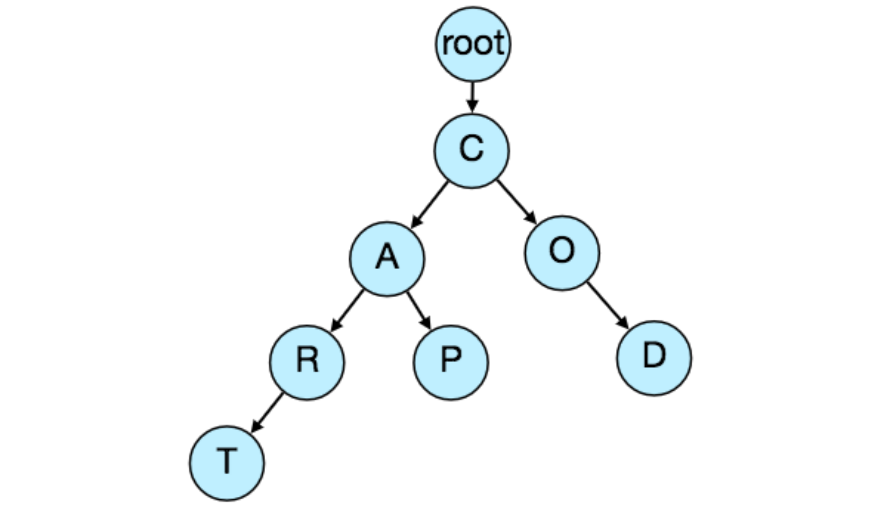

# 提前设计建议

让我们设计一个实时的建议服务，当用户输入文本进行搜索时，它就会向用户推荐词条。类似服务:自动提示，Typeahead搜索难度:中等

## 1. 什么是Typeahead建议?

   Typeahead建议使用户能够搜索已知的和经常搜索的词。当用户在搜索框中输入时，它会尝试根据用户输入的字符预测查询，并给出一个建议列表来完成查询。提前输入建议可以帮助用户更好地表达他们的搜索请求。这不是为了加快搜索过程，而是为了引导用户，帮助他们构建搜索查询。

## 2. 系统的需求和目标

   功能需求:当用户键入他们的查询时，我们的服务应该建议以用户键入的内容开头的前10个术语。

   非功能需求:建议应该实时显示。用户应该能够在200毫秒内看到建议。

## 3. 基本的系统设计和算法

   我们正在解决的问题是，我们需要以这样的方式存储大量的“字符串”，用户可以在任何前缀上进行搜索。我们的服务将建议下一个术语，将匹配给定的前缀。例如，如果我们的数据库包含以下术语:cap, cat, captain, capital;用户输入了“cap”，我们的系统会提示“cap”，“captain”和“capital”。

   由于我们必须以最小的延迟为大量查询提供服务，因此我们需要提出一种能够有效存储数据的方案，以便能够快速查询数据。我们不能依赖数据库;我们需要在内存中以高效的数据结构存储索引。

   可以满足我们的目的的最合适的数据结构之一是Trie(发音为“try”)。trie是一种树状数据结构，用于存储短语，其中每个节点按顺序存储短语的一个字符。例如，如果我们需要在trie中存储' cap, cat, caption, captain, capital '，它将看起来像:

现在，如果用户输入了' cap '，我们的服务可以遍历节点' P '，找到所有以这个前缀开头的术语(例如，cap, capital等)。

我们可以合并只有一个分支的节点，以节省存储空间。上面的trie可以这样存储:

我们应该使用不区分大小写的trie吗?为了简单和搜索用例，让我们假设我们的数据不区分大小写。

如何找到最佳建议?现在我们可以找到所有给定前缀的术语，那么我们如何知道我们应该建议的前10个术语呢?一个简单的解决方案是存储终止于每个节点的搜索计数，例如，如果用户搜索了大约‘CAPTAIN’100次和‘CAPTION’500次，我们可以存储这个数字与短语的最后一个字符。所以现在如果用户输入了“CAP”，我们知道前缀“CAP”下搜索最多的单词是“CAPTION”。给定一个前缀，我们可以遍历它下面的子树，找到最上面的建议。

给定一个前缀，它可以花多少时间来遍历它的子树?考虑到需要索引的数据量，我们应该会看到一个巨大的树。甚至，遍历一个子树也会花费很长时间，例如，短语“系统设计面试问题”有30个层次。由于延迟需求非常紧迫，我们确实需要提高解决方案的效率。

我们是否可以在每个节点中存储顶级建议?这当然可以加快我们的搜索速度，但将需要大量额外的存储空间。我们可以在每个节点上存储可以返回给用户的前10条建议。为了达到所需的效率，我们必须承受存储容量的大幅增加。

我们可以通过只存储终端节点的引用而不是存储整个短语来优化存储。为了找到建议的术语，我们需要使用来自终端节点的父引用遍历。我们还需要存储每个引用的频率，以跟踪顶级建议。

我们如何构建这个trie?我们可以有效地自底向上构建我们的三聚体。每个父节点将递归地调用所有子节点来计算它们的顶级建议及其计数。父节点将结合所有子节点的顶部建议，以确定它们的顶部建议。

如何更新trie?假设每天有50亿次搜索，也就是每秒大约有60K次查询。如果我们试图为每个查询更新我们的尝试，这将是极其资源密集型的，这也会妨碍我们的读请求。处理此问题的一种解决方案是在一定间隔后离线更新我们的trie。

当新的查询出现时，我们可以记录它们并跟踪它们的频率。我们可以记录每一个查询，也可以采样并记录每1000次查询。例如，如果我们不想显示一个搜索次数少于1000次的词，那么可以安全地记录每1000次搜索的词。

我们可以设置一个Map-Reduce (MR)来周期性地处理所有的日志数据，比如每小时。这些MR工作将计算在过去一小时内所有搜索词的频率。然后，我们可以用这些新数据更新我们的尝试。我们可以获取trie的当前快照，并使用所有新术语及其频率更新它。我们应该离线执行，因为我们不希望读取查询被update trie请求阻塞。我们可以有两个选择:

1.我们可以在每个服务器上复制一份trie，以离线更新它。一旦完成，我们就可以开始使用它，丢弃旧的。

2.另一个选项是，我们可以为每个trie服务器配置一个主从配置。当主服务器在服务流量时，我们可以更新从服务器。一旦更新完成，我们就可以让从机成为我们的新主机。我们可以稍后更新我们的旧主机，然后它也可以开始服务流量。

如何更新排字建议的频率?因为我们在每个节点上存储我们的提前输入建议的频率，所以我们也需要更新它们。我们只能更新频率的差异，而不是从头开始重述所有的搜索词。如果我们对过去10天内搜索的所有词汇进行计数，我们将需要从不再包含的时间段中减去计数，并添加包含的新时间段的计数。我们可以根据每一项的指数移动平均(EMA)进行频率的加减。在EMA中，我们给予最新数据更多的权重。它也被称为指数加权移动平均。

在trie中插入一个新术语后，我们将进入短语的终结点，并增加它的频率。因为我们将前10个查询存储在每个节点中，所以这个特定的搜索词可能会进入其他几个节点的前10个查询中。因此，我们需要更新这些节点的前10个查询。我们要从结点一直遍历到根结点。对于每一个父查询，我们检查当前查询是否在前10名中。如果是，我们更新相应的频率。如果没有，我们检查当前查询的频率是否高到足以进入前10名。如果是，我们插入这个新项，去掉频率最低的项。

我们如何从三次中删除一项?假设我们因为一些法律问题、仇恨或盗版等原因，要从三种情况中删除一个术语。当定期更新发生时，我们可以从trie中完全删除这些术语，同时，我们可以在每个服务器上添加一个过滤层，它将在发送给用户之前删除任何这些术语。

建议的排名标准会有什么不同?除了简单的计数，对于词汇排名，我们还必须考虑其他因素，例如新鲜度，用户位置，语言，人口统计数据，个人历史等。

## 4. Trie的永久存储

   如何将trie存储在一个文件中，以便我们可以轻松地重建我们的trie -这将需要当机器重启?我们可以定期获取trie的快照，并将其存储在一个文件中。这将使我们能够在服务器宕机时重新进行尝试。要进行存储，我们可以从根节点开始，逐级保存这三个节点。对于每个节点，我们可以存储它包含的字符以及它有多少个子节点。在每个节点后面，我们应该放它所有的子节点。假设我们有以下的trie:

如果我们将这三种方法存储在一个具有上述方案的文件中，我们将得到:“C2,A2,R1,T,P,O1,D”。由此，我们可以轻松地重建我们的尝试。

如果您注意到我们没有在每个节点中存储top建议及其计数，那么很难存储这些信息，因为我们的trie是自上而下存储的，我们没有在父节点之前创建子节点，所以没有简单的方法来存储它们的引用。对于这个，我们必须重新计算上面所有有计数的项。这可以在我们构建trie时完成。每个节点将计算出它的首选建议，并将其传递给它的父节点。每个父节点将合并其所有子节点的结果，以确定其最优建议。

## 5. 规模估计

   如果我们正在构建一个与谷歌规模相同的服务，我们可以预计每天有50亿次搜索，也就是说每秒大约有60K次查询。

   由于在50亿个查询中会有很多重复，我们可以假设其中只有20%是唯一的。如果我们只想索引前50%的搜索词，我们可以摆脱很多不太频繁搜索的查询。让我们假设我们有1亿个要为其构建索引的惟一项。

   存储估计:如果平均每个查询包含3个单词，如果一个单词的平均长度是5个字符，那么就会得到15个字符的平均查询大小。假设我们需要2个字节来存储一个字符，那么我们将需要30个字节来存储一个平均查询。所以我们需要的总存储空间是:

   100 million * 30 bytes => 3 GB

   我们可以预计这些数据每天都会有所增长，但我们也应该删除一些不再被搜索的术语。如果我们假设我们每天有2%的新查询，如果我们在过去一年里维护我们的索引，我们应该预期的总存储:

   3GB + (0.02 * 3 GB * 365 days) => 25 GB

## 6. 数据分区

   虽然我们的索引可以很容易地安装在一台服务器上，但是为了满足更高的效率和更低的延迟的要求，我们仍然可以对它进行分区。如何有效地对数据进行分区，以便将其分布到多个服务器上?

   a.基于范围的分区:如果我们根据短语的第一个字母将它们存储在单独的分区中会怎么样?所以我们把所有以字母A开头的项保存在一个分区中把以字母B开头的项保存在另一个分区中，以此类推。我们甚至可以将某些不太经常出现的字母组合到一个数据库分区中。我们应该静态地提出这种分区方案，以便始终能够以可预测的方式存储和搜索术语。

   这种方法的主要问题是，它会导致服务器不平衡;如果我们决定将所有以字母“E”开头的术语放入一个DB分区，但后来我们意识到我们有太多以字母“E”开头的术语，我们无法放入一个DB分区。

   我们可以看到，上述问题将发生在每一个静态定义方案。不可能计算出我们的每个分区是否静态地适合一台服务器。

   b.根据服务器的最大容量进行分区:假设我们根据服务器的最大内存容量对trie进行分区。只要服务器有可用的内存，我们就可以一直将数据存储在服务器上。每当一个子树不能装入服务器时，我们就在那里分割我们的分区，将这个范围分配给这个服务器，然后移动到下一个服务器上，重复这个过程。让我们假设，如果我们的第一个三服务器可以存储从“A”到“AABC”的所有术语，这意味着我们的下一个服务器将存储从“AABD”开始的术语。如果我们的第二个服务器可以存储到' BXA '，下一个服务将从' BXB '开始，以此类推。我们可以保留一个哈希表来快速访问这个分区方案:

   Server 1, A-AABC

   Server 2, AABD-BXA

   Server 3, BXB-CDA

   对于查询，如果用户输入了“A”，我们必须查询服务器1和服务器2，以找到最前面的建议。当用户输入' AA '时，我们仍然需要查询服务器1和服务器2，但当用户输入' AAA '时，我们只需要查询服务器1。

   我们可以在我们的trie服务器前面有一个负载均衡器，它可以存储这个映射并重定向流量。此外，如果我们从多个服务器查询，要么我们需要在服务器端合并结果，以计算总的最优结果，要么让我们的客户端这样做。如果我们喜欢在服务器端这样做，我们需要在负载均衡器和trie服务器之间引入另一层服务器，我们称它们为聚合器。这些服务器将聚合来自多个trie服务器的结果，并将顶部的结果返回给客户机。

   基于最大容量的分区仍然可以将我们引向热点，例如，如果有很多以“cap”开头的术语的查询，那么持有它的服务器将比其他服务器有更高的负载。

   c.根据词的哈希进行分区:每个词都会被传递给一个哈希函数，哈希函数会生成一个服务器号，我们会将词存储在该服务器上。这将使我们的术语分布随机，从而最小化热点。为了找到一个术语的提前输入建议，我们必须询问所有服务器，然后聚合结果。我们必须使用一致的哈希来进行容错和负载分配。

## 7. 缓存

   我们应该意识到缓存热门搜索词将对我们的服务非常有帮助。将会有一小部分查询负责大部分的流量。我们可以在trie服务器前面设置独立的缓存服务器，保存最常用的搜索词和它们的输入建议。应用程序服务器应该在访问这三个服务器之前检查这些缓存服务器，看看它们是否有所需的搜索项。

   我们还可以建立一个简单的机器学习(ML)模型，根据简单的计数、个性化或趋势数据等，尝试预测每个建议的参与度，并缓存这些术语。

## 8. 复制和负载均衡器

   我们应该为我们的trie服务器提供副本，以实现负载平衡和容错。我们还需要一个负载均衡器来跟踪我们的数据分区方案，并基于前缀重定向流量。

## 9. 容错

   当trie服务器宕机时会发生什么?如上所述，我们可以有一个主从配置，如果主失效，从可以在故障转移后接管。任何恢复的服务器都可以根据最后的快照重新构建trie。

## 10. Typeahead 客户端

   我们可以在客户端进行以下优化来提升用户体验:

   1.客户端应该只在用户没有按任何键50ms的情况下尝试敲击服务器。

   2.如果用户一直在输入，客户端可以取消正在进行的请求。

   3.最初，客户端可以等待用户输入几个字符。

   4.客户端可以从服务器预取一些数据，以保存将来的请求。

   5.客户可以在本地存储建议的最近历史记录。近期历史有很高的重用率。

   6.尽早与服务器建立连接是最重要的因素之一。只要用户打开搜索引擎网站，客户端就可以打开与服务器的连接。因此，当用户键入第一个字符时，客户端不浪费时间建立连接。

   7.为了提高效率，服务器可以将部分缓存推送给cdn和互联网服务提供商(isp)。

## 11. 个性化

   用户会收到一些基于他们的历史搜索、位置、语言等的提前输入建议。我们可以将每个用户的个人历史记录分别存储在服务器上，并将它们缓存到客户机上。在发送给用户之前，服务器可以在最终的集合中添加这些个性化的条款。个性化搜索应该总是优先于其他搜索。
