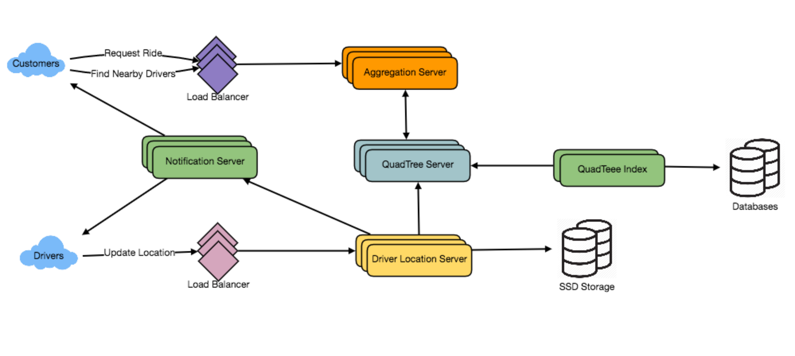

# 设计 Uber 后端

让我们设计一个像Uber这样的拼车服务，把需要搭车的乘客和有车的司机联系起来。类似服务:Lyft、滴滴、Via、Sidecar等。难度级别:hard先决条件:设计Yelp

## 1. What is Uber?

   优步让客户可以预约出租车司机。优步司机用他们的私家车接送顾客。顾客和司机都使用优步应用程序通过智能手机进行沟通。

## 2. 系统的需求和目标

   让我们从构建一个简单版的优步开始。

   在我们的系统中有两种用户:1)驱动用户2)客户用户。

   ●司机需要定期通知该服务他们当前的位置和他们是否可以接送乘客。

   ●乘客可以看到附近所有可用的司机。

   ●客户可以要求搭车;附近的司机会接到通知，有一位顾客已经准备好被接走了。

   ●一旦司机和顾客接了车，他们就可以不断看到彼此的当前位置，直到旅程结束。

   ●到达目的地后，司机标志着旅程结束，可以开始下一趟旅程。

## 3. 容量估算与约束

   ●假设我们有3亿客户和1百万司机，每天有1百万活跃客户和50万活跃司机。

   ●我们假设每天有100万人次乘坐。

   ●让我们假设所有活跃的司机每三秒通知他们当前的位置。

   ●一旦客户提出搭车请求，系统应该能够实时联系司机。

## 4. 基本的系统设计和算法

   我们将采用设计Yelp中讨论的解决方案，并对其进行修改，使其适用于上述的“Uber”用例。我们最大的不同是，我们的四叉树并没有在构建时考虑到它会经常更新。因此，我们的动态网格解决方案有两个问题:

   ●由于所有活跃的驱动程序每三秒钟报告一次他们的位置，我们需要更新数据结构来反映这一点。如果我们必须为驾驶员位置的每一次变化更新四叉树，这将花费大量的时间和资源。为了将一个驱动程序更新到它的新位置，我们必须根据驱动程序之前的位置找到正确的网格。如果新位置不属于当前网格，我们必须从当前网格中移除驱动程序，并将用户重新插入到正确的网格中。在此移动之后，如果新网格达到驱动程序的最大限制，我们必须重新划分它。

   ●我们需要一个快速的机制来传播所有附近司机的当前位置到该区域的任何活跃客户。此外，当一辆车正在行驶时，我们的系统需要通知司机和乘客车辆的当前位置。

   虽然我们的四叉树可以帮助我们快速找到附近的驱动程序，但树的快速更新并不能保证。

   我们需要修改我们的四叉树每次驱动报告他们的位置吗?如果我们不更新我们的四叉树与每个更新的驱动程序，它将有一些旧的数据，并不能反映当前的位置的驱动程序正确。如果你还记得，我们构建四叉树的目的是为了有效地找到附近的司机(或地点)。由于所有活跃的驾驶员每三秒钟报告一次他们的位置，因此，与查询附近的驾驶员相比，我们的树将会有更多的更新发生。那么，如果我们将所有驱动程序报告的最新位置保存在哈希表中，并减少更新四叉树的频率，会怎么样呢?让我们假设我们保证驱动程序的当前位置将在15秒内反映在四叉树中。同时，我们将维护一个哈希表，该哈希表将存储驱动程序报告的当前位置;我们称之为DriverLocationHT。

   我们需要多少内存用于DriverLocationHT?我们需要在哈希表中存储DriveID，以及它们现在和过去的位置。所以我们总共需要35个字节来存储一条记录:

   1.DriverID (3 bytes - 1 million drivers)

   2.Old latitude (8 bytes)

   3.Old longitude (8 bytes)

   4.New latitude (8 bytes)

   5.New longitude (8 bytes) Total = 35 bytes

   如果我们总共有100万个驱动，我们需要以下内存(忽略哈希表开销):

   1 million * 35 bytes => 35 MB

   我们的服务将消耗多少带宽来接收所有司机的位置更新?如果我们得到DriverID和他们的位置，它将是(3+16 => 19字节)。如果我们每3秒从100万名司机那里收到这个信息，我们将每3秒收到19MB。

   我们需要将DriverLocationHT分发到多个服务器上吗?虽然我们的内存和带宽需求没有这样的要求，因为所有这些信息都可以很容易地放在一台服务器上，但是为了可伸缩性、性能和容错，我们应该将哈希表分布到多个服务器上。我们可以基于DriverID进行分发，使分发完全随机。让我们将持有DriverLocationHT的机器称为DriverLocation服务器。除了存储驱动程序的位置，这些服务器还会做两件事:

   1.一旦服务器接收到驱动程序位置的更新，它们就会将该信息广播给所有感兴趣的客户。

   2.服务器需要通知相应的四叉树服务器来刷新驱动程序的位置。如上所述，这种情况每10秒发生一次。

   我们如何有效地向客户广播司机的位置?我们可以有一个Push Model，服务器将把位置推送给所有相关用户。我们可以有一个专用的通知服务，可以向所有感兴趣的客户广播司机的当前位置。我们可以在发布者订阅者模型上构建通知服务。当顾客在手机上打开优步应用程序时，他们会向服务器查询附近的司机。在服务器端，在向客户返回驱动程序列表之前，我们将向客户订阅来自这些驱动程序的所有更新。我们可以维护一个客户(订阅者)的列表，了解驱动程序的位置，每当我们在DriverLocationHT中有一个驱动程序的更新时，我们可以向所有订阅的客户广播驱动程序的当前位置。通过这种方式，我们的系统确保我们总是向客户显示司机当前的位置。

   我们需要多少内存来存储所有这些订阅?如上所述，我们将拥有100万的每日活跃客户和50万的每日活跃司机。我们假设平均有5个客户订阅一个驱动程序。让我们假设我们将所有这些信息存储在一个哈希表中，这样我们就可以有效地更新它。我们需要存储驱动程序和客户id来维护订阅。假设我们需要3个字节的DriverID和8个字节的CustomerID，我们将需要21MB的内存。

   (500K * 3) + (500K * 5 * 8 ) ~= 21 MB

   我们需要多少带宽向客户广播司机的位置?对于每个活动驱动程序，我们有5个订阅者，所以我们有:

   5 * 500K => 2.5M

   对于所有这些客户，我们需要每秒发送DriverID(3字节)和他们的位置(16字节)，所以我们需要以下带宽:

   2.5M * 19 bytes => 47.5 MB/s

   我们如何有效地实现通知服务?我们可以使用HTTP长轮询或推送通知。

   如何为当前的客户添加新的出版商驱动程序?正如我们在上面提出的，当客户第一次打开优步应用程序时，会订阅附近的司机，当新的司机进入客户正在查看的区域，会发生什么?要动态地添加新的客户驱动程序订阅，我们需要跟踪客户正在关注的区域。这将使我们的解决方案变得复杂，如果客户端不是推送这些信息，而是从服务器中提取这些信息呢?

   如果客户端从服务器上获取附近司机的信息怎么办?客户端可以发送他们当前的位置，服务器将从四叉树中找到所有附近的驱动返回给客户端。在接收到这个信息后，客户端可以更新他们的屏幕，以反映司机的当前位置。客户端可以每5秒查询一次，以限制到服务器的往返次数。与上面描述的push模型相比，这个解决方案看起来相当简单。

   我们是否需要在网格达到最大限制时重新分区?我们可以有一个缓冲，让每个网格在我们决定分割它之前，增长一点点超出限制。假设我们的网格可以在划分和合并它们之前再增长缩小10%。这应该会减少在高流量网格上进行网格划分或合并的负载。

“请求乘坐”用例如何工作?

1.客户会提出搭车请求。

2.其中一个Aggregator服务器将接受请求并请求四叉树服务器返回附近的驱动程序。

3.Aggregator服务器收集所有结果并按等级对它们进行排序。

4.Aggregator服务器将同时向顶部(比如三个)的司机发送通知，最先接受请求的司机将被分配乘车。其他驱动程序将收到取消请求。如果这三个司机都没有响应，聚合器将从列表中接下来的三个司机请求搭车。

5.一旦驱动程序接受了一个请求，客户就会得到通知。

## 5. 容错与复制

   如果驱动程序位置服务器或通知服务器死亡怎么办?我们需要这些服务器的副本，这样，如果主服务器死亡，从服务器就可以控制。此外，我们还可以将这些数据存储在能够提供快速IOs的ssd等持久存储中;这将确保如果主服务器和辅助服务器都故障，我们可以从持久存储恢复数据。

## 6. 排名

   如果我们不仅要根据接近程度，还要根据受欢迎程度或相关性对搜索结果进行排名呢?

   在给定的半径范围内，我们如何返回最优秀的司机?让我们假设我们在数据库和四叉树中跟踪每个驱动程序的总体评级。在我们的系统中，一个加起来的数字可以代表这种受欢迎程度，例如，一个司机从10颗星中得到多少颗星?当搜索给定半径内的前10个驱动器时，我们可以要求四叉树的每个分区返回最高评级的前10个驱动器。然后，聚合器服务器可以从不同分区返回的所有驱动程序中确定前10个驱动程序。

## 7. 高级的问题

   1.如何处理慢速和断开网络的客户端?

   2.如果客户端在搭车时断开连接了怎么办?在这种情况下，我们将如何处理账单?

   3.如果客户端提取所有信息，而服务器总是推送信息，情况会怎样?
