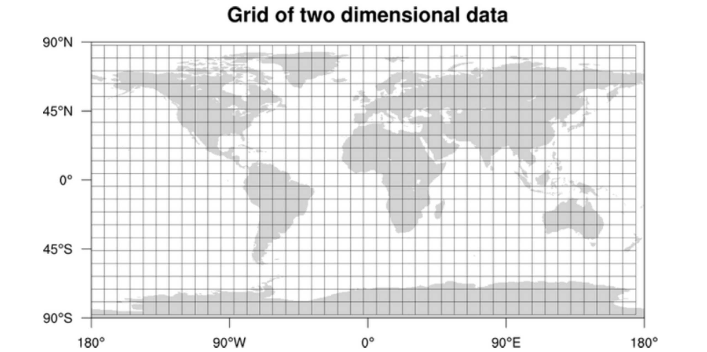
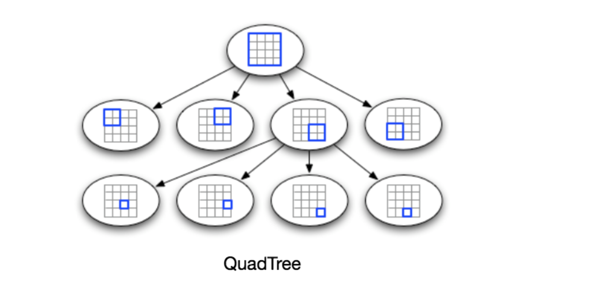
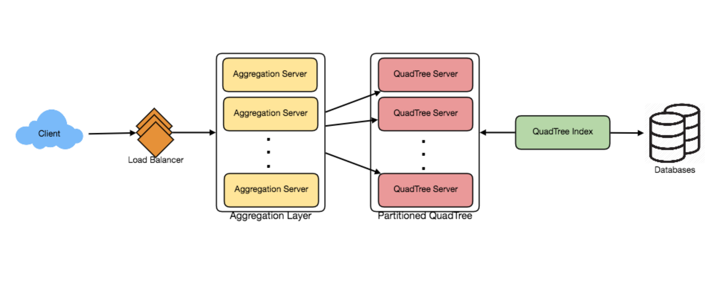

# 设计Yelp 或附近的朋友

让我们设计一个类似Yelp的服务，用户可以搜索附近的餐馆、剧院或购物中心等，还可以添加地点评论。类似服务:接近服务器。难度:难

## 1. 为什么是Yelp或接近服务器?

   近距离服务器用于发现附近的景点，如地点、事件等。如果你以前没有使用过yelp.com，请在继续之前尝试它。你可以搜索附近的餐馆、剧院等，并花些时间了解网站提供的不同选择。这将帮助你更好地理解这一章。

## 2. 系统的需求和目标

   我们希望通过Yelp这样的服务实现什么?我们的服务将存储不同地点的信息，这样用户就可以对这些地点进行搜索。在查询时，我们的服务将返回用户周围的位置列表。

   我们的类似yelp的服务应满足以下要求:

   功能需求:

   1.Users should be able to add/delete/update Places.

   2.给定他们的位置(经度)，用户应该能够找到在给定半径内的所有附近的地方。

   3.用户应该能够添加关于一个地方的反馈评论。反馈可以有图片、文本和评级。

   非功能性需求:

   1.用户应该有实时搜索体验，以最小的延迟。

   2.我们的服务应该支持较大的搜索负载。与添加一个新位置相比，将会有大量的搜索请求。

## 3. 规模估计

   让我们假设我们有5亿个位置和每秒10万个查询(QPS)来构建我们的系统。让我们还假设每年的地点和QPS数量增长20%。

## 4. 数据库模式

   每个位置可以有以下字段:

   1.LocationID(8字节):唯一标识一个位置。

   2.Name (256 bytes)

   3.Latitude (8 bytes)

   4.Longitude (8 bytes)

   5.Description (512 bytes)

   6.Category (1 byte): E.g., coffee shop, restaurant, theater, etc.

   尽管一个4字节的数字可以唯一标识500个位置，考虑到未来的增长，我们将使用8字节的LocationID。

   Total size: 8 + 256 + 8 + 8 + 512 + 1 => 793 bytes

   我们还需要存储评论、照片和一个地方的评级。我们可以有一个单独的表格来存储对地点的评论:

   1.LocationID (8 bytes)

   2.ReviewID (4 bytes): Uniquely identifies a review, assuming any location will not have more than 2^32 reviews.

   3.ReviewText (512 bytes)

   4.Rating (1 byte): how many stars a place gets out of ten.

   类似地，我们可以有一个单独的表来存储地点和评论的照片。

## 5. System APIs

   我们可以使用SOAP或REST api来公开服务的功能。下面是搜索API的定义:

   search(api_dev_key, search_terms, user_location, radius_filter, maximum_results_to_return,

   category_filter, sort, page_token)

   Parameters:

   api_dev_key (string):注册帐户的API开发人员密钥。这将用于根据用户分配的配额限制用户。

   search_terms (string):包含搜索项的字符串。

   user_location (string):执行搜索的用户的位置。

   radius_filter (number):可选搜索半径，单位为米

   maximum_results_to_return (number):要返回的业务结果的数量。

   category_filter (string):可选类别，用于过滤带有餐馆、购物中心等的搜索结果。

   sort (number):可选排序模式:最佳匹配(0 -默认)，最小距离(1)，最高评级(2)。

   page_token (string):该token将指定结果集中应该返回的页面。

   Returns: (JSON)

   包含与搜索查询匹配的企业列表信息的JSON。每个结果条目都有企业名称、地址、类别、评级和缩略图。

## 6. 基本的系统设计和算法

   在高层次上，我们需要存储和索引上面描述的每个数据集(位置、评论等)。对于查询这个庞大数据库的用户来说，索引应该被高效地读取，因为当用户搜索附近的地方时，他们希望看到实时的结果。

   由于位置的变化不那么频繁，所以我们不需要担心数据的频繁更新。相反，如果我们想要构建一个对象经常改变其位置的服务，例如，人或出租车，那么我们可能会提出一个非常不同的设计。

   让我们看看有哪些不同的方法来存储这些数据，并找出哪种方法最适合我们的用例:

   a. SQL解决方案。

   一个简单的解决方案是将所有数据存储在MySQL之类的数据库中。每个位置将存储在单独的行中，由LocationID惟一地标识。每个地方都将其经度和纬度分别存储在两个不同的列中，并执行快速搜索;我们应该在这两个字段上都有索引。

   要找到半径为“D”的给定位置(X, Y)附近的所有位置，我们可以这样查询:

   Select * from Places where Latitude between X-D and X+D and Longitude between Y-D and Y+D

   这个查询的效率有多高?我们估计在我们的服务中有5亿个存储空间。因为我们有两个单独的索引，所以每个索引都可能返回一个巨大的位置列表，并且在这两个列表上执行交集将不会很有效。另一种看待这个问题的方式是，在‘X-D’和‘X+D’之间可能有太多的位置，在‘Y-D’和‘Y+D’之间也可能有太多的位置。如果我们能以某种方式缩短这些列表，就能提高查询的性能。

   b. 网格

   我们可以将整个地图划分成更小的网格，将位置分组成更小的集合。每个网格将存储在一定的经度和纬度范围内的所有地点。这个方案将使我们只查询几个网格就能找到附近的地点。根据给定的位置和半径，我们可以找到所有附近的网格，然后只查询这些网格就可以找到附近的位置。

让我们假设GridID(一个四个字节的数字)将惟一地标识我们系统中的网格。

什么是合理的网格大小?网格大小可以等于我们想要查询的距离，因为我们还想减少网格的数量。如果网格大小等于我们想要查询的距离，那么我们只需要在包含给定位置和邻近8个网格的网格中进行搜索。由于我们的网格是静态定义的(从固定的网格大小)，我们可以很容易地找到任何位置(纬度，长)及其邻近网格的网格号。

在数据库中，我们可以存储每个位置的GridID，并在其上建立索引，以便更快地进行搜索。现在，我们的查询看起来像这样:

Select * from Places where Latitude between X-D and X+D and Longitude between Y-D and Y+D and GridID in (GridID, GridID1, GridID2, ..., GridID8)

这无疑将改善查询的运行时。

我们应该把索引保存在内存中吗?在内存中维护索引将提高服务的性能。我们可以将索引保存在一个哈希表中，其中“key”是网格编号，“value”是包含在该网格中的位置列表

我们需要多少内存来存储索引?假设我们的搜索半径是10英里，假设地球的总面积大约是2亿平方英里;我们将有2000万个电网。我们需要一个4字节的数字来唯一地标识每个网格，由于LocationID是8字节，因此我们需要4GB的内存(忽略哈希表开销)来存储索引。

(4 * 20M) + (8 * 500M) ~= 4 GB

对于那些有很多位置的网格，这个解决方案仍然运行缓慢，因为我们的位置不是均匀地分布在网格中。我们可以有一个有很多地方的稠密地区，另一方面，我们也可以有人口稀少的地区。

如果我们能够动态调整我们的网格大小，那么这个问题就可以得到解决，比如每当我们有一个有很多地方的网格时，我们就把它分解成更小的网格。这种方法的一个挑战可能是，我们如何将这些网格映射到位置?另外，我们如何找到一个网格的所有相邻网格?

c. 动态尺寸网格

让我们假设我们不希望在一个网格中有超过500个位置，这样我们可以有更快的搜索。所以，当一个网格达到这个极限时，我们把它分成四个大小相等的网格，并在它们之间分配位置。这意味着像旧金山市中心这样人口稠密的地区将有很多网格，而像太平洋这样人口稀少的地区将有很大的网格，只有沿海地区。

什么数据结构可以保存这些信息?每个节点有四个子节点的树可以满足我们的目的。每个节点将表示一个网格，并包含关于该网格中所有位置的信息。如果一个节点达到500个位置的限制，我们将把它分解成在它下面创建4个子节点，并在它们之间分配位置。通过这种方式，所有的叶节点将表示不能进一步分解的网格。所以叶节点会保存它们所在位置的列表。这种每个节点可以有四个子节点的树结构称为四叉树

我们如何构建四叉树?我们将从一个节点开始，该节点将代表一个网格中的整个世界。由于它将有500多个位置，我们将把它分解成4个节点，并在其中分配位置。我们将对每个子节点重复这个过程，直到所有节点的位置都超过500个

我们如何构建四叉树?我们将从一个节点开始，该节点将代表一个网格中的整个世界。由于它将有500多个位置，我们将把它分解成4个节点，并在其中分配位置。我们将对每个子节点重复这个过程，直到所有节点的位置都超过500个。

我们如何找到给定位置的网格?我们将从根节点开始，向下搜索以找到所需的节点网格。在每一步中，我们将查看当前访问的节点是否有子节点，如果有，我们将移动到包含所需位置的子节点，并重复此过程。如果节点没有任何子节点，那么它就是我们想要的节点。

一旦我们有了附近的locationid，我们就可以查询后端数据库来找到这些地方的详细信息。

搜索工作流程是什么?我们将首先找到包含用户位置的节点。如果该节点有足够的期望位置，我们可以将它们返回给用户。如果没有，我们将继续扩展到邻近节点(通过父指针或双链表)，直到我们找到所需的位置数量或基于最大半径耗尽搜索。

存储四叉树需要多少内存?对于每个Place，如果我们只缓存LocationID和LatLong，我们将需要12GB来存储所有位置。

24 * 500M => 12 GB

因为每个网格最多可以有500个位置，而我们有500个位置，所以我们总共有多少个网格?

500M / 500 => 1M grids

这意味着我们将有1M个叶子节点，它们将存储12GB的位置数据。一个有1M叶节点的四叉树将有大约13个内部节点，每个内部节点将有4个指针(用于其子节点)。如果每个指针是8字节，那么我们需要存储所有内部节点的内存将是:

1M * 1/3 * 4 * 8 = 10 MB

所以，保存整个四叉树所需的总内存是12.01GB。这可以很容易地放进一个现代服务器。

我们如何在系统中插入一个新的Place ?每当用户添加新的Place时，我们需要将其插入到数据库中，以及插入到四叉树中。如果我们的树位于一个服务器上，很容易添加一个新的Place，但是如果QuadTree分布在不同的服务器上，首先我们需要找到新Place的网格服务器，然后将其添加到那里(在下一节中讨论)。

## 7. 数据分区

   如果我们有大量的位置，以至于索引不能放进一台机器的内存中，该怎么办?以每年20%的速度增长，我们将在未来达到服务器的内存极限。另外，如果一台服务器不能提供所需的读流量怎么办?为了解决这些问题，我们必须划分四叉树!

   我们将在这里探索两种解决方案(这两种分区方案也可以应用于数据库):

   a.基于区域的分片:我们可以将我们的地点划分为区域(如邮政编码)，这样所有属于一个区域的地点都会存储在一个固定的节点上。在存储时，我们将找到每个位置的区域，以找到服务器并将该位置存储在那里。类似地，在查询附近的位置时，我们可以询问包含用户位置的区域服务器。这种方法有几个问题:

   1.如果一个地区变热了怎么办?在保存该区域的服务器上会有很多查询，使其执行缓慢。这将影响我们服务的性能。

   2.随着时间的推移，与其他地区相比，一些地区最终会存储很多地方。因此，在区域不断增长的情况下，保持区域的均匀分布是相当困难的。

   为了从这些情况中恢复，我们要么必须重新分区数据，要么使用一致的哈希。

   b.基于LocationID的分片:我们的哈希函数将每个LocationID映射到我们将存储该位置的服务器上。在构建四叉树时，我们将遍历所有位置并计算每个LocationID的哈希值，以找到存储它的服务器。为了找到一个位置的附近位置，我们必须查询所有的服务器，每个服务器将返回一组附近的位置。集中式服务器将聚合这些结果并将它们返回给用户。

   我们会在不同的分区上有不同的四叉树结构吗?是的，这是可能发生的，因为它不能保证我们在任何给定网格的所有分区上拥有相同数量的位置。尽管如此，我们还是要确保所有服务器拥有大致相同数量的Places。但是，不同服务器上的这种不同的树结构不会引起任何问题，因为我们将在所有分区的给定半径内搜索所有邻近的网格。

   本章剩下的部分假设我们已经基于LocationID对数据进行了分区。

## 8. 复制和容错

   拥有QuadTree服务器的副本可以提供数据分区的替代方案。为了分发读流量，我们可以拥有每个四叉树服务器的副本。我们可以有一个主从配置，其中副本(从服务器)将只服务于读流量，所有的写流量将首先进入主服务器，然后应用于从服务器。从服务器可能没有一些最近插入的位置(会有几毫秒的延迟)，但这是可以接受的。

   当四叉树服务器死亡时会发生什么?我们可以拥有每个服务器的辅助副本，如果主服务器失效，它可以在故障转移后接管控制权。主服务器和辅助服务器都具有相同的四叉树结构。

   如果主服务器和辅助服务器同时死亡怎么办?我们得分配一个新服务器并在上面重建相同的四叉树。我们怎么做呢，因为我们不知道服务器上有哪些位置?蛮力解决方案是遍历整个数据库，并使用我们的哈希函数过滤locationid，以找出将存储在该服务器上的所有必需位置。这将是低效和缓慢的，在服务器重建期间也是如此;我们将无法从它提供任何查询，因此错过了一些应该被用户看到的地方。

   我们如何有效地检索位置和四叉树服务器之间的映射?我们必须建立一个反向索引，将所有的地点映射到他们的四叉树服务器。我们可以有一个单独的四叉树索引服务器来保存这些信息。我们将需要构建一个HashMap，其中的“键”将是四叉树服务器的编号，“值”将是一个包含所有的位置在四叉树服务器上保存的HashSet。我们需要在每个位置存储LocationID和LatLong，因为通过这些信息服务器可以构建它们的quadtree。注意，我们将Places的数据保存在一个HashSet中，这将使我们能够快速地从索引中删除Places。所以现在，当一个四叉树服务器需要重建自己时，它可以简单地向四叉树索引服务器询问它需要存储的所有位置。这种方法肯定是非常快的。我们还应该有一个四叉树索引服务器的副本来进行容错。如果QuadTree Index服务器死亡，它总是可以通过遍历数据库来重建索引。

## 9. Cache

   为了处理hot Places，我们可以在数据库前面引入缓存。我们可以使用现成的解决方案，比如Memcache，它可以存储关于热点的所有数据。应用服务器在访问后端数据库之前可以快速检查缓存是否有那个Place。根据客户端的使用模式，我们可以调整需要多少缓存服务器。对于缓存退出策略，最近最少使用(Least Recently Used, LRU)似乎适合我们的系统。

## 10. Load Balancing (LB)

   我们可以在我们系统的两个地方添加LB层:1)在客户端和应用服务器之间，2)在应用服务器和后端服务器之间。最初，可以采用一种简单的轮询方法;这将在后端服务器之间平均分配所有传入的请求。这个LB实现起来很简单，而且不引入任何开销。这种方法的另一个好处是，如果服务器死亡，负载平衡器将把它从轮换中取出，并停止向它发送任何流量。

   Round Robin LB的一个问题是，它不会考虑服务器负载。如果服务器负载过重或运行缓慢，负载均衡器将不会停止向该服务器发送新请求。要处理这个问题，需要一个更智能的LB解决方案，周期性地查询后端服务器的负载并据此调整流量。

## 11. 排名

   如果我们不仅要根据接近程度，还要根据受欢迎程度或相关性对搜索结果进行排名呢?

   我们如何在给定的半径内返回最受欢迎的地方?让我们假设我们一直在跟踪每个地方的总体受欢迎程度。在我们的系统中，一个综合的数字可以代表这种受欢迎程度，例如，一个地方从10颗星中得到多少颗星(这将是用户给出的不同排名的平均值)?我们将把这个数字存储在数据库中，也存储在四叉树中。在给定半径内搜索前100名的位置时，我们可以要求四叉树的每个分区返回最受欢迎的前100名位置。然后，聚合器服务器可以在不同分区返回的所有位置中确定前100个位置。

   请记住，我们构建的系统并不是为了频繁更新place的数据。有了这个设计，我们如何修改四叉树中一个地方的流行度?虽然我们可以在四叉树中搜索一个地方并更新它的流行度，但这将需要大量的资源，并会影响搜索请求和系统吞吐量。假设一个地方的受欢迎程度不会在几个小时内反映在系统中，我们可以决定每天更新一次或两次，特别是在系统负载最小的时候。

   我们的下一个问题设计优步后端详细讨论了四叉树的动态更新。
