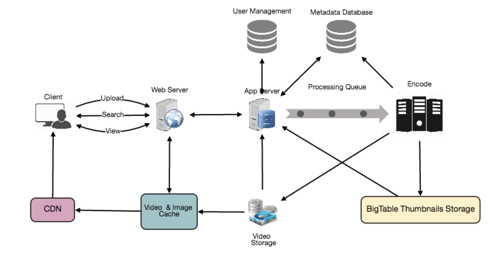

# 设计 Youtube 或 Netflix

让我们设计一个像Youtube一样的视频共享服务，用户可以上传视频。类似服务:netflix.com, vimeo.com, dailymotion.com, veoh.com难度:中等

## 1. Why Youtube?

   Youtube是世界上最受欢迎的视频分享网站之一。该服务的用户可以上传、查看、分享、评分、举报视频，并对视频进行评论。

## 2. 系统的需求和目标

   为了便于本练习，我们计划设计一个更简单的Youtube版本，要求如下:

   功能需求:

   1.用户应该能够上传视频。

   2.用户应该能够分享和观看视频。

   3.用户可以根据视频标题进行搜索。

   4.我们的服务应该能够记录视频的统计数据，例如，喜欢的不喜欢，总浏览量等。

   5.用户应该能够添加和查看视频评论。

   非功能性需求:

   1.系统应该是高度可靠的，任何视频上传不应该丢失。

   2.系统应该是高可用的。一致性可能会受到打击(在可用性方面)，如果用户有一段时间没有看到视频，应该没问题。

   3.用户在观看视频时应该有实时体验，不应该感到任何延迟。

   不属于范围:视频推荐、最受欢迎视频、频道、订阅、后期观看、收藏等。

## 3. 容量估算与约束

   假设我们有15亿用户，其中8亿是日活跃用户。如果一个用户平均每天观看5个视频，那么每秒总视频浏览量为:

   800M * 5 / 86400 sec => 46K videos/sec

   让我们假设我们的上传:观看比例是1:200，也就是说，每上传一个视频，我们就有200个视频被观看，每秒就有230个视频被上传。

   46K / 200 => 230 videos/sec

   存储估算:假设每分钟有500个小时的视频被上传到Youtube。如果一分钟的视频平均需要50MB的存储空间(视频需要以多种格式存储)，那么一分钟内上传视频所需的总存储空间为:

   500 hours * 60 min * 50MB => 1500 GB/min (25 GB/sec)

   这些数字是估计的，忽略了视频压缩和复制，这将改变我们的估计。

   带宽估计:如果每分钟上传500小时的视频，假设每次上传视频需要10MBmin的带宽，那么每分钟将有300GB的上传。

   500 hours * 60 mins * 10MB => 300GB/min (5GB/sec)

   假设上传:查看的比例为1:200，我们将需要1tb的输出带宽。

## 4. 系统 APIs

   我们可以使用SOAP或REST api来公开服务的功能。以下是视频上传和搜索api的定义:

````        
   uploadVideo(api_dev_key, video_title, vide_description, tags[], category_id, default_language,recording_details, video_contents)

````        

   Parameters:

   api_dev_key (string):注册帐户的API开发人员密钥。这将用于根据用户分配的配额限制用户。

   video_title (string):视频标题。

   vide_description (string):可选视频描述信息。

   tags (string[]):可选的视频标签。

   category_id (string):视频的类别，例如，电影，歌曲，人等。

   default_language (string):例如英语、普通话、印地语等。

   recording_details (string):视频录制的位置。

   video_contents (stream):待上传的视频。

   Returns: (string)

   成功的上传将返回HTTP 202(请求被接受)，一旦视频编码完成，用户将通过电子邮件收到访问视频的链接的通知。我们还可以公开一个可查询的API，让用户知道他们上传的视频的当前状态。

````
   searchVideo(api_dev_key, search_query, user_location, maximum_videos_to_return, page_token)
````

   Parameters:

   api_dev_key (string):我们服务注册帐户的API开发人员密钥。

   search_query (string):包含搜索词的字符串。

   user_location (string):执行搜索的用户的可选位置。

   maximum_videos_to_return (number):一个请求中返回的最大结果数。

   page_token (string):这个令牌将在结果集中指定应该返回的页面。

   Returns: (JSON)

   一个JSON，包含匹配搜索查询的视频资源列表的信息。每个视频资源将有一个视频标题，一个缩略图，一个视频创建日期和它有多少浏览量。

## 5. 高水平设计

   在高级别上，我们需要以下组成部分:

   1.处理队列:每个上传的视频将被推送到一个处理队列中，稍后将从队列中取出来进行编码、缩略图生成和存储。

   2.编码器:将每个上传的视频编码成多种格式。

   3.缩略图生成器:我们需要为每个视频有一些缩略图。

   4.视频和缩略图存储:我们需要在一些分布式文件存储中存储视频和缩略图文件。

   5.用户数据库:我们需要一些数据库来存储用户信息，例如，姓名、电子邮件、地址等。

   6.视频元数据存储:元数据数据库存储视频的所有信息，如标题、文件在系统中的路径、上传用户、总浏览量、喜欢、不喜欢等。此外，它将用于存储所有的视频评论。


Youtube的高水平设计

## 6. 数据库模式

   视频元数据存储—MySql

   视频元数据可以存储在SQL数据库中。以下信息应与每段视频一起存储:

   ●VideoID

   ●Title

   ●Description

   ●Size

   ●Thumbnail

   ●Uploader/User

   ●Total number of likes

   ●Total number of dislikes

   ●Total number of views

   对于每个视频评论，我们需要存储以下信息:

   ●CommentID

   ●VideoID

   ●UserID

   ●Comment

   ●TimeOfCreation

   用户数据存储—MySql

   ●UserID, Name, email, address, age, registration details etc.

## 7. 详细的组件设计

   该服务的读取量很大，因此我们将专注于构建一个能够快速检索视频的系统。我们可以期望我们的读:写比率为200:1，这意味着每上传一个视频就有200个视频观看。

   视频应该存储在哪里?视频可以存储在HDFS或GlusterFS这样的分布式文件存储系统中。

   我们应该如何有效地管理阅读流量?我们应该将读通信与写通信隔离开来。由于我们将拥有每个视频的多个副本，我们可以将我们的读流量分配到不同的服务器上。对于元数据，我们可以有主从配置，写操作将首先到主服务器，然后在所有的从服务器上重播。这样的配置可能会导致一些过时数据,例如当添加一个新的视频,其元数据将首先插入大师,和之前重播奴隶,奴隶将无法看到它,因此将返回的结果给用户。在我们的系统中，这种过时可能是可以接受的，因为它将非常短暂，用户将能够在几毫秒后看到新的视频。

   缩略图存储在哪里?会有更多的缩略图而不是视频。如果我们假设每个视频都有五个缩略图，那么我们就需要一个非常高效的存储系统来满足巨大的读流量。在决定使用哪个存储系统的缩略图之前，有两个考虑因素:缩略图存储在哪里?会有更多的缩略图而不是视频。如果我们假设每个视频都有五个缩略图，那么我们就需要一个非常高效的存储系统来满足巨大的读流量。在决定使用哪个存储系统的缩略图之前，有两个考虑因素:

   1.缩略图是小文件，每个最大5KB。

   2.与视频相比，缩略图的阅读流量将是巨大的。用户将一次只看一个视频，但他们可能会看到一个页面上有20个其他视频的缩略图。

   让我们评估一下把所有的缩略图存储在磁盘上的情况。考虑到我们有大量的文件;为了读取这些文件，我们必须对磁盘上的不同位置执行大量搜索。这是非常低效的，并将导致更高的延迟。

   在这里，Bigtable是一个合理的选择，因为它将多个文件组合成一个块存储在磁盘上，并且在读取少量数据时非常高效。这两个都是我们服务的两个最大的需求。将热缩略图保存在缓存中也将有助于改善延迟，并且鉴于缩略图文件的大小较小，我们可以轻松地在内存中缓存大量这样的文件。

   视频上传:由于视频可能很大，如果在上传过程中连接断开，我们应该支持从同一点恢复。

   视频编码:新上传的视频存储在服务器上，在处理队列中添加一个新的任务，将视频编码成多种格式。一旦所有的编码完成;上传者会得到通知，视频也可用于视图共享。



Youtube的详细组件设计

## 8. 元数据分片

   由于我们每天有大量的新视频，我们的读负载也非常高，我们需要将我们的数据分发到多台机器上，以便我们可以有效地执行读写操作。我们有很多方法来分片数据。让我们来看看这些数据分片的不同策略:

   基于UserID的分片:我们可以尝试将特定用户的所有数据存储在一台服务器上。在存储时，我们可以将UserID传递给我们的哈希函数，该函数将把用户映射到一个数据库服务器，我们将在该服务器上存储该用户视频的所有元数据。在查询用户的视频时，我们可以要求哈希函数找到保存用户数据的服务器，然后从那里读取数据。要按标题搜索视频，我们必须查询所有服务器，每个服务器将返回一组视频。然后，集中式服务器将对这些结果进行聚合和排序，然后将它们返回给用户。

   这种方法有几个问题:

   1.如果一个用户变得流行了怎么办?该用户所在的服务器上可能存在大量查询，从而造成性能瓶颈。这将影响我们服务的整体性能。

   2.随着时间的推移，与其他用户相比，一些用户最终会存储大量的视频。保持用户数据的均匀分布是非常困难的。

   为了从这些情况中恢复，我们要么必须重新分区，重新分配我们的数据，要么使用一致的哈希来平衡服务器之间的负载。

   基于VideoID的分片:我们的哈希函数将每个VideoID映射到一个随机的服务器，在那里我们将存储视频的元数据。为了查找一个用户的视频，我们将查询所有服务器，每个服务器将返回一组视频。集中式服务器将对这些结果进行聚合和排序，然后将它们返回给用户。这种方法解决了热门用户的问题，但却将其转移到热门视频上。

   通过引入缓存在数据库服务器前存储热门视频，我们可以进一步提高性能。

## 9. 视频重复数据删除

   由于用户数量庞大，上传大量视频数据，我们的服务将不得不处理广泛的视频复制。重复的视频通常在纵横比或编码上有所不同，可以包含重叠或额外的边界，也可以是较长的原始视频的节选。重复视频的泛滥会在许多层面上产生影响:

   1.数据存储:我们可能会因为保存同一视频的多个副本而浪费存储空间。

   2.缓存:重复的视频会导致缓存效率下降，因为它占用了可以用于唯一内容的空间。

   3.网络使用:增加必须通过网络发送到网络内缓存系统的数据量。

   4.能源消耗:更高的存储、低效的缓存和网络使用将导致能源消耗。

   对于终端用户来说，这些效率低下的表现形式是重复的搜索结果、较长的视频启动时间和中断的流媒体。

   在我们的服务中，重复数据删除在用户上传视频的时候最有意义;与后期处理相比，可以在以后找到重复的视频。内嵌重复数据删除将为我们节省大量资源，可以用于编码、传输和存储视频的副本。只要任何用户开始上传视频，我们的服务就可以运行视频匹配算法(例如，块匹配，相位相关等)来查找重复的视频。如果我们已经有一个正在上传的视频的副本，我们可以停止上传并使用现有的副本或使用新上传的视频(如果它的质量更高)。如果新上传的视频是现有视频的一部分，反之亦然，我们可以智能地将视频分割成更小的块，这样我们就只上传那些缺失的部分。

## 10. 负载均衡

   我们应该在我们的缓存服务器之间使用一致的哈希，这也将有助于平衡缓存服务器之间的负载。由于我们将使用基于静态散列的方案来将视频映射到主机名，由于每个视频的流行程度不同，这可能会导致逻辑副本上的负载不均衡。例如，如果一个视频变得流行起来，与该视频对应的逻辑副本将比其他服务器经历更多的流量。这些逻辑副本的不均匀负载随后会转化为相应物理服务器上的不均匀负载分布。为了解决这个问题，在一个位置上的任何繁忙的服务器都可以将客户端重定向到同一缓存位置上不那么繁忙的服务器。我们可以在这个场景中使用动态HTTP重定向。

   然而，重定向的使用也有其缺点。首先，由于我们的服务尝试在本地实现负载平衡，如果接收到重定向的主机不能提供视频服务，就会导致多个重定向。而且，每次重定向都需要客户端发出一个额外的HTTP请求;这也会导致视频开始回放前的延迟。此外，层间(或跨数据中心)重定向将客户端引向一个远程缓存位置，因为较高的层缓存只存在于少量的位置。

## 11. 缓存

   为了服务全球分布的用户，我们的服务需要一个大规模的视频传输系统。我们的服务应该使用大量地理分布的视频缓存服务器，将其内容推向更接近用户的位置。我们需要一种策略，既能最大化用户性能，又能均匀地分配缓存服务器上的负载。

   我们可以为元数据服务器引入缓存来缓存热数据库行。在访问数据库之前，使用Memcache缓存数据和应用服务器，可以快速检查缓存是否有所需的行。最近最少使用(Least Recently Used, LRU)对于我们的系统来说是一个合理的缓存回收策略。在此策略下，我们首先丢弃最近最少查看的行。

   如何构建更智能的缓存?如果我们遵循80-20规则，也就是说，视频每天20%的阅读量就会产生80%的流量，这意味着某些视频非常受欢迎，大多数人都会观看它们;因此，我们可以尝试缓存每天20%的视频和元数据读量。

## 12. 内容分发网络(CDN)

CDN是一个分布式服务器系统，它根据用户的地理位置、网页的来源和内容交付服务器向用户交付网络内容。看看我们的缓存章节中的“CDN”一节。

我们的服务可以将最受欢迎的视频转移到cdn:

 ● cdn在多个地方复制内容。有一个更好的机会，视频更接近用户和更少的跳跃，视频将从一个更友好的网络流。

 ● CDN机器大量使用高速缓存，并且可以提供内存不足的视频。

   没有被cdn缓存的不太受欢迎的视频(每天1-20次观看)可以由我们在不同数据中心的服务器提供。

## 13. 容错

   我们应该在数据库服务器之间使用一致哈希。一致的哈希不仅有助于替换失效的服务器，还有助于在服务器之间分配负载。
