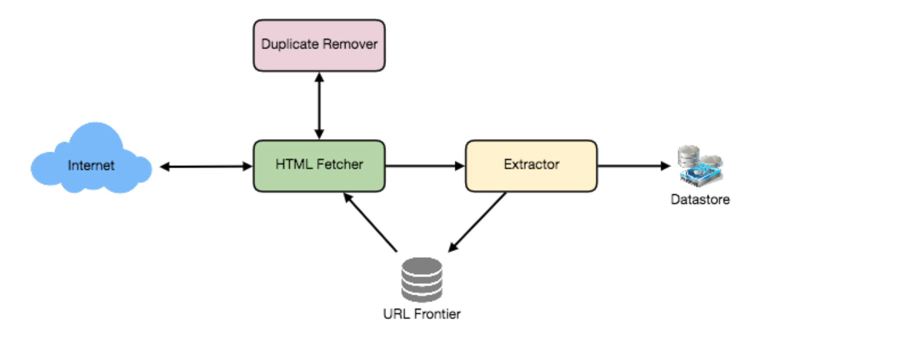
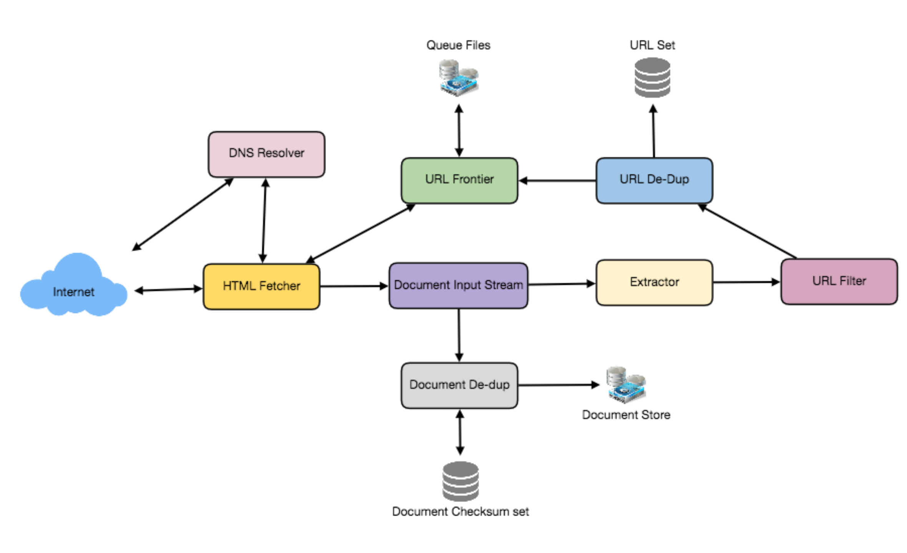

# 设计一个 Web 爬虫

让我们设计一个Web Crawler来系统地浏览和下载万维网。网络爬虫程序也被称为网络蜘蛛、机器人、蠕虫、步行者和机器人。难度:难

## 1. 什么是网络爬虫?

   网络爬虫是一种软件程序，它以一种有系统的、自动化的方式浏览万维网。它通过递归地从一组起始页面获取链接来收集文档。许多网站，特别是搜索引擎，使用网络爬行作为一种提供最新数据的手段。搜索引擎下载所有页面，在上面创建索引，以执行更快的搜索。

   网络爬虫的一些其他用途是:

   ●测试网页和链接的有效语法和结构。

   ●监视站点以查看它们的结构或内容何时发生变化。

   ●为流行的Web站点维护镜像站点。

   ●搜索侵犯版权的行为。

   ●建立一个特殊用途的索引，例如，一个对存储在网络多媒体文件中的内容有一定了解的索引。

## 2. 系统的需求和目标

   假设我们需要爬遍所有的网络。

   可伸缩性:我们的服务需要具有可伸缩性，以便能够抓取整个Web，并可用于获取数亿个Web文档。

   可扩展性:我们的服务应该以模块化的方式设计，并期望新功能被添加到其中。将来可能需要下载和处理较新的文档类型。

## 3. 一些设计方面的考虑

   在网络上爬行是一项复杂的任务，有很多方法可以实现。在进一步讨论之前，我们应该问几个问题:

   它是一个仅针对HTML页面的爬虫吗?或者我们应该获取和存储其他类型的媒体，如声音文件、图像、视频等?这一点很重要，因为答案可能会改变设计。如果我们正在编写一个通用的爬虫程序来下载不同的媒体类型，我们可能想要将解析模块分解成不同的模块集:一个用于HTML，另一个用于图像，另一个用于视频，每个模块提取对该媒体类型有兴趣的内容。

   现在让我们假设我们的爬虫只处理HTML，但是它应该是可扩展的，并且可以很容易地添加对新媒体类型的支持。

   我们在看什么协议?HTTP吗?那么FTP链接呢?我们的爬虫应该处理哪些不同的协议?为了便于练习，我们将假设是HTTP。同样，将设计扩展到以后使用FTP和其他协议应该不难。

   我们将抓取的预期页面数是多少?URL数据库将会变得多大?假设我们需要抓取10亿个网站。由于一个网站可以包含很多很多url，让我们假设爬行器访问的不同网页的上限是150亿个。

   什么是“机器人排除”，我们应该如何处理它?谦恭的Web爬虫程序实现了Robots Exclusion Protocol，该协议允许网站管理员将其网站的某些部分声明为爬虫程序所不能访问的。Robots Exclusion Protocol要求Web爬虫程序在从网站下载任何实际内容之前获取一个名为robot.txt的特殊文档，该文档包含网站上的这些声明。

## 4. 容量估算与约束

   如果我们想在四周内抓取150亿页，每秒需要读取多少页?

   15B / (4 weeks * 7 days * 86400 sec) ~= 6200 pages/sec

   存储呢?页面大小变化很大，但如上所述，因为我们将只处理HTML文本，所以假设平均页面大小为100KB。对于每个页面，如果我们要存储500个字节的元数据，那么我们需要的总存储空间是:

   15B * (100KB + 500) ~= 1.5 petabytes

   假设70%容量模型(我们不希望超过存储系统总容量的70%)，我们将需要的总存储空间:

   1.5 petabytes / 0.7 ~= 2.14 petabytes

## 5. 高水平设计

   任何Web爬行器执行的基本算法都是将种子url列表作为输入，并重复执行以下步骤。

   1.从未访问的URL列表中选择一个URL。

   2.确定其主机名的IP地址。

   3.建立与主机的连接，下载相应文档。

   4.解析文档内容以查找新的url。

   5.将新的url添加到未访问的url列表中。

   6.处理下载的文件，例如，存储它或索引它的内容等。

   7.回到第1步

   怎么爬?

   广度优先还是深度优先?通常使用宽度优先搜索(BFS)。然而，深度优先搜索(DFS)在某些情况下也会被使用，比如如果你的爬虫已经与这个网站建立了连接，它可能只是DFS这个网站中的所有url，以节省一些握手开销。

   上行路径爬行:上行路径爬行可以帮助发现许多孤立的资源，或者在特定Web站点的常规爬行中无法找到入站链接的资源。在这个方案中，一个爬虫程序将上升到它想要爬行的每个URL中的每一条路径。例如，当给定一个种子URL http:foo.comabpage.html时，它将尝试抓取ab, a，和。

   实现高效网络爬虫的困难

   网络的两个重要特征使得网络爬行变得非常困难:

1.  大量的网页:大量的网页意味着网络爬虫在任何时候只能下载一小部分网页，因此网络爬虫应该足够智能，优先下载是至关重要的。

2. 网页的变化速率。当今动态世界的另一个问题是，互联网上的网页变化非常频繁，因此，当爬虫从一个站点下载最后一个页面时，页面可能会改变，或者一个新页面已经添加到该站点。

   一个最低限度的爬虫至少需要这些组件:

1. URL边界:用于存储要下载的URL列表，并对应该首先抓取的URL进行优先级排序。

2. HTTP Fetcher:从服务器取回网页。

   3.提取器:从HTML文档中提取链接。

4. 重复消除器:确保相同的内容不会被无意地提取两次。

5. 数据存储:用于存储检索页面、URL和其他元数据。

## 6. 详细的组件设计

   让我们假设我们的爬虫程序在一台服务器上运行，所有的爬行都是由多个工作线程完成的，其中每个工作线程在一个循环中执行下载和处理文档所需的所有步骤。

   此循环的第一步是从共享URL边界中删除用于下载的绝对URL。绝对URL以一个方案(例如，“HTTP”)开头，该方案标识了应该用于下载它的网络协议。我们可以以模块化的方式实现这些协议以获得可扩展性，这样以后如果我们的爬虫需要支持更多的协议，它就可以很容易地完成。根据URL的方案，worker调用适当的协议模块来下载文档。下载后，文档被放入文档输入流(DIS)。将文档放入DIS将使其他模块能够多次读取文档。

   一旦将文档写入DIS，工作线程将调用重复数据删除测试，以确定之前是否见过这个文档(与不同的URL相关联)。如果是，则不会进一步处理文档，工作线程会从边界中删除下一个URL。

   接下来，我们的爬虫程序需要处理下载的文档。每个文档可以有不同的MIME类型，如HTML页面，图像，视频等。我们可以以模块化的方式实现这些MIME模式，这样以后如果我们的爬虫需要支持更多类型，我们就可以轻松地实现它们。根据下载的文档的MIME类型，worker调用与该MIME类型关联的每个处理模块的处理方法。

   此外，我们的HTML处理模块将从页面中提取所有链接。每个链接都被转换成一个绝对URL，并根据用户提供的URL过滤器进行测试，以确定是否应该下载它。如果URL通过了过滤器，worker将执行URL可见性测试，该测试检查URL是否在之前被看到过，也就是说，它是否在URL边界内或已经被下载。如果URL是新的，它将被添加到边框中。

让我们逐一讨论这些组件，看看它们是如何分布到多台机器上的:

1. URL边界:URL边界是包含所有有待下载的URL的数据结构。我们可以通过执行宽度优先的Web遍历来爬行，从种子集中的页面开始。这样的遍历很容易通过使用FIFO队列来实现。

   由于我们将有一个巨大的URL列表来抓取，我们可以将我们的URL边界分配到多个服务器。让我们假设在每个服务器上都有多个工作线程执行爬行任务。让我们还假设我们的哈希函数将每个URL映射到一个负责爬行它的服务器。

   在设计分布式URL边界时，必须牢记以下礼貌要求:

   1.我们的爬虫不应该通过下载大量的页面来超载服务器。

   2.我们不应该让多台机器连接一个web服务器。

   为了实现这个礼貌约束，我们的爬虫程序可以在每个服务器上有一组不同的FIFO子队列。每个工作线程都有自己单独的子队列，它从子队列中删除用于爬行的url。当需要添加一个新的URL时，放置该URL的FIFO子队列将由URL的规范主机名决定。我们的哈希函数可以将每个主机名映射到一个线程号。这两点加在一起意味着最多只有一个工作线程会从给定的Web服务器下载文档，而且通过使用FIFO队列，它不会使Web服务器超载。

   1.我们的URL边界有多大?大小将在数亿个url中。因此，我们需要将url存储在磁盘上。我们可以通过这样一种方式来实现队列，即队列有单独的缓冲区用于进入队列和退出队列。入队列缓冲区，一旦被填满将被转储到磁盘，而出队列缓冲区将保留一个需要访问的url缓存，它可以定期从磁盘读取来填充缓冲区。

   2.读取器模块:读取器模块的目的是使用适当的网络协议(如HTTP)下载与给定URL对应的文档。正如上面所讨论的那样，站长创建robot.txt以使他们的网站的某些部分不受爬虫的限制。为了避免在每次请求时都下载这个文件，我们的爬虫程序的HTTP协议模块可以维护一个固定大小的缓存，将主机名映射到它们的机器人排除规则。

   3.文档输入流:我们的爬虫的设计使相同的文档可以被多个处理模块处理。为了避免多次下载文档，我们使用一种称为文档输入流(document Input Stream, DIS)的抽象在本地缓存文档。

   DIS是一个输入流，它缓存从互联网读取的文档的全部内容。它还提供了重新读取文档的方法。DIS可以在内存中完全缓存小型文档(64 KB或更小)，而大型文档可以临时写入备份文件。

   每个工作线程都有一个相关的DIS，它从一个文档重用到另一个文档。在从边界提取URL之后，worker将该URL传递给相关的协议模块，该模块从网络连接初始化DIS以包含文档的内容。然后工人将DIS传递给所有相关的处理模块。

4. 文档重复数据删除测试:Web上的许多文档可以在多个不同的url下使用。在许多情况下，文档被镜像到不同的服务器上。这两种效果都会导致任何Web爬行器多次下载相同的文档内容。为了防止对文档进行多次处理，我们对每个文档执行重复数据删除测试以删除重复数据。

   要执行此测试，我们可以计算每个已处理文档的64位校验和，并将其存储在数据库中。对于每个新文档，我们可以将其校验和与之前计算的所有校验和进行比较，以查看之前见过的文档。我们可以使用MD5或SHA来计算这些校验和。

   校验和存储有多大?如果我们的校验和存储的全部目的是重复数据删除，那么我们只需要保留一个包含所有以前处理过的文档的校验和的唯一集。考虑到150亿个不同的网页，我们需要:

   15B * 8 bytes => 120 GB

   尽管这可以放进现代服务器的内存中，但如果我们没有足够的可用内存，我们可以在每个服务器上保持更小的基于LRU的缓存，并将所有内容保存在一个持久存储中。重复数据删除测试首先检查缓存中是否存在校验和。如果不是，它必须检查校验和是否驻留在后存储中。如果找到校验和，我们将忽略该文档。否则，它将被添加到缓存和后端存储中。

5. URL过滤器:URL过滤机制提供了一种可定制的方式来控制所下载的URL集合。这是用来黑名单网站，以便我们的爬虫可以忽略他们。在将每个URL添加到边界之前，工作线程会咨询用户提供的URL过滤器。我们可以定义过滤器来根据域、前缀或协议类型限制url。

6. 域名解析:在联系Web服务器之前，Web爬行器必须使用域名服务(DNS)将Web服务器的主机名映射到IP地址。鉴于我们要处理的url数量，DNS名称解析将成为我们爬虫的一大瓶颈。为了避免重复请求，我们可以通过构建本地DNS服务器来缓存DNS结果。

7. URL重复数据删除测试:在提取链接时，任何Web爬虫都会遇到指向同一文档的多个链接。为了避免多次下载和处理文档，在将每个提取的链接添加到URL边界之前，必须对其执行URL重复数据删除测试。

   要执行URL重复数据删除测试，我们可以将爬行器看到的所有URL以规范形式存储在数据库中。为了节省空间，我们没有在URL集中存储每个URL的文本表示，而是存储一个固定大小的校验和。

   为了减少对数据库存储的操作数量，我们可以在所有线程共享的每个主机上保留流行url的内存缓存。使用此缓存的原因是，到某些url的链接非常常见，因此将常用的链接缓存到内存中将导致内存中较高的命中率。

   URL的存储需要多少存储空间?如果我们的校验和的全部目的是进行URL重复数据删除，那么我们只需要保留一个包含所有以前看到的URL的校验和的唯一集。考虑到150亿个不同的url和2个字节的校验和，我们需要:

   15B * 2 bytes => 30 GB

   我们可以使用bloom过滤器来重复数据删除吗?布隆过滤器是一个概率数据结构的集合成员测试，可能会产生假阳性。一个大的位向量表示这个集合。通过计算元素的“n”哈希函数并设置相应的位，将元素添加到集合中。如果一个元素的哈希位置的所有“n”位都被设置好，则该元素被认为在集合中。因此，一个文档可能被错误地认为在集合中，但假阴性是不可能的。

   在URL seen测试中使用bloom过滤器的缺点是，每次误报都会导致URL没有被添加到边界中，因此文档将永远不会被下载。假阳性的机会可以通过使位向量变大来降低。

8. 检查点:抓取整个Web需要数周时间。为了防止出现故障，我们的爬虫程序可以将其状态的常规快照写入磁盘。中断或中止的爬行可以很容易地从最新的检查点重新启动。

## 7. 容错

   我们应该在爬行服务器之间使用一致的散列。扩展哈希不仅有助于替换死主机，还有助于在爬行服务器之间分配负载。

   我们所有的爬行服务器将执行常规检查点和存储他们的FIFO队列到磁盘。如果服务器坏了，我们可以替换它。同时，扩展哈希应该将负载转移到其他服务器。

## 8. 数据分区

   我们的爬虫将处理三种类型的数据:1)URL访问2)URL重复数据删除校验和3)文件重复数据删除校验和。

   因为我们是基于主机名分发url的，所以我们可以将这些数据存储在同一个主机上。因此，每个主机将存储需要访问的url集、所有之前访问过的url的校验和和所有下载的文档的校验和。由于我们将使用扩展的哈希，我们可以假设url将从过载的主机重新分发。

   每个主机将定期执行检查点，并将所有数据的快照转储到远程服务器。这将确保如果一个服务器停止工作，另一个服务器可以通过从最后一个快照获取数据来替换它。

## 9. 爬虫的陷阱

   有许多爬虫陷阱、垃圾网站和隐藏内容。一个爬行器陷阱是一个URL或一组URL，导致一个爬行器无限爬行。有些爬虫陷阱是无意的。例如，文件系统中的符号链接可以创建一个循环。其他爬虫陷阱是有意引入的。例如，人们编写了能够动态生成无限文档Web的陷阱。这些陷阱背后的动机各不相同。反垃圾邮件陷阱旨在捕捉垃圾邮件发送者寻找电子邮件地址所使用的爬虫程序，而其他网站则使用陷阱捕捉搜索引擎爬虫程序，以提高它们的搜索评级。

   AOPIC算法(自适应在线页面重要性计算)，可以帮助减轻常见类型的机器人陷阱。AOPIC通过使用信用系统解决了这个问题。

   1.从一组N个种子页开始。

   2.在开始爬行之前，为每个页面分配固定的X数量的积分。

   3.选择一个拥有最高积分的页面P(或者选择一个随机页面，如果所有页面都拥有相同的积分)。

   4.抓取页面P(假设P在抓取时拥有100个积分)。

   5.从页面P中提取所有链接(假设有10个链接)。

   6.将P的积分设为0。

   7.Take a 10% “tax” and allocate it to a Lambda page.

   8.Allocate an equal amount of credits each link found on page P from P’s original credit after subtracting the tax, so: (100 (P credits) - 10 (10% tax))/10 (links) = 9 credits per each link从P的原始信用中扣除税款后，在P页上找到的每个链接分配等量的信用，因此:(100 (P信用)- 10(10%的税))10(链接)=每个链接9信用。.

   9.重复步骤3。

   由于Lambda页面不断地收取税款，最终它将成为拥有最大额度的信贷的页面，我们将不得不“爬行”它。通过爬行Lambda页面，我们只是获取它的功劳并将它们平均分配到数据库中的所有页面。

   由于机器人陷阱只给内部链接提供信用，他们很少从外部获得信用，他们会不断地向Lambda页面泄漏信用(从税收)。Lambda页面将把积分平均分配到数据库中的所有页面，在每个循环中，机器人陷阱页面将失去越来越多的积分，直到它的积分少到几乎再也不会被抓取。这不会发生在好的页面上，因为他们经常从其他页面的反向链接中获得积分。
