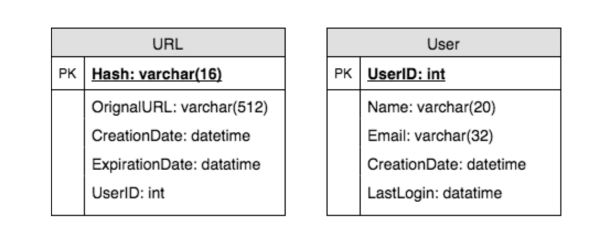
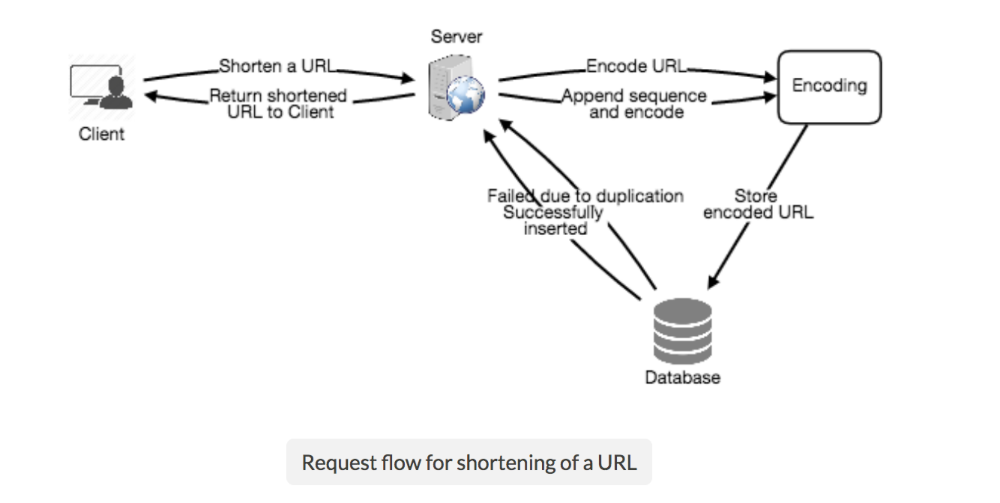
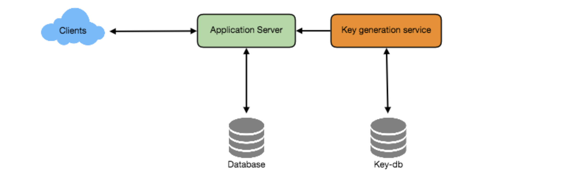
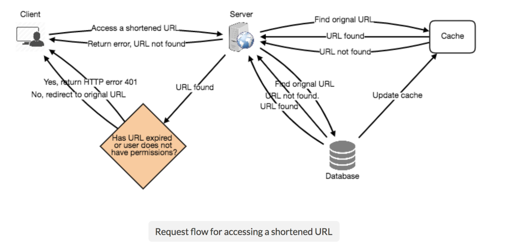
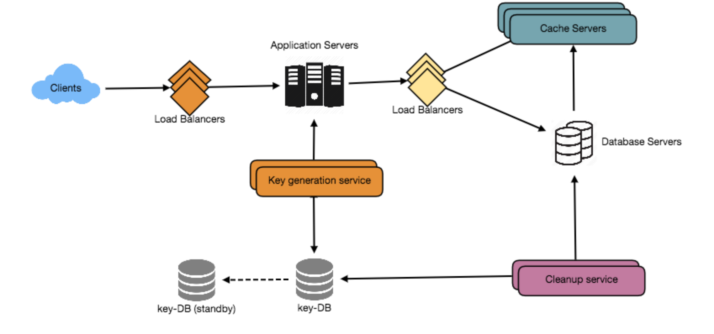

# 设计像 TinyURL 这样的短 URL 服务

让我们设计一个URL缩短服务，比如TinyURL。该服务将提供短别名重定向到长url。

类似的服务:bit.ly, goo.gl, 2020.fm etc.

难度级别:简单

##1. 为什么我们需要网址缩短

   URL缩短用于为长URL创建更短的别名。当用户遇到这些别名时，会被重定向到原始URL。任何URL的短版本都可以节省大量的空间，无论我们何时使用它，例如，当打印或tweet作为tweet有字符限制时。

   例如，如果我们通过TinyURL缩短这个页面:

   https://www.educative.io/collection/page/5668639101419520/5649050225344512/5668600916475904/

   我们可以得到:

   http://tinyurl.com/jlg8zpc

   缩短后的网址几乎是实际网址大小的3分之1。

   URL缩短用于优化跨设备的链接，跟踪单个链接以分析受众和活动表现，以及隐藏关联的原始URL等。

   如果你以前没有使用过tinyurl.com，请尝试创建一个新的缩短的URL，并花一些时间浏览他们的服务提供的不同选项。这将帮助你更好地理解这一章。

## 2. 系统的需求和目标

   💡    你应该在面试一开始就明确要求，并提出问题，以找到面试官心目中系统的确切范围。

   我们的网址缩短系统应符合下列要求:

###   功能需求:

   给定一个URL，我们的服务应该生成一个更短且唯一的URL别名。

   当用户访问较短的URL时，我们的服务应该将他们重定向到原始链接。

   用户应该可以选择为他们的URL选择一个自定义别名。

   链接将在特定的时间间隔后自动过期;用户还应该能够指定过期时间。

###   非功能性需求:

   系统应该是高可用的。这是必需的，因为如果我们的服务停止，所有的URL重定向都将开始失败。

   URL重定向应该以最小的延迟实时发生。

   缩短的链接不应该是可猜测的(不可预测的)。

###   扩展要求:

   分析，例如，多少次重定向发生?

   我们的服务也应该可以被其他服务通过REST api访问。

## 3. 容量估算与约束

   我们的系统会有很多读取量;与新的URL缩短相比，会有大量的重定向请求。让我们假设读和写的比例为100:1。

   流量估计: 流量估计:如果我们假设每个月有5亿个新url被缩短，那么在同一时间内，我们可以预期(100亿个url => 50B)重定向。什么是查询每秒(QPS)为我们的系统?

   每秒新增url缩短:

   500 million / (30 days * 24 hours * 3600 seconds) ~= 200 URLs/s

   5亿/(30天*24小时*3600秒)~= 200个url)

   URLs重定向秒:

   50 billion / (30 days * 24 hours * 3600 sec) ~= 19K/s

   存储估计: 因为我们预计每个月有5亿个新url，如果我们将这些对象保存5年;我们要存储的对象的总数是300亿个。

   500 million * 5 years * 12 months = 30 billion

   让我们假设我们要存储的每个对象可以是500字节(只是一个大概的数字，我们将在后面深入研究);我们需要15TB的总存储空间:

   30 billion * 500 bytes = 15 TB

   带宽估计: 对于写请求，由于我们预计每秒钟有200个新的url，我们服务的总传入数据将是每秒100KB。

   200 * 500 bytes = 100 KB/s

   对于读请求，由于我们期望每秒钟有~19K的url重定向，我们服务的总输出数据将是每秒9MB。

   19K * 500 bytes ~= 9 MB/s

   内存估计: 如果我们想缓存一些经常被访问的热门url，我们需要多少内存来存储它们?如果我们遵循80-20规则，即20%的url产生80%的流量，我们希望缓存这20%的热url。

   因为我们每秒有19K个请求，所以我们每天会收到17亿个请求。

   19K * 3600 seconds * 24 hours ~= 1.7 billion

   为了缓存这些请求的20%，我们需要170GB的内存。

   0.2 * 1.7 billion * 500 bytes ~= 170GB

   高水平估计: 假设每月新增5亿url，读写比例为100:1，以下是我们服务的高水平估计总结:

|   New URLs| 200/s
|:---|:---
| URL重定向|  19K/s
| I输入数据|100KB/s
|   传出数据 |9MB/s
|   贮存5年|   15TB
|   内存缓存 |170GB

## 4. 系统api

   💡      一旦我们确定了需求，定义系统api总是一个好主意。这将明确地声明系统所期望的内容。

   我们可以使用SOAP或REST api来公开服务的功能。下面是创建和删除url的api的定义:

   creatURL(api_dev_key, original_url, custom_alias=None user_name=None, expire_date=None)

   参数:

   api_dev_key (string): 注册帐户的API开发人员密钥。这将用于根据用户分配的配额限制用户。

   original_url (string):需要缩短的原始URL。

   custom_alias (string): URL的可选自定义键。

   user_name (string):可选用于编码的用户名。

   expire_date (string):缩短URL的可选过期日期。

   Returns: (string)

   成功的插入将返回缩短的URL，否则将返回错误代码。

   deleteURL(api_dev_key, url_key)

   其中“url_key”是表示要检索的缩短URL的字符串。成功删除将返回“URL已删除”。

   我们如何发现和防止滥用? 例如，任何服务都可能因为消耗当前设计中的所有键而导致我们破产。为了防止滥用，我们可以通过api_dev_key限制用户，即他们在特定时间内可以创建或访问多少URL。

## 5. 数据库设计

   💡      在面试的早期阶段定义DB模式将有助于理解不同组件之间的数据流，并在之后指导数据分区。

   关于我们将要存储的数据的性质的几点观察:

   我们需要存储数十亿条记录。

   我们要存储的每个对象都很小(小于1K)。

   记录之间没有关系，除非我们想要存储哪个用户创建了哪个URL。

   我们的服务是读多的。

   数据库模式:

   我们需要两个表，一个用于存储关于URL映射的信息，另一个用于存储用户数据。

我们应该使用什么样的数据库? 因为我们可能要存储数十亿行，而且我们不需要使用对象之间的关系——像Dynamo或Cassandra这样的NoSQL键值存储是一个更好的选择，它们也更容易伸缩。详情请参阅SQL vs NoSQL。如果我们选择NoSQL，我们不能在URL表中存储UserID(因为NoSQL中没有外键)，为此我们需要第三个表来存储URL和用户之间的映射。

## 6. 基本的系统设计和算法

   我们在这里解决的问题是为给定的URL生成一个简短且唯一的键。在上面的例子中，我们得到的缩短URL是:" http: tinyurls .comjlg8zpc "，该URL的最后六个字符是我们想要生成的短键。我们将在这里探索两种解决方案:

   a.编码实际URL

   我们可以计算给定URL的唯一哈希值(例如，MD5或SHA256等)。然后可以对散列进行编码以显示。这种编码可以是base36 ([a-z,0-9])或base62 ([a-z, a-z, 0-9])，如果我们加上' - '和'。’，我们可以使用base64编码。一个合理的问题是;短键的长度应该是多少?6个、8个还是10个字符?

   使用base64编码，一个6字母长的键将产生64^6 ~= 687亿可能的字符串

   使用base64编码，一个8个字母长的键将产生64^8 ~= 281万亿可能的字符串

   对于68.7B唯一的字符串，让我们假设在我们的系统中，六个字母的键就足够了。

   如果我们使用MD5算法作为我们的哈希函数，它将产生一个128位的哈希值。在base64编码之后，我们将得到一个超过20个字符的字符串，那么我们如何选择我们的键呢?我们可以取前6(或8)个字母作为密钥。这可能会导致键重复，在此基础上，我们可以从编码字符串中选择一些其他字符或交换一些字符。

   我们的解决方案有哪些不同的问题?我们的编码方案有以下几个问题:

   如果多个用户输入相同的URL，他们可以得到相同的缩短URL，这是不可接受的。

   如果部分URL是URL编码的呢? e.g., http://www.educative.io/distributed.php?id=design, and http://www.educative.io/distributed.php%3Fid%3Ddesign 除了URL编码外是相同的。

   问题的解决方法: 我们可以给每个输入URL添加一个递增的序列号，使其惟一，然后生成它的哈希值。不过，我们不需要将这个序列号存储在数据库中。这种方法可能存在的问题可能是这个序列号有多大，它会溢出吗?增加序列号也会影响服务的性能。

   另一种解决方案是，将用户id(应该是唯一的)附加到输入URL。但是，如果用户还没有登录，我们可以要求用户选择惟一密钥。即使在这之后，如果我们有冲突，我们必须不断生成一个键，直到我们得到一个唯一的。

b. 离线生成密钥

我们可以有一个独立的密钥生成服务(KGS)，它预先随机生成六个字母字符串，并将它们存储在数据库中(我们称之为Key - db)。每当我们想要缩短URL时，我们只需要获取一个已经生成的键并使用它。这种方法将使事情变得非常简单和快速，因为我们不用对URL进行编码，也不用担心重复或冲突。KGS将确保插入key-DB中的所有密钥是唯一的。

并发性会导致问题吗? 一旦一个键被使用，就应该在数据库中标记它，这样它就不会被再次使用了。如果有多个服务器同时读取键值，我们可能会遇到这样的情况:两个或多个服务器试图从数据库读取相同的键值。我们如何解决这个并发问题?

服务器可以使用KGS来读取数据库中的密钥。KGS可以使用两个表来存储键，一个用于尚未使用的键，另一个用于所有已使用的键。只要KGS向其中一个服务器提供密钥，它就可以将密钥移动到使用的密钥表中。KGS总是可以在内存中保存一些密钥，以便在服务器需要它们时，能够快速提供它们。为了简单起见，只要KGS在内存中加载一些键，它就可以将它们移动到使用的键表中。通过这种方式，我们可以确保每个服务器都得到唯一的密钥。如果KGS在将所有加载的键分配给某个服务器之前死亡，我们将浪费这些键，我们可以忽略这些键，因为我们有大量的键。KGS还必须确保不会向多个服务器提供相同的密钥。为此，它必须同步(或锁定)保存键的数据结构，然后从该结构中删除键并将它们交给服务器。

key-DB的大小是多少? 使用base64编码，我们可以生成68.7B唯一的6个字母的密钥。如果我们需要一个字节来存储一个字母数字字符，我们可以将所有这些键存储在:

6 (characters per key) * 68.7B (unique keys) => 412 GB.

假如KGS发生单点故障? 为了解决这个问题，我们可以拥有KGS的备用副本，当主服务器失效时，它可以接管生成和提供密钥。

每个应用服务器可以缓存key-DB中的一些键吗? 是的，这肯定能加快速度。尽管在本例中，如果应用程序服务器在使用所有键之前死亡，我们最终将失去这些键。这是可以接受的，因为我们有68B唯一的6个字母的钥匙。

如何执行键查找? 我们可以在数据库或键值存储库中查找键来获得完整的URL。如果存在，则向浏览器返回“HTTP 302重定向”状态，并在请求的“Location”字段中传递存储的URL。如果该密钥在我们的系统中不存在，则发出“HTTP 404 not Found”状态，或将用户重定向回主页。

我们应该对自定义别名施加大小限制吗? 由于我们的服务支持自定义别名，用户可以选择任何他们喜欢的“键”，但提供自定义别名不是强制性的。然而，对自定义别名施加大小限制是合理的(而且通常是可取的)，这样我们就有了一致的URL数据库。让我们假设用户可以指定最长16个字符的客户键(如上面的数据库模式所示)。

用于URL缩短的高级系统设计

## 7. 数据分区和复制

   为了扩展我们的数据库，我们需要对它进行分区，以便它能够存储关于数十亿个URL的信息。我们需要提出一个分区方案，将我们的数据划分并存储到不同的DB服务器上。

   a.基于范围的分区: 我们可以根据URL的首字母或哈希键将URL存储在单独的分区中。因此，我们将所有以字母“A”开头的url保存在一个分区中，而那些以字母“B”开头的url保存在另一个分区中，以此类推。这种方法称为基于范围的分区。我们甚至可以将某些不太经常出现的字母组合到一个数据库分区中。我们应该静态地提出这种分区方案，以便始终能够以可预测的方式存储和查找文件。

   这种方法的主要问题是，它会导致服务器不平衡;如果我们决定将所有以字母“E”开头的url放入一个DB分区中，但后来我们意识到我们有太多以字母“E”开头的url，我们无法放入一个DB分区中。

   b.基于哈希的分区: 在这个方案中，我们取我们正在存储的对象的哈希值，然后根据这个哈希值，我们找出这个对象应该去的DB分区。在我们的例子中，我们可以使用' key '的哈希值或实际的URL来确定存储文件的分区。我们的哈希函数将随机地将url分配到不同的分区中，例如，我们的哈希函数总是可以将任意键映射到[1…256]之间的一个数字，而这个数字将代表存储我们对象的分区。

   这种方法仍然会导致分区的重载，这可以通过使用一致的哈希来解决。

## 8. 缓存

   我们可以缓存经常被访问的url。我们可以使用一些现成的解决方案，比如Memcache，它可以存储带有各自哈希值的完整url。应用服务器在访问后端存储之前，可以快速检查缓存是否有所需的URL。

   我们应该有多少缓存? 我们可以从每天流量的20%开始，根据客户的使用模式，我们可以调整需要多少缓存服务器。如上所述，我们需要170GB的内存来缓存20%的日常流量，因为现在的服务器可以有256GB的内存，我们可以很容易地将所有缓存放入一台机器，或者我们可以选择使用几个较小的服务器来存储所有这些热url。

   哪种cache逐出策略最适合我们的需求? 当缓存是满的，我们想替换一个链接与一个新的更热的URL，我们应该如何选择?最近最少使用(Least Recently Used, LRU)对于我们的系统来说是一个合理的策略。在此策略下，我们首先丢弃最近最少使用的URL。我们可以使用链接哈希图或类似的数据结构来存储我们的url和哈希表，这也将跟踪最近访问的url。

   为了进一步提高效率，我们可以复制缓存服务器来在它们之间分配负载。

   如何更新每个缓存副本?每当有一个缓存错过，我们的服务器将击中后端数据库。每当发生这种情况时，我们可以更新缓存并将新条目传递到所有缓存副本。每个副本都可以通过添加新条目来更新它们的缓存。如果副本已经拥有该条目，则可以忽略它。

## 9. 负载均衡 (LB)
   
   我们可以在系统的三个地方添加负载均衡层:

   客户端和应用服务器之间

   在应用程序服务器和数据库服务器之间

   应用服务器和缓存服务器之间

   最初，可以采用一种简单的轮询方法;将传入的请求平均分配到后端服务器。这个LB实现起来很简单，而且不引入任何开销。这种方法的另一个好处是，如果服务器死亡，LB将把它从轮换中移除，并停止向它发送任何流量。Round Robin LB的一个问题是，它不会考虑服务器负载。如果服务器负载过重或运行缓慢，LB将不会停止向该服务器发送新请求。为了解决这个问题，可以放置一个更智能的LB解决方案，它可以周期性地查询后端服务器的负载，并据此调整流量。

## 10. 清除或DB清理

   条目应该永远存在还是应该被清除?如果达到了用户指定的过期时间，该链接会发生什么?如果我们选择主动搜索过期链接并删除它们，这将给我们的数据库带来很大的压力。我们可以慢慢地删除过期的链接，也可以做一个惰性清理。我们的服务将确保只有过期的链接将被删除，尽管一些过期的链接可以存活更长时间，但永远不会返回给用户。

   当用户试图访问一个过期的链接时，我们可以删除该链接并返回一个错误给用户。

   一个单独的清理服务可以定期运行，从我们的存储和缓存中删除过期的链接。此服务应该是非常轻量级的，并且只能在预期用户流量较低时调度运行。

   我们可以为每个链接设置一个默认的过期时间，例如，两年。

   在删除一个过期的链接之后，我们可以将密钥放回要重用的key- db中。

   我们是否应该删除一段时间内(比如6个月)未被访问的链接?这可能很棘手。由于存储变得越来越便宜，我们可以决定永远保持链接。

URL缩短的详细组件设计

## 11. 遥测

  短URL被使用了多少次，用户位置是什么，等等?我们如何存储这些统计数据?如果它是每个视图上更新的DB行的一部分，当一个流行的URL被大量并发请求攻击时会发生什么?

  我们可以有关于访问者的国家的统计，访问的日期和时间，网页指的点击，浏览器或平台从页面被访问和更多。

## 12. 安全与权限

  用户是否可以创建私有URL或允许特定的一组用户访问URL?

   我们可以在数据库中为每个URL存储权限级别(public - private)。我们还可以创建一个单独的表来存储具有查看特定URL权限的userid。如果用户没有权限并试图访问URL，我们可以返回一个错误(HTTP 401)。考虑到这一点，我们将数据存储在一个像Cassandra这样的NoSQL宽列数据库中，表存储权限的键将是' Hash '(或KGS生成的' key ')，列将存储那些有权限查看URL的用户的userid。

