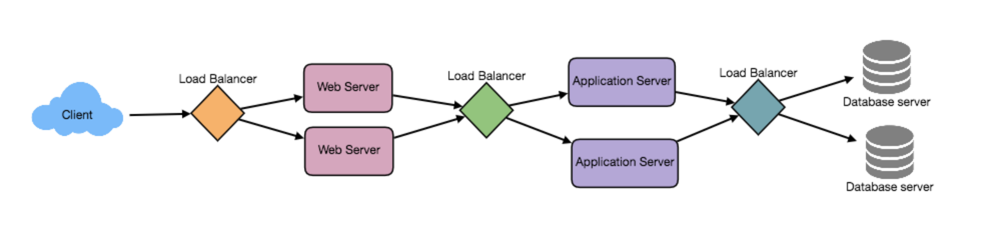

负载均衡器（LB）是任何分布式系统的另一个关键部分。它有助于根据一些指标(随机、轮询、随机加权内存或CPU利用率等)跨多个资源分配负载。LB还在分发请求时跟踪所有资源的状态。如果服务器无法接受新的请求，或者没有响应，或者错误率升高，LB将停止向这样的服务器发送流量。

为了充分利用可伸缩性和冗余，我们可以尝试在系统的每一层平衡负载。我们可以在三个地方添加LBs:

* 在用户和web服务器之间
* 在web服务器和内部平台层之间，比如应用服务器或缓存服务器
* 内部平台层和数据库之间。

**有许多方法可以实现负载均衡。**

## 智能客户端
一个智能客户端将使用一个服务主机池，并在它们之间平衡负载。它还检测没有响应的主机，以避免以自己的方式发送请求。智能客户端还必须检测恢复的主机，处理添加新主机等。

对于开发人员来说，向数据库(缓存、服务等)客户机中添加负载平衡功能通常是一个很有吸引力的解决方案。它看起来很容易实现和管理，特别是当系统不是很大的时候。但随着系统的发展，LBs需要发展成独立的服务器。

## 硬件负载均衡器

最昂贵但性能非常高的负载平衡解决方案是购买一个专用的硬件负载平衡器(类似于Citrix NetScaler)。虽然它们可以解决一系列显著的问题，但硬件解决方案非常昂贵，而且配置起来并不容易。

因此，即使是拥有大量预算的大公司也常常会避免使用专用硬件来满足所有的负载平衡需求。相反，它们只将它们用作用户对其基础设施的请求的第一个接触点，并使用其他机制(智能客户机或下一节讨论的混合方法)来对其网络内的流量进行负载平衡。

## 软件负载均衡
如果我们想避免创建智能客户端的痛苦，并且由于购买专用硬件的工作量过大，我们可以采用一种混合的方法，称为软件负载平衡器。

HAProxy是一种流行的开源软件LB.负载均衡器可以放置在客户端和服务器之间，或者两个服务器端层之间。如果我们可以控制客户端运行的机器，HAProxy就可以运行在同一台机器上。我们希望实现负载平衡的每个服务都可以在那台机器上拥有一个本地绑定端口(例如localhost:9000)，客户机将使用这个端口连接到服务器。这个端口实际上是由HAProxy管理的;代理将接收这个端口上的每个客户机请求，然后以一种有效的方式(分配负载)传递给后端服务。如果我们不能管理客户端的机器，HAProxy可以运行在中间服务器上。类似地，我们可以让代理在不同的服务器端组件之间运行。HAProxy管理健康检查，并将删除或添加机器到这些池。它还在这些池中的所有机器之间平衡请求。

对于大多数系统，我们应该从软件负载平衡器开始，然后根据需要转移到智能客户端或硬件负载平衡。