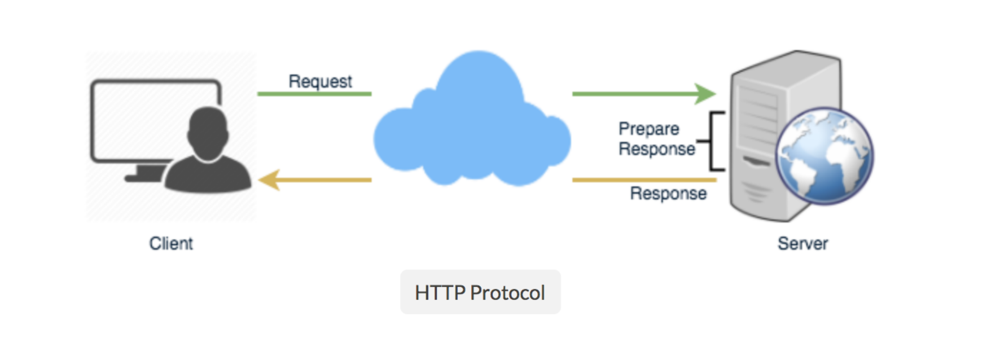
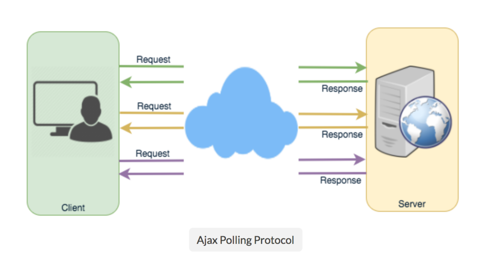
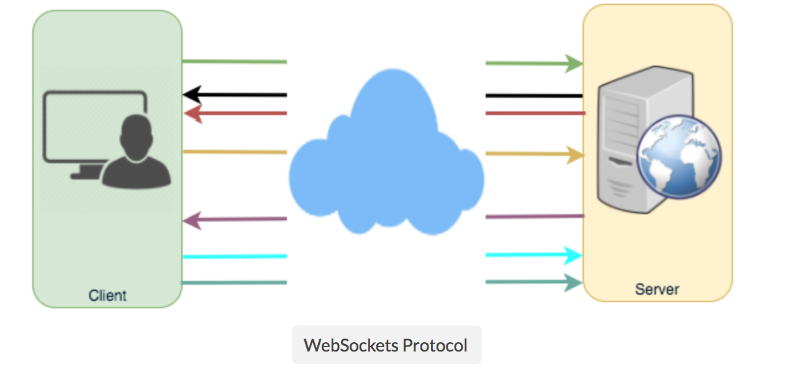
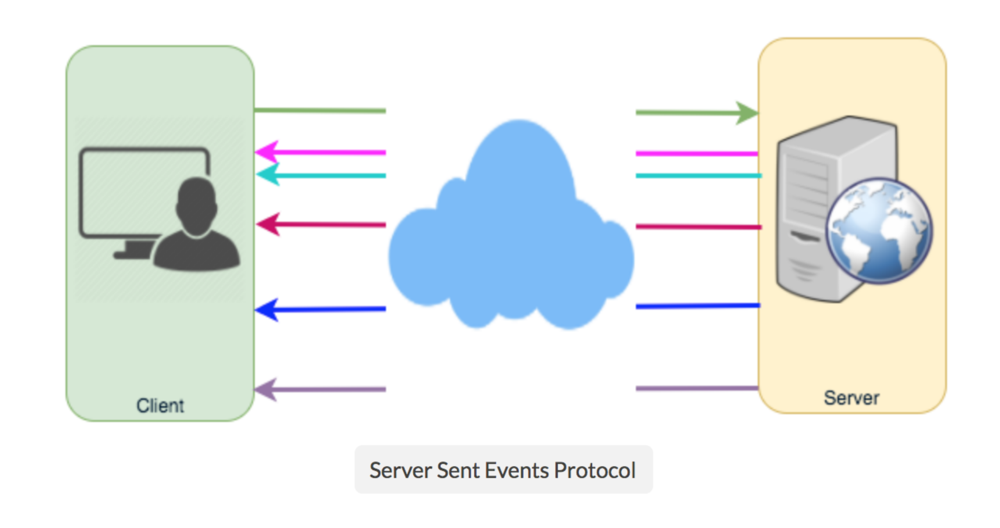

# 长轮询 vs WebSockets vs 服务器发送事件

长轮询、WebSockets和服务器发送事件之间的区别是什么?

长轮询、WebSockets和服务器发送事件是客户机(如web浏览器和web服务器)之间流行的通信协议。

首先，让我们从理解标准HTTP web请求的样子开始。以下是常规HTTP请求的一系列事件:

1. 客户端打开一个连接并从服务器请求数据。
2. 服务器计算响应。
3. 服务器根据打开的请求将响应发送回客户机。

## Ajax 轮询

轮询是绝大多数AJAX应用程序使用的标准技术。其基本思想是客户机反复轮询(或请求)服务器以获取数据。客户端发出请求并等待服务器响应数据。如果没有可用的数据，则返回空响应。

1. 客户端使用常规HTTP打开连接并从服务器请求数据。
2. 被请求的网页定期向服务器发送请求(例如，0.5秒)。
3. 服务器计算响应并将其发送回来，就像常规的HTTP通信一样。
4. 客户机定期重复上述三个步骤，以从服务器获取更新。

轮询的问题在于客户端必须不断向服务器请求任何新数据。因此，许多响应是空的，从而产生HTTP开销。

## HTTP 长轮询

传统轮询技术的一种变体，允许服务器在数据可用时将信息推送到客户端。使用Long-Polling，客户端向服务器请求信息与正常的轮询完全一样，但期望服务器不会立即响应。这就是为什么这种技术有时被称为“挂起GET”。

* 如果服务器没有客户端可用的任何数据，服务器不会发送空响应，而是保存请求并等待，直到一些数据可用。

* 一旦数据可用，将向客户端发送完整的响应。然后客户机立即从服务器重新请求信息，以便服务器几乎总是有一个可用的等待请求，它可以使用该请求来传递数据以响应事件。

使用HTTP Long-Polling的应用程序的基本生命周期如下:

1. 客户端使用常规HTTP发出初始请求，然后等待响应。
2. 服务器将延迟其响应，直到更新可用，或者发生超时。
3. 当更新可用时，服务器向客户端发送完整的响应。
4. 客户端通常会在收到响应后立即发送一个新的长轮询请求，或者在暂停之后允许一个可接受的延迟时间。
5. 每个Long-Poll请求都有一个超时时间。由于超时，客户端必须在连接关闭后定期重新连接。

## WebSockets

WebSocket在单个TCP连接上提供全双工通信通道。它在客户端和服务器之间提供了一个持久的连接，双方都可以使用它在任何时候开始发送数据。客户端通过一个称为WebSocket握手的过程建立一个WebSocket连接。如果该过程成功，那么服务器和客户端可以随时在两个方向上交换数据。WebSocket协议允许客户端和服务器之间以较低的开销进行通信，促进服务器之间和服务器之间的实时数据传输。这是通过为服务器提供一种标准化的方式来实现的，服务器可以在不需要客户机请求的情况下向浏览器发送内容，并允许在保持连接打开的情况下来回传递消息。通过这种方式，可以在客户机和服务器之间进行双向(双向)的持续对话。

## 服务器发送的事件(ss)

在ses下，客户端与服务器建立持久的、长期的连接。服务器使用此连接向客户端发送数据。如果客户端想要向服务器发送数据，它将需要使用另一种技术协议来做到这一点。

1. 客户端使用常规HTTP向服务器请求数据。
2. 被请求的网页打开到服务器的连接。
3. 只要有可用的新信息，服务器就将数据发送给客户机。

当我们需要从服务器到客户端的实时流量时，或者当服务器在循环中生成数据并将多个事件发送到客户端时，ses是最好的。

