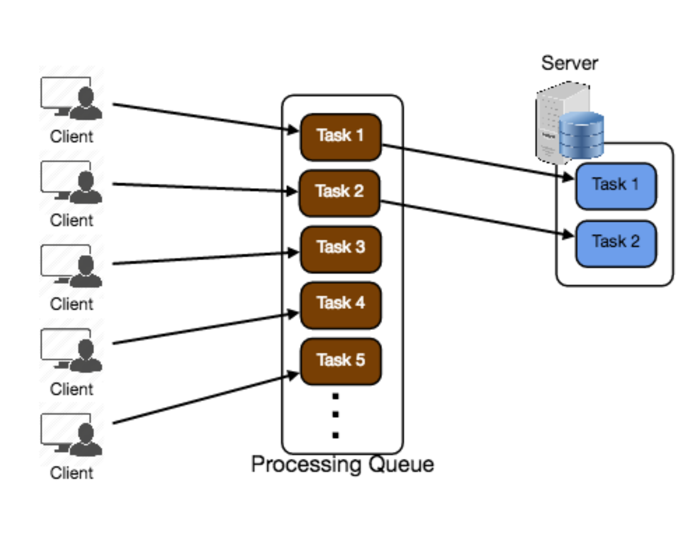

# 队列
队列用于在大型分布式系统中有效地管理请求。在具有最小处理负载和较小数据库的小型系统中，写操作可以预期地快;然而，在更复杂和大型的系统中，写操作可能会花费几乎不确定的长时间。例如，数据可能必须写入不同服务器或索引的不同位置，或者系统可能只是处于高负载状态。在这种情况下，单个写操作(或任务)可能需要很长时间，实现高性能和可用性需要系统的不同组件以异步方式工作;一种常见的方法是使用队列。

让我们假设在一个系统中，每个客户机都请求在远程服务器上处理一个任务。这些客户机将各自的请求发送给服务器，服务器试图尽快完成任务，并将结果返回给各自的客户机。在小型系统中，一个服务器处理传入请求的速度和它们来的速度一样快，这种情况应该可以很好地工作。然而，当服务器收到超过其处理能力的请求时，每个客户机被迫等待其他客户机的请求完成，然后才能生成响应。

这种同步行为会严重降低客户端的性能;客户机被迫等待，实际上不做任何工作，直到它的请求得到响应。增加额外的服务器来解决高负载也不能解决问题;即使有了有效的负载平衡，也很难确保工作的公平和平衡分配，从而最大限度地提高客户端性能。此外，如果处理请求的服务器不可用或失败，那么上游客户端也将失败。要有效地解决这个问题，需要在客户机的请求和为其服务而执行的实际工作之间构建一个抽象。

处理队列和它听起来一样简单:所有传入的任务都被添加到队列中，只要任何一个worker有能力处理，它们就可以从队列中提取任务。这些任务可以表示对数据库的简单写入，也可以表示为文档生成缩略图预览图像这样复杂的事情。

队列是在异步通信协议上实现的，这意味着当客户端向队列提交任务时，它们不再需要等待结果;相反，它们只需要确认请求已被正确接收。当客户需要时，这种确认可以作为工作结果的参考。队列对单个请求中可能传输的数据大小和队列中可能仍未完成的请求数量有隐式或显式的限制。

队列还用于容错，因为它们可以对服务中断和故障提供一些保护。例如，我们可以创建一个高度健壮的队列，它可以重试由于暂时系统故障而失败的服务请求。最好使用队列来保证服务质量，而不是将客户端直接暴露于间歇性的服务中断中，这需要复杂且经常不一致的客户端错误处理。

队列在管理大型分布式系统中不同部分之间的分布式通信中扮演着至关重要的角色。有很多方法可以实现它们，也有很多开源的队列实现，比如RabbitMQ、ZeroMQ、ActiveMQ和BeanstalkD。